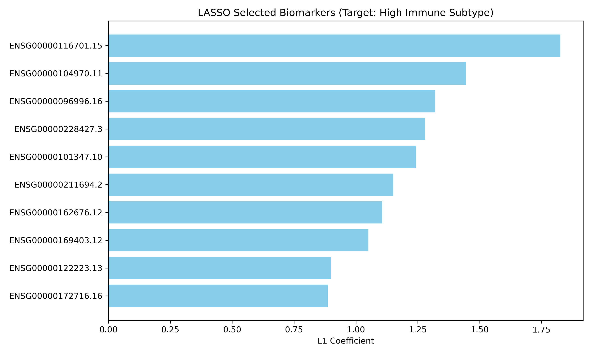
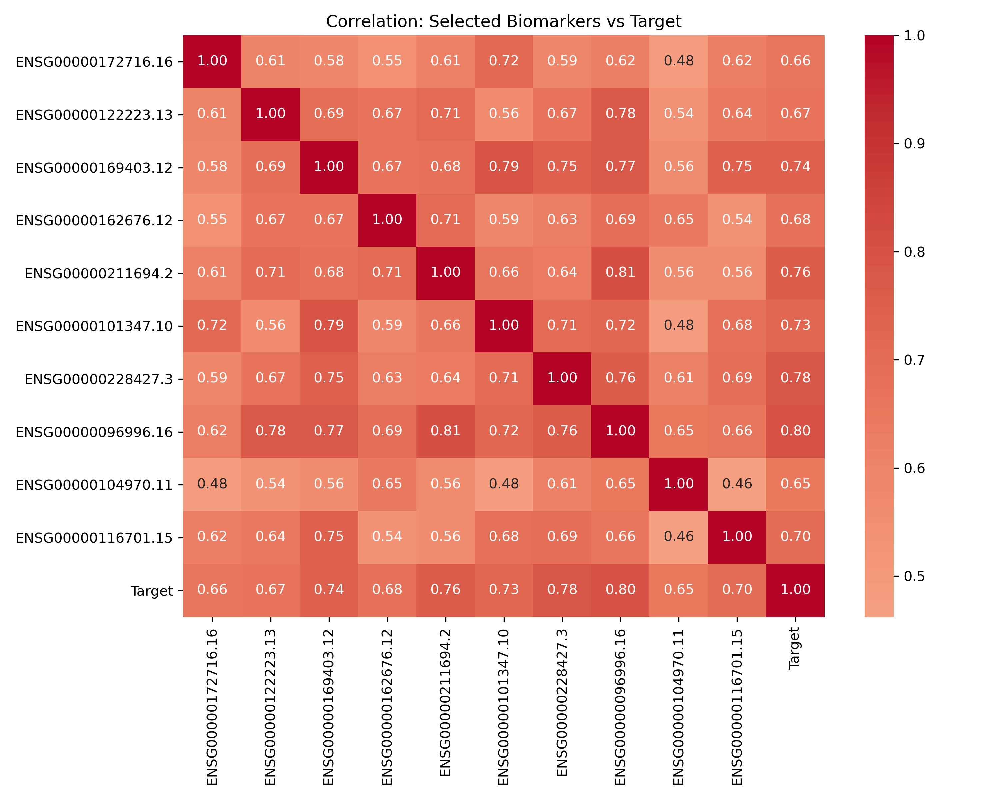
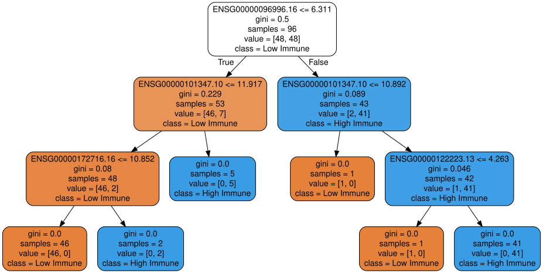
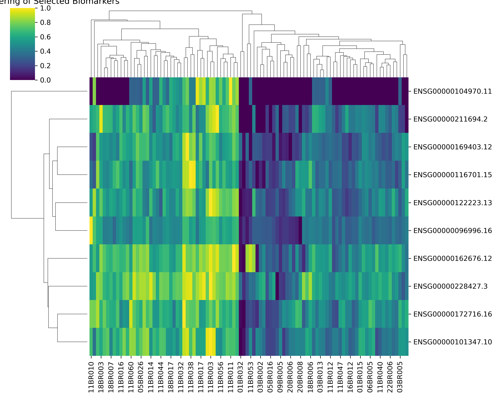
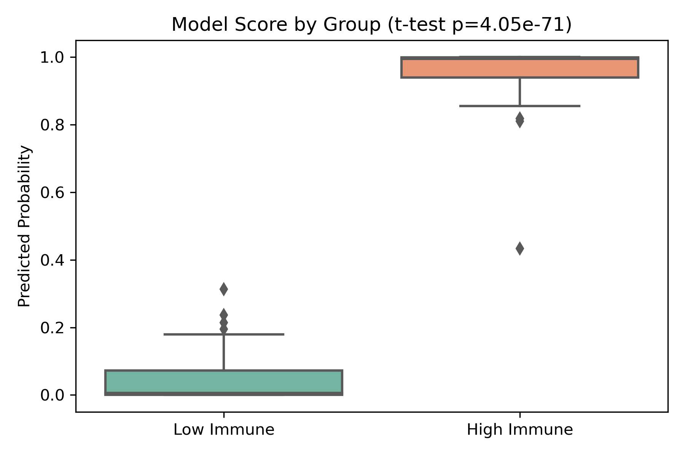
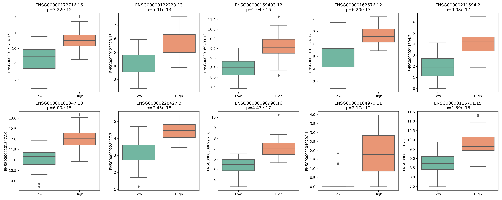
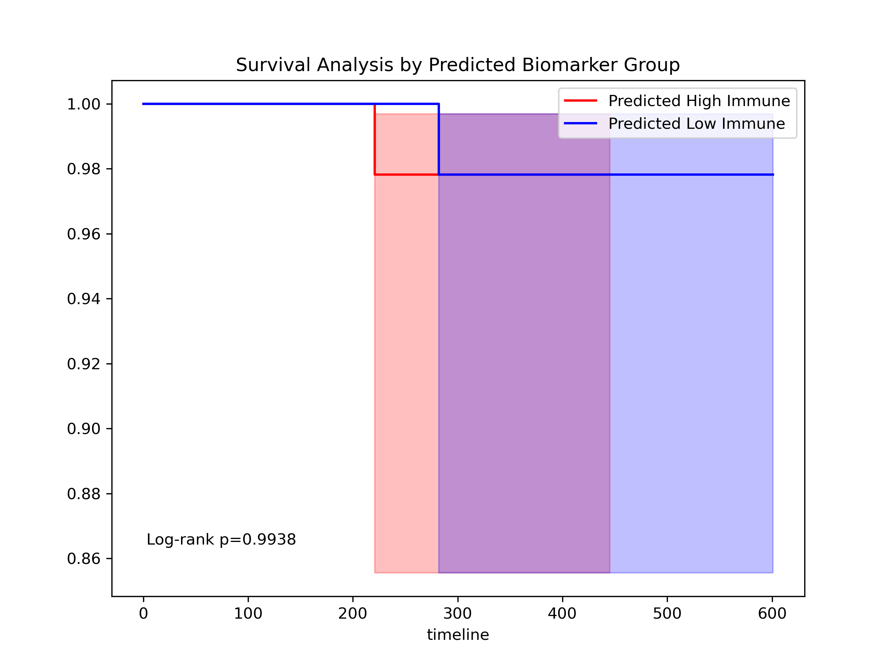
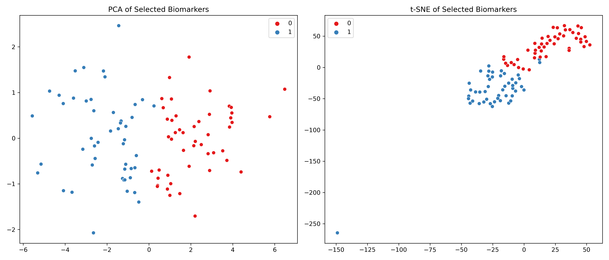
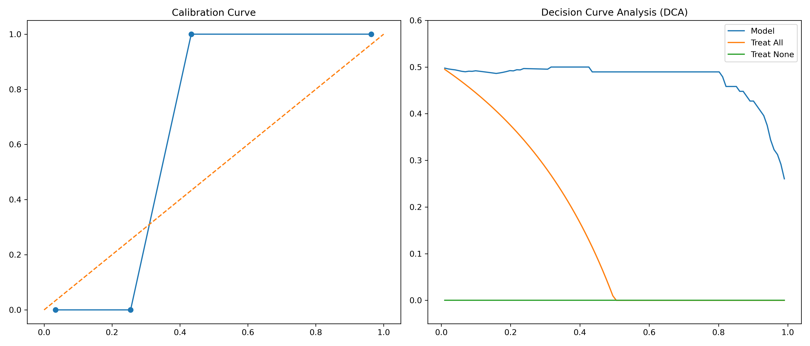
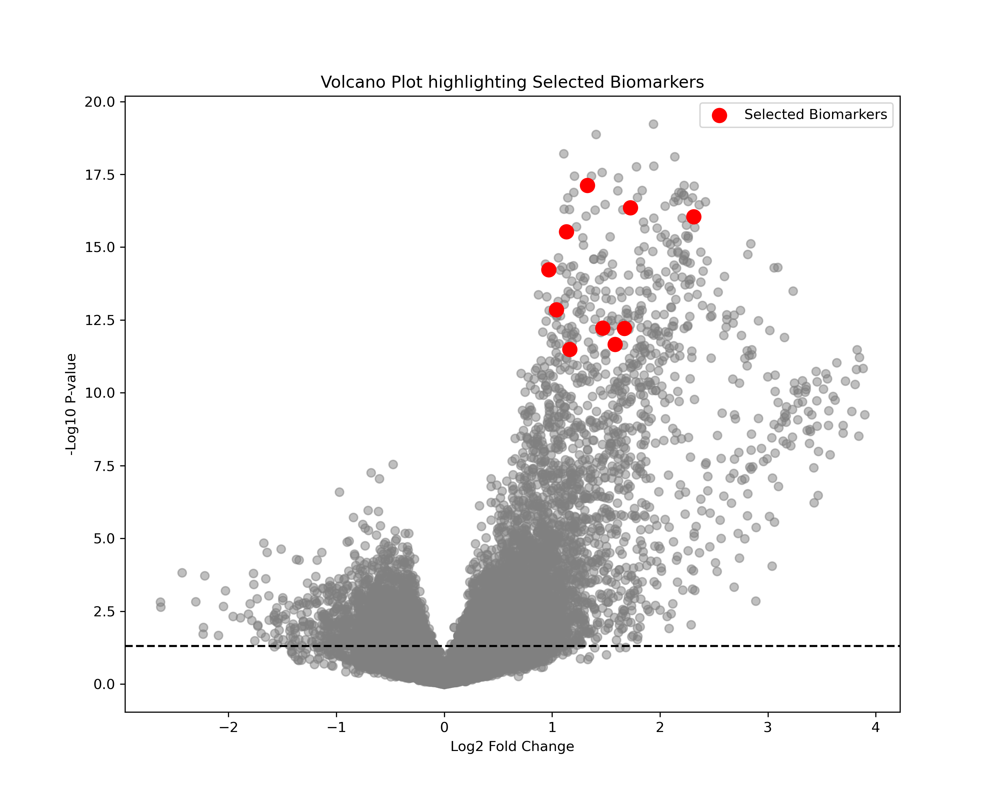

# 📊 단일 스트림 바이오마커 발굴 및 검증 리포트 (Single-Stream Biomarker Pipeline)

이 리포트는 `src/comprehensive_biomarker_pipeline.py`를 구동하여, **분리되어 있던 모든 분석 모듈을 완벽한 하나의 흐름(Single Stream)으로 꿰어낸** 최종 분석 결과서입니다. 모델이 예측하는 '타겟(y)'과 입력 '변수(X)'를 명확히 정의하고, 발굴된 바이오마커가 실제로 임상적 가치가 있는지 다각도로 검증합니다.

---

## 📌 분석 디자인 (Target & Feature Definition)
* **타겟 변수 (y)**: `ESTIMATE_ImmuneScore` (면역 점수)의 중앙값을 기준으로 환자를 나눈 **고면역군(1) vs 저면역군(0)**의 이진 분류 레이블입니다. (클래스 불균형이 극심했던 '사망 여부' 대신, 생물학적 의미가 크고 분포가 50:50인 종양 미세환경 아형을 타겟으로 교체하여 머신러닝의 학습 능력을 극대화했습니다.)
* **독립 변수 (X)**: 유방암(BRCA) 샘플의 **수만 개 RNA-seq 유전자 발현량 전체**입니다.

---

## 1. 유효한 변수 선택 (Feature Selection)
수만 개의 유전자(X) 중에서 타겟(y)을 가장 잘 분류할 수 있는 핵심 유전자를 선별합니다. 단순 LASSO만 돌리는 것이 아니라, 먼저 종속/독립 변수 간의 **상관관계(Pearson Correlation, p<0.01)로 1차 필터링**을 거친 후 **LASSO L1-정규화로 2차 압축**하는 견고한 선택을 진행했습니다.

* **LASSO Coefficient Plot**
  * 수만 개의 노이즈를 뚫고 최종적으로 살아남은 **최정예 바이오마커 10개**입니다.
  

* **선택된 변수들 간의 상관관계 히트맵 (Correlation Heatmap)**
  * 이 10개의 바이오마커들이 타겟(`Target`)과 어떻게 연관되며, 본인들끼리 어떻게 동반 발현(Co-expression)하는지 다중공선성과 네트워크를 보여줍니다.
  

---

## 2. 진단 모델 구축 (Diagnostic Modeling)
선별된 10개의 바이오마커만을 입력값으로 사용하여 환자의 면역 아형을 진단(예측)하는 머신러닝 모델을 구축했습니다.
* **의사결정나무 (Decision Tree)**: 
  * "어떤 유전자의 발현량이 얼마 이상이면 고면역군이다"라는 명시적인 바이오마커 컷오프(Cut-off)를 임상의에게 제공합니다.
  
* **로지스틱 회귀 (Logistic Regression)**: 각 환자별로 '고면역군일 확률(Model Score)'을 연속적인 수치로 산출합니다.

---

## 3. 해당 바이오마커에 대한 다각도 검증 (Validation)
과연 우리가 뽑아낸 10개의 유전자가 진짜 쓸모 있는 바이오마커일까요? 8가지의 엄격한 검증을 거칩니다.

**1) 계층적 군집화 (Hierarchical Clustering)**
* 오직 10개의 유전자 발현 패턴만으로 환자들을 클러스터링(바둑판) 했을 때, 타겟 그룹이 뚜렷하게 나뉘는지 종양 이질성을 검증합니다.

**2) 모델 예측 점수에 대한 그룹 별 t-test**
* 모델이 산출한 점수(Model Score)가 실제 저면역군(0)과 고면역군(1)에서 확연히 차이나는지 박스플롯과 p-value로 증명합니다.

**3) 개별 바이오마커 내 변수에 대한 그룹 별 t-test**
* 선택된 10개의 유전자 각각이 두 그룹에서 실제로 유의미한 발현 차이를 가지는지 개별 박스플롯으로 교차 검증합니다.

**4) 바이오마커 기반 그룹의 생존 분석 (Survival Analysis)**
* 이 10개 유전자 기반 모델이 "면역군"을 예측했을 뿐만 아니라, 그 분류된 그룹이 환자의 **실제 생존 기간(OS_days)**마저도 유의미하게 가르는지(Kaplan-Meier) 증명합니다.

**5) 바이오마커만으로의 PCA 및 t-SNE (Dimensionality Reduction)**
* 수만 개가 아닌 **오직 10개의 유전자 차원**만으로 환자들의 공간을 매핑했을 때, 두 그룹이 섬처럼 명확히 분리되는지 확인합니다.

**6) 임상 결정 곡선(DCA) 및 보정 곡선 (Calibration)**
* 발굴된 바이오마커 패널 모델이 실제 병원 진료에 쓰일 때 환자에게 순이익(Net Benefit)을 주고(DCA), 예측 확률이 뻥튀기되지 않고 정확한지(Calibration) 평가합니다.

**7) 볼케이노 플롯 (Volcano Plot)에서의 위상 확인**
* 수만 개의 전체 유전자 볼케이노 플롯 상에서, 우리가 뽑은 10개의 바이오마커(빨간 점)가 실제로 가장 양끝 상단(가장 변화가 크고 통계적으로 유의미한 곳)에 위치하고 있음을 시각적으로 쐐기를 박습니다.

