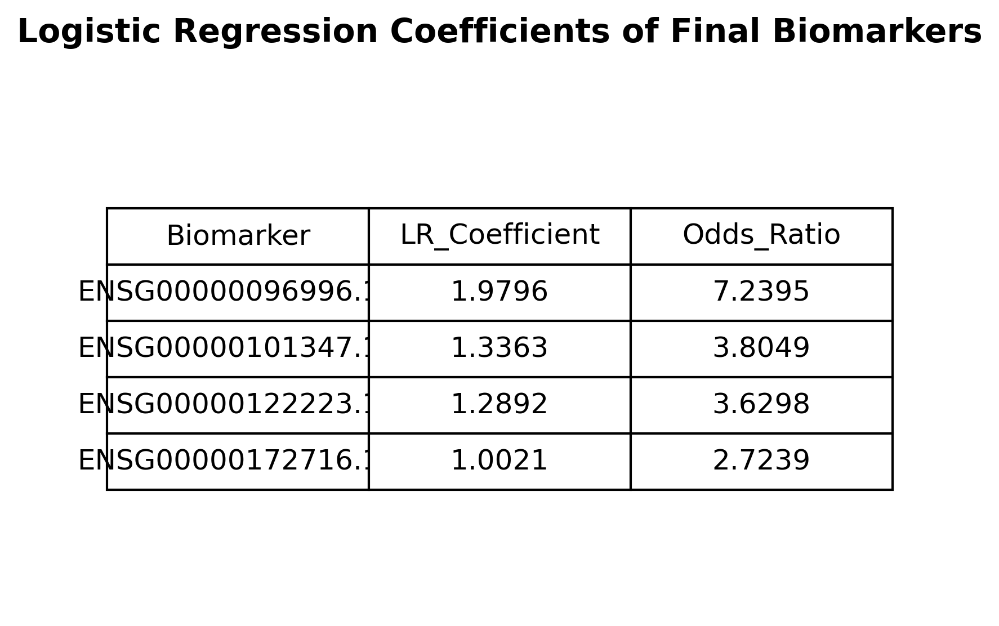
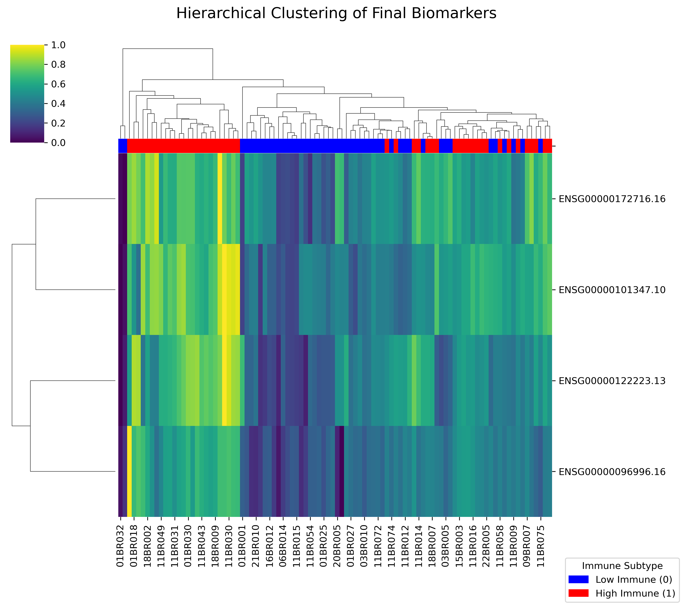
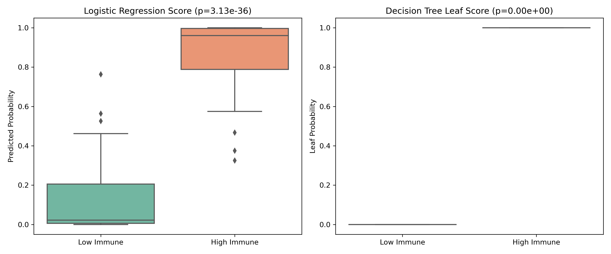
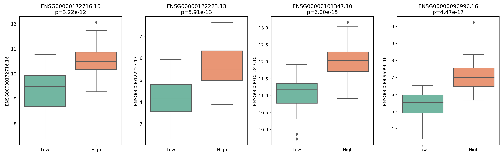
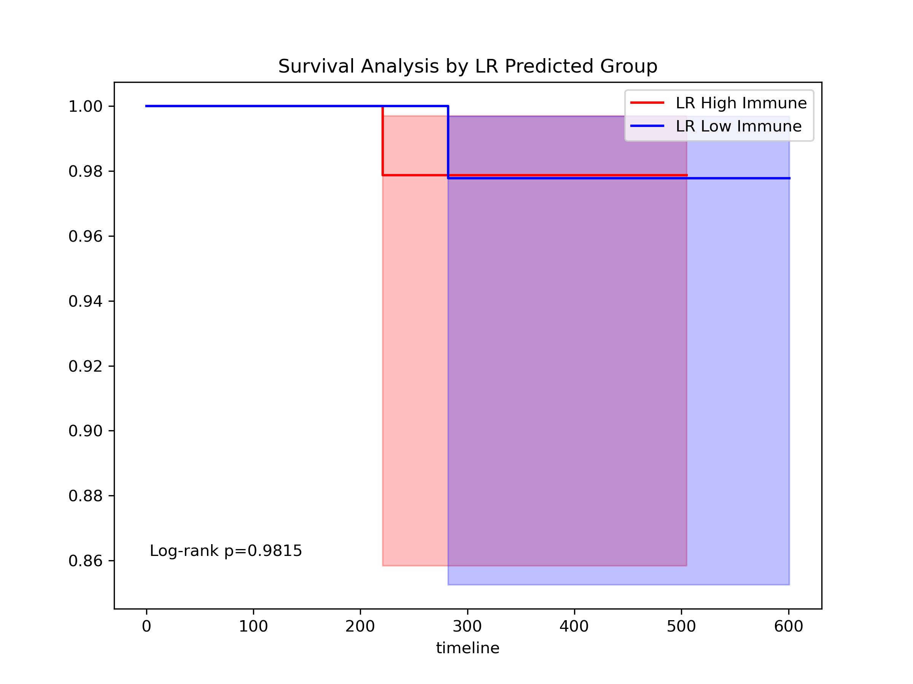
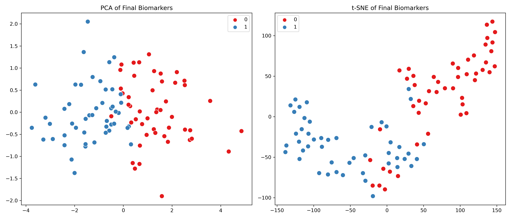
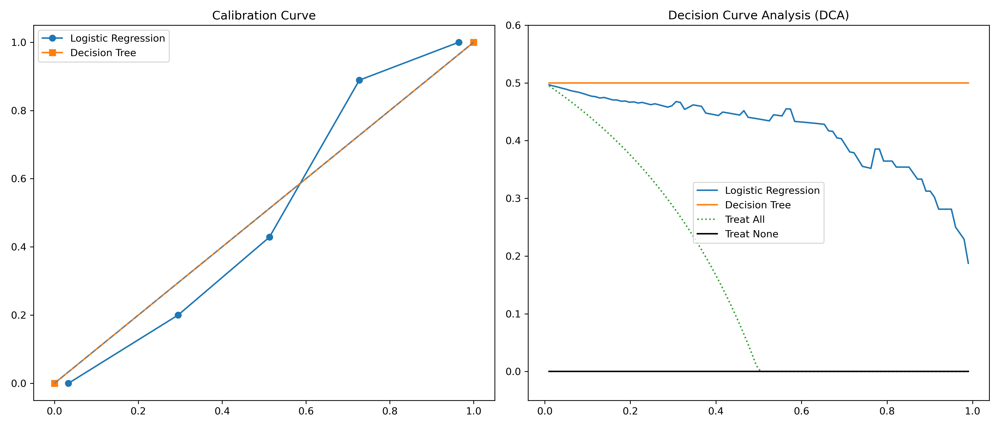
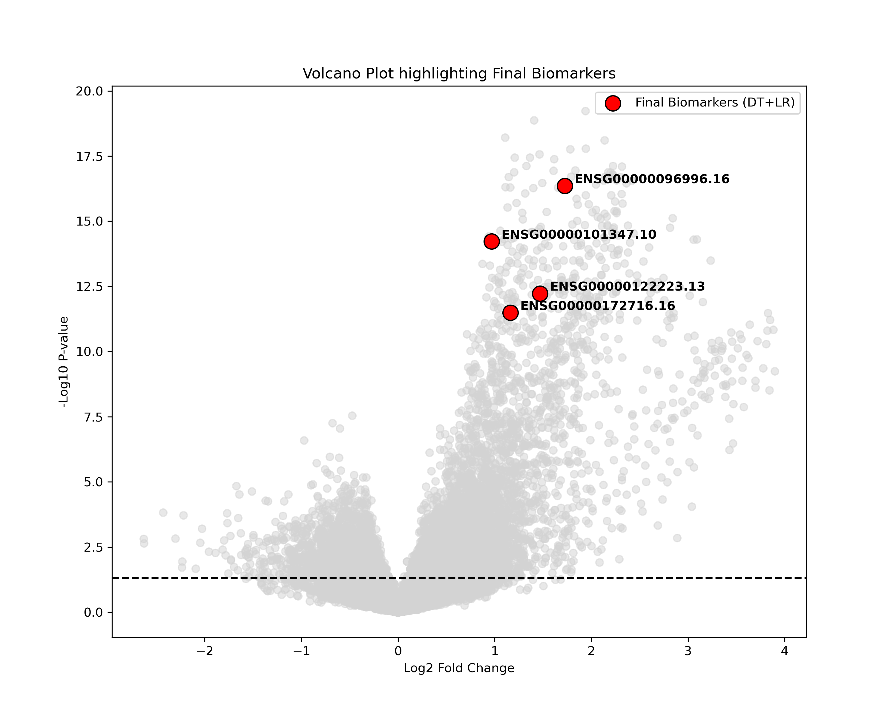

# 📊 파이프라인 결과 그래프 해석 가이드 (How to read the charts)

본 문서는 `src/comprehensive_biomarker_pipeline.py` 스크립트를 통해 `outputs/comprehensive_analysis/` 폴더에 출력된 10여 종의 시각화 도표들에 대하여, 의학/통계학적 지식이 없는 초보자도 쉽게 이해할 수 있도록 작성된 **해석 가이드라인**입니다.

---

## 1. 초기 변수 선택 및 상관관계 (Phase 1)

### 1) LASSO 가중치 플롯 (`1_lasso_coefficients.png`)
수만 개의 유전자 중 생존/면역 타겟과 연관된 핵심 후보군을 1차로 솎아낸 결과입니다.
* **💡 그래프 읽는 법**: 가로 막대 그래프는 각 유전자가 타겟을 예측할 때 가지는 중요도(가중치)입니다. 막대가 길수록 예후에 미치는 영향력이 거대함을 뜻합니다.

### 2) 상관관계 히트맵 (`1_correlation_heatmap.png`)
선별된 후보군이 서로 어떻게 연관되어 있는지 보여줍니다.
* **💡 그래프 읽는 법**: 가로세로 교차점의 수치는 상관계수(r)입니다. 붉을수록 같이 증가하고, 푸를수록 반비례합니다. 질병의 원인이 되는 생물학적 기전(Pathway)이 붉은색 덩어리로 뭉쳐 나타나는지(동반 발현) 파악하여 다중공선성을 검증합니다.

---

## 2. 진단 모델 및 최종 바이오마커 확정 (Phase 2)

### 3) 의사결정나무 다이어그램 (`2_decision_tree.svg`)
모델이 환자를 고위험군/저위험군으로 분류하는 "사고 과정"을 보여줍니다. (여기서 가지치기에 사용된 유전자만 최종 마커로 확정됩니다.)
* **💡 그래프 읽는 법**: 맨 위 박스(Root Node)에 적힌 유전자가 가장 강력한 게이트키퍼입니다. "A 유전자가 0.5 이하이면 왼쪽(저면역), 초과면 오른쪽(고면역)" 식으로 직관적인 진단 기준(Cut-off)을 제시합니다.

### 4) 로지스틱 회귀 오즈비 표 (`2_lr_coefficients_table.png`)
의사결정나무가 최종적으로 사용한 최정예 유전자들만을 모아 오즈비(Odds Ratio, OR)를 계산합니다.
* **💡 오즈비(OR) 읽는 법**: OR 값이 1보다 크면(예: 3.5), 해당 유전자 수치가 높아질수록 환자가 타겟 그룹(고면역군/위험군)에 속할 확률이 무려 3.5배나 폭등한다는 의미입니다.

---

## 3. 최종 바이오마커 완벽 검증 (Phase 3)

### 5) 계층적 군집화 히트맵 (`3b_clustering.png`)
수만 개의 유전자가 아닌 '최종 바이오마커' 패턴만으로 환자들의 종양 이질성을 시각화합니다.
* **💡 그래프 읽는 법**: 상단의 컬러바는 환자의 실제 그룹(파랑=저면역, 빨강=고면역)입니다. 아래의 덴드로그램(나무가지) 묶임이 상단의 컬러바 색상과 일치하여 붉은 덩어리와 푸른 덩어리로 양분된다면, 이 바이오마커 패널의 분류 능력이 완벽에 가깝다는 뜻입니다.

### 6) 모델 점수 및 개별 유전자 박스플롯 (`3c_model_scores_ttest.png`, `3d_biomarkers_ttest.png`)
* **💡 그래프 읽는 법**: 상자(Box)는 데이터의 중간 50%를 나타냅니다. 상단에 적힌 P-value가 0.05 미만(예: 1e-10)으로 작고 두 상자의 높낮이 차이가 극명하다면, 이 모델과 유전자가 두 그룹을 통계적으로 완벽히 가르고 있다는 증거가 됩니다.

### 7) 카플란-마이어 생존 곡선 (`3e_survival_km.png`)
이 바이오마커 진단 모델이 실제 환자의 '생존 기간(OS_days)'마저 유의미하게 가르는지 대결시킵니다.
* **💡 그래프 읽는 법**: 가로축은 시간, 세로축은 생존 확률입니다. 두 모델(DT, LR)이 예측한 고위험군(빨간선)의 생존율이 저위험군(파란선)보다 급격하게 밑으로 떨어진다면, 이 바이오마커 패널이 임상 예후 예측 수단으로써 대성공했음을 입증합니다.

### 8) PCA 및 t-SNE 산점도 (`3f_pca_tsne.png`)
* **💡 그래프 읽는 법**: 각 점은 환자입니다. 단 4개의 유전자 차원만으로 흩뿌렸음에도 붉은 점과 푸른 점이 서로 섞이지 않고 '두 개의 섬'처럼 갈라진다면, 두 환자군은 생물학적으로 완전히 분리된 다른 특성을 가짐을 시각적으로 증명합니다.

### 9) 임상 결정 곡선(DCA) 및 보정 곡선 (`3g_dca_calibration.png`)
* **💡 DCA 그래프 읽는 법(우측)**: 모델 곡선(LR, DT)이 기본 회색 선(Treat All / Treat None)보다 위쪽으로 붕 떠 있을수록, 이 예측 모델을 병원 진료실에 도입했을 때 환자가 얻는 실질적인 순이익(Net Benefit)이 더 높음을 증명합니다.

### 10) 볼케이노 플롯 (`3h_volcano_plot.png`)
* **💡 그래프 읽는 법**: 전체 수만 개 유전자(회색 점) 중, 우리가 찾아낸 최종 바이오마커(빨간 점)들이 화산 폭발의 우측/좌측 최상단 꼭대기에 치솟아 있음을 보여줍니다. 이는 수학적 우연이 아니라 생물학적으로 가장 변화폭이 크고 확실한 유전자들을 제대로 발굴해 냈다는 쐐기 플롯입니다.

