# 의료 데이터 분석 방법론 및 결과 해석 가이드

이 문서는 본 프로젝트의 `src/` 스크립트를 통해 산출되는 분석 결과(통계치 및 시각화 도구)들의 입력/출력 기준과 의료 통계학적 의미를 종합적으로 설명합니다.
*(※ 아래 첨부된 시각화 이미지들은 파이썬 스크립트 실행 후 `outputs/` 폴더에 생성된 파일들입니다.)*

---

## 1. 그룹 간 비교 분석 (`01_comparative_analysis.py`)
* **입력**: 범주형 환자 특성(예: 조직학적 등급, 임상 병기)과 이와 비교하고자 하는 연속형 변수(예: 특정 유전자의 RNA 발현량).
* **출력**: Student's t-test / Mann-Whitney U test (두 집단), ANOVA / Kruskal-Wallis test (세 집단 이상)의 P-value 및 P-value가 표기된 Box Plot.
* **의료 통계학적 의미**: 특정 바이오마커(유전자/단백질)의 발현이 환자의 병기나 등급에 따라 통계적으로 유의미한 차이를 보이는지(P < 0.05)를 검증합니다. Box plot 상단의 P-value 바(bar)는 두 집단 간의 발현 차이가 우연인지 실제 생물학적 의미가 있는지를 직관적으로 보여주며, 질환의 악성화 후보 인자를 발굴하는 근거로 활용됩니다.

*(예시: P-value Annotated Box Plot)*
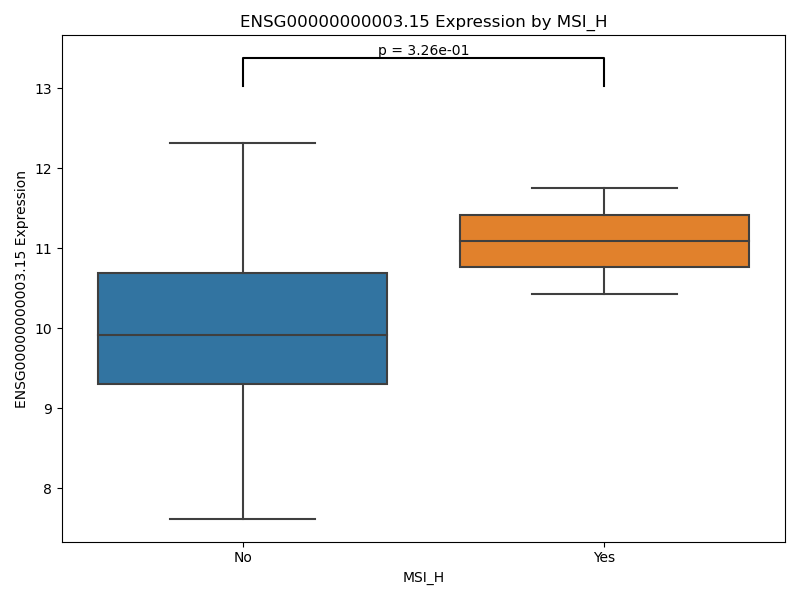

## 2. 범주형 데이터 및 상관관계 분석 (`02_categorical_correlation.py`)
* **입력**: 범주형 분석(두 범주형 변수), 상관 분석(두 연속형 변수).
* **출력**: Chi-Square/Fisher's Exact 검정의 P-value, Pearson/Spearman 상관계수 및 추세선이 포함된 Scatter Plot.
* **의료 통계학적 의미**: 교차 분석을 통해 환자의 임상 병리적 인자들 사이에 독립성이 있는지 확인합니다. 상관 분석 산점도(Scatter Plot) 상의 회귀선(Regression line)과 상관계수(r)는 두 바이오마커가 체내에서 동일한 생물학적 경로를 공유하여 동반 상승/하강하는지 선형적 강도(-1 ~ +1)를 보여줍니다.

*(예시: 상관분석 Scatter Plot)*
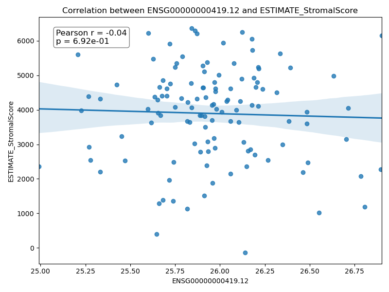

## 3. 생존 및 예후 분석 (`03_survival_analysis.py`)
* **입력**: 환자의 추적 관찰 시간(`OS_days`), 사망 혹은 재발 발생 여부(`OS_event`).
* **출력**: Kaplan-Meier Plot, Log-rank test P-value, Cox Proportional Hazards 모델의 Hazard Ratio(HR).
* **의료 통계학적 의미**: 특정 변수가 환자의 생존에 미치는 예후적 가치를 평가합니다. Kaplan-Meier 플롯은 시간에 따른 생존 확률의 추이를 직관적으로 보여주며, Cox 회귀 모델은 위험비(HR)를 통해 사망 위험의 증감을 산출합니다.

*(예시: Kaplan-Meier Survival Curve)*
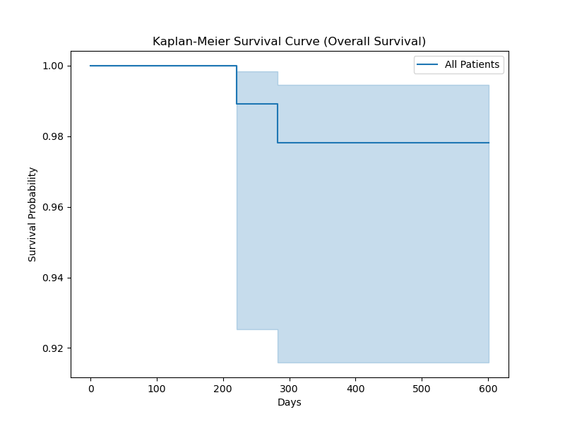

## 4. 진단 및 예측 모델링 (`04_predictive_modeling.py`)
* **입력**: 다변량 독립변수(RNA발현, 나이, 면역점수 등) 및 이분법적 타겟 종속변수.
* **출력**: 로지스틱 회귀 모델의 Odds Ratio 및 Accuracy, 의사결정나무 시각화 다이어그램.
* **의료 통계학적 의미**: 여러 바이오마커 및 임상 지표를 결합하여 특정 질환 상태를 진단하거나 예측합니다. 의사결정나무는 명시적인 컷오프(Cut-off) 기준을 제시해주어 임상 의사결정을 돕습니다.

*(예시: 의사결정나무 다이어그램)*
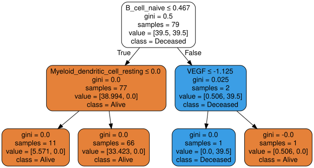

## 5. 검사법 간 일치도 및 동반진단 (`05_concordance_analysis.py`)
* **입력**: 동일한 환자/샘플을 두 가지 다른 기기, 진단 키트, 혹은 의사가 측정한 연속형/범주형 결과.
* **출력**: Cohen's Kappa 계수, Bland-Altman Plot.
* **의료 통계학적 의미**: Kappa 계수는 범주형 판독 간의 우연을 배제한 일치도를 나타내며, Bland-Altman Plot은 두 연속형 측정치 간의 구조적 바이어스가 존재하는지, 오차 허용 범위 내에 들어오는지를 시각적으로 검증합니다.

*(예시: Bland-Altman Plot)*
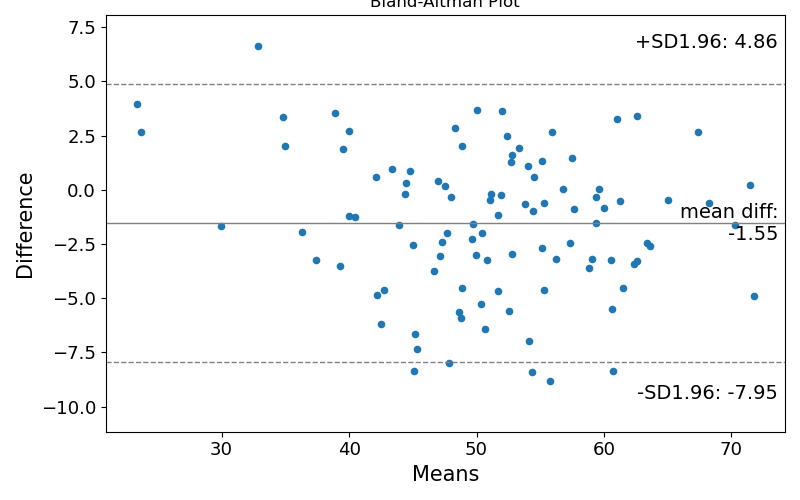

## 6. 인과 추론 및 혼란 인자 통제 (`06_causal_inference.py`)
* **입력**: 환자의 처치 그룹(예: 신약 치료군 vs 기존 치료군), 다양한 임상 배경 변수들(나이, 병기 등).
* **출력**: 성향점수매칭(PSM) 후의 집단 데이터, 러브 플롯.
* **의료 통계학적 의미**: 후향적 임상 관찰 연구에서 선택 편향을 통제합니다. 러브 플롯은 매칭 후 집단 간 임상적 배경 변수의 불균형이 해소되었음을 통계적으로 증명하는 근거가 됩니다.

*(예시: 러브 플롯)*
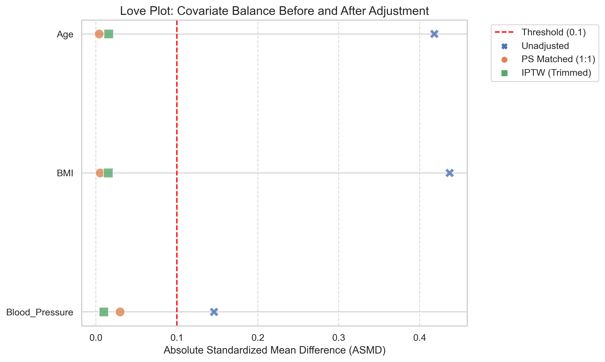

## 7. 고급 임상 시각화 도구 (`07_advanced_visualization.py`)

**1) 예측 노모그램 (Nomogram)**
회귀 모델 수식을 의사나 환자가 점수표 형태로 쉽게 더해서 최종 발생 확률을 산출하게 해주는 도구입니다.
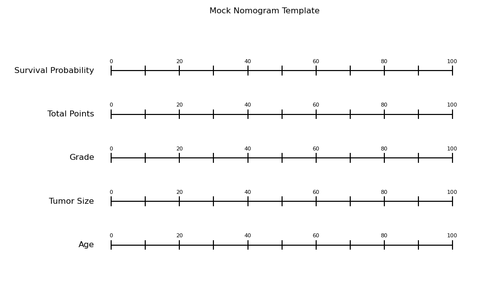

**2) 보정 곡선 (Calibration Curve)**
모델이 예측한 확률 값과 실제 발생 빈도가 얼마나 정확히 일치하는지(45도 직선에 가까울수록 우수) 평가합니다.
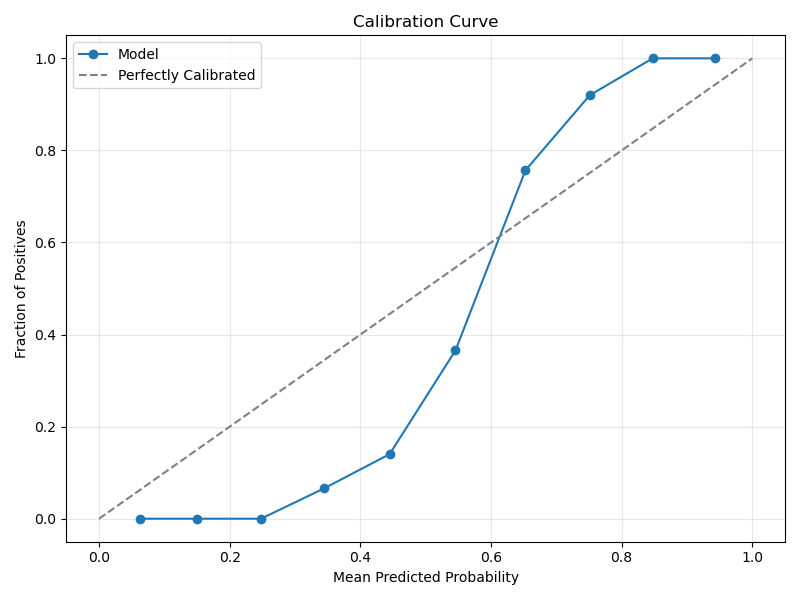

**3) 임상 결정 곡선 (DCA Plot)**
예측 모델을 실제 임상 현장에 적용했을 때 얻을 수 있는 순이익(Net Benefit)을 시각화합니다.
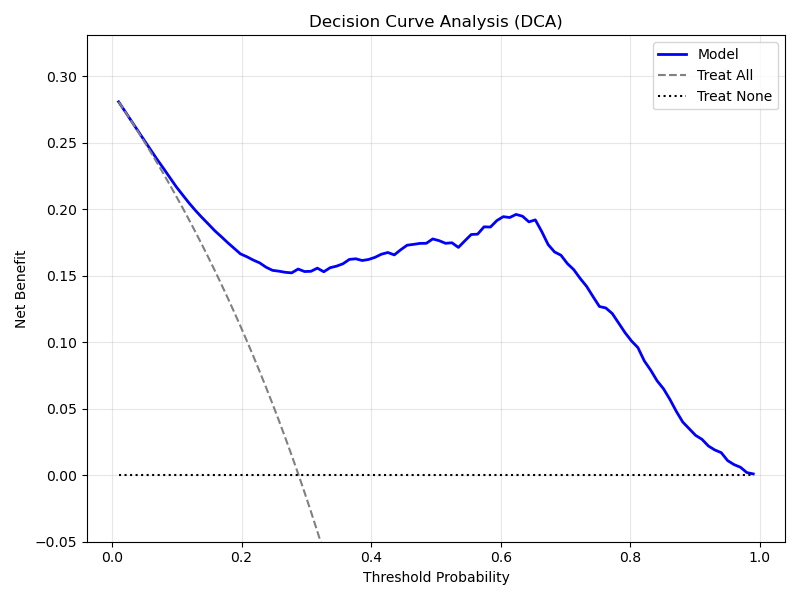

**4) 볼케이노 플롯 (Volcano Plot)**
변화량(Fold Change)과 통계적 유의성(-log10 P-value)을 나타내어 핵심 차발현 유전자(DEG)를 한눈에 선별합니다.
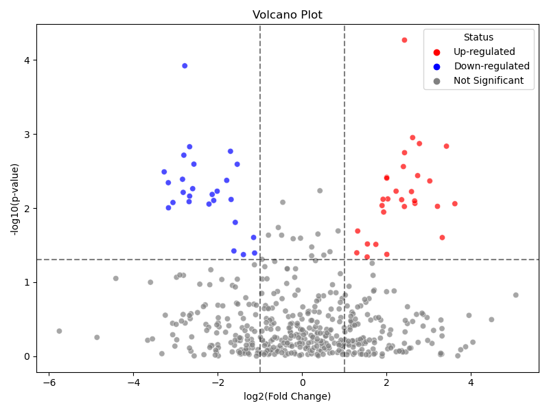

**5) 구획별 버블 플롯 (Bubble Plot)**
종양 구획과 기질 구획 간의 다양한 단백질 발현 정도를 색상과 크기로 다차원 비교합니다.
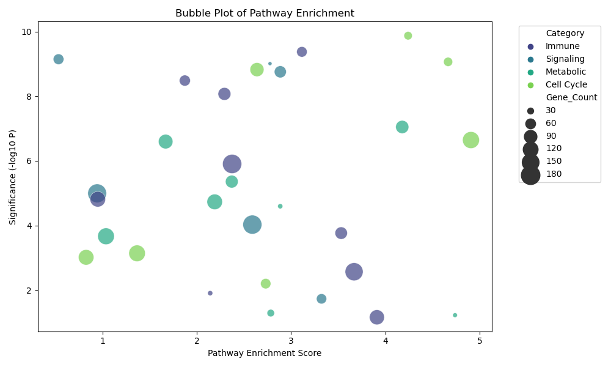

**6) 설명 가능한 AI (Grad-CAM)**
인공지능 모델이 판단을 내릴 때 이미지의 어느 영역을 활성화(집중)해서 보았는지 시각적으로 추적합니다.
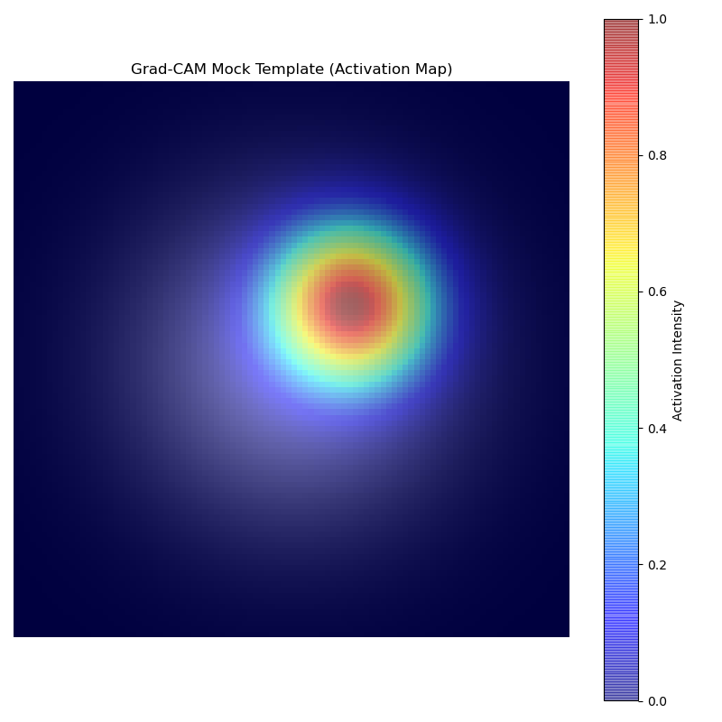

## 8. 계층적 군집화 (Hierarchical Clustering) (`08_hierarchical_clustering.py`)
* **입력**: 다수의 환자(Case) 샘플과 선별된 상위 바이오마커(유전자/단백질) 발현 매트릭스, 그리고 환자의 임상 그룹(예: 고병기/저병기) 정보.
* **출력**: 환자와 바이오마커 양축으로 군집화된 히트맵(Clustermap).
* **의료 통계학적 의미**: 개별 환자들 사이의 종양 이질성(Tumor Heterogeneity)을 전체 유전자 발현 패턴 단위로 그룹화합니다. 임상 그룹(Color bar)과 군집화된 가지(Dendrogram)가 어떻게 묶이는지를 확인하여, 특정 바이오마커 군(Cluster)이 특정 임상 병기나 생존 그룹 환자들에게서만 독특하게 과발현되는 패턴을 분리해 냅니다.

*(예시: Hierarchical Clustering Clustermap)*
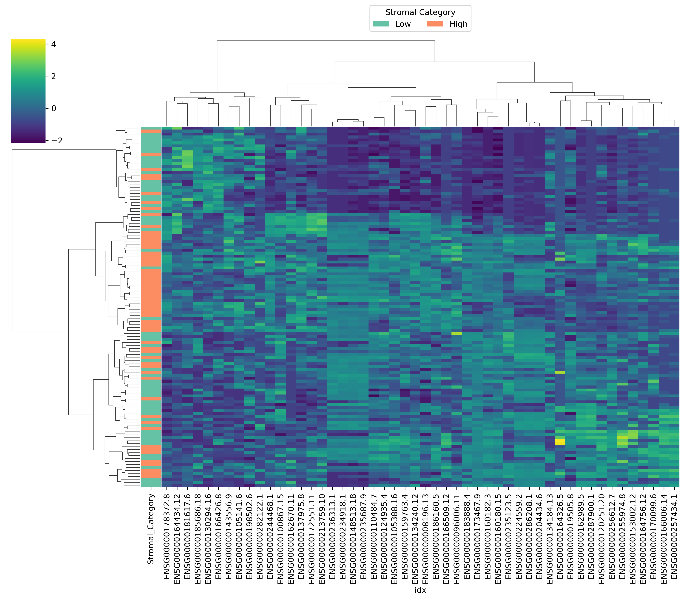
