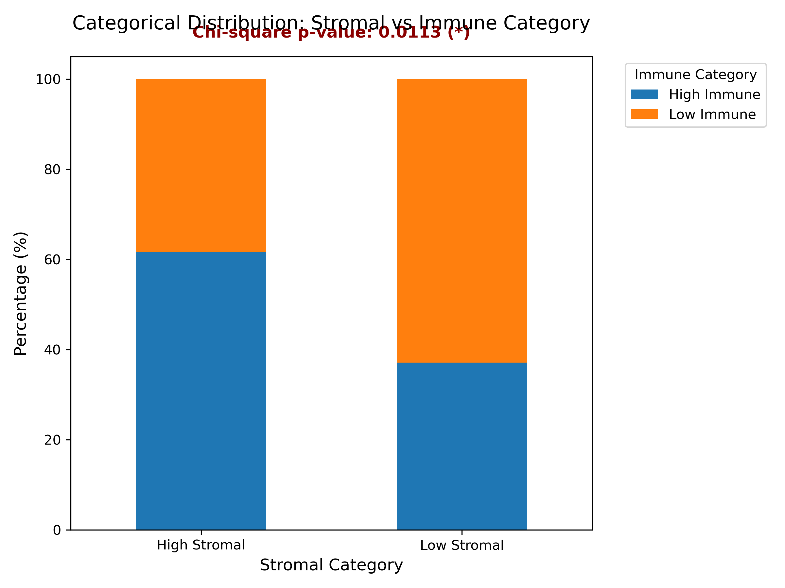
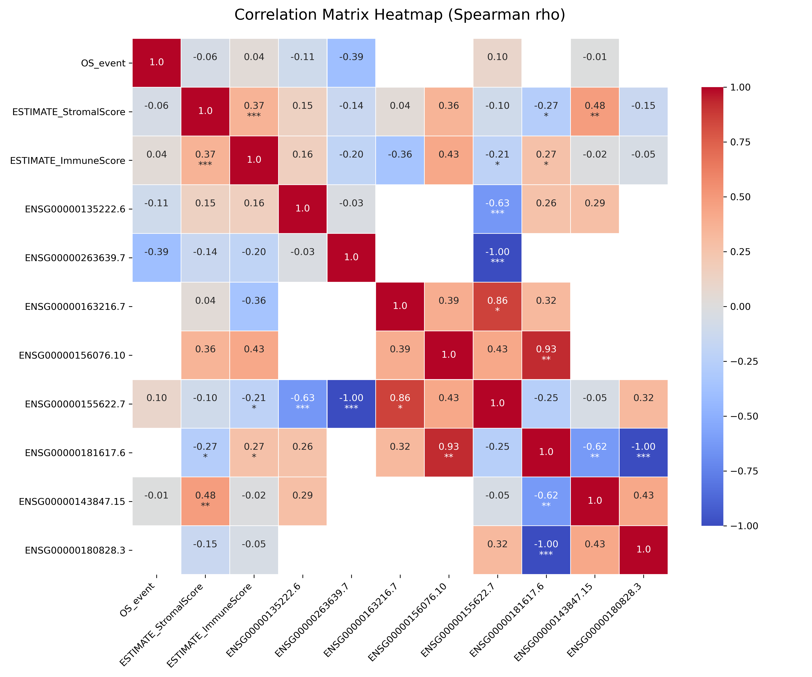
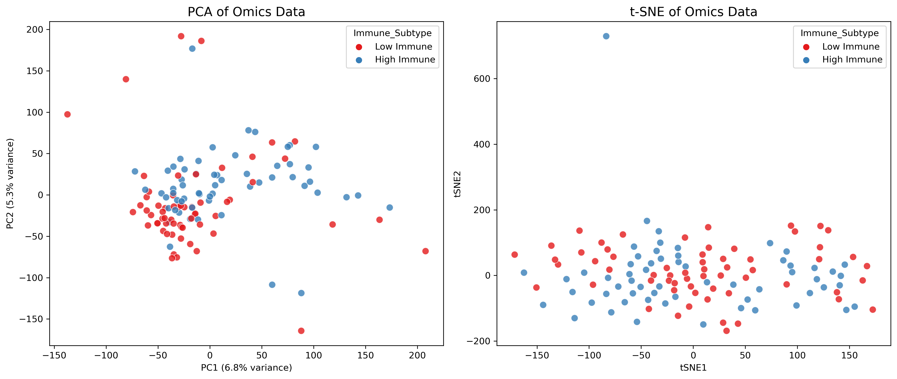
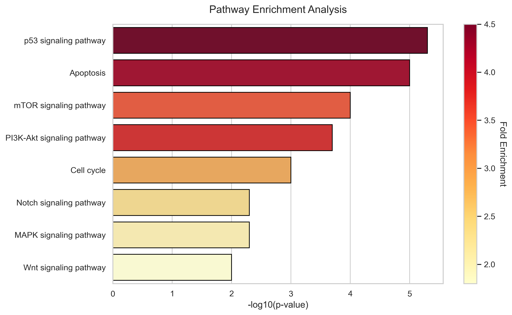
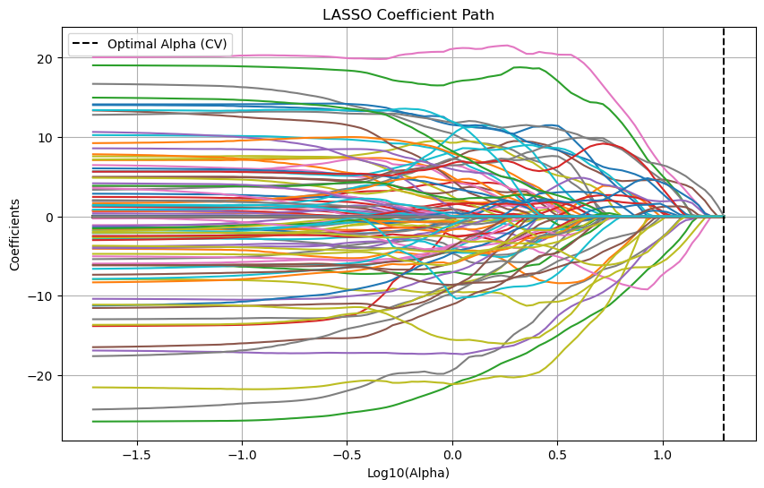

# 의료 데이터 분석 방법론 및 결과 해석 가이드

이 문서는 본 프로젝트의 `src/` 스크립트를 통해 산출되는 분석 결과(통계치 및 시각화 도구)들의 입력/출력 기준과 의료 통계학적 의미, 그리고 **초보자도 쉽게 이해할 수 있는 차트 읽는 법**을 종합적으로 설명합니다.
*(※ 아래 첨부된 시각화 이미지들은 파이썬 스크립트 실행 후 `outputs/` 폴더에 생성된 파일들입니다.)*

---

## 1. 그룹 간 비교 분석 (`01_comparative_analysis.py`)
* **입력**: 범주형 환자 특성(예: 임상 병기)과 연속형 변수(예: 특정 유전자 발현량).
* **출력**: P-value가 표기된 상자 수염 그림(Box Plot).
* **의료 통계학적 의미**: 특정 바이오마커가 환자의 병기에 따라 유의미한 발현 차이를 보이는지 검증하여, 악성화 후보 인자를 발굴합니다.

**💡 그래프 읽는 법:**
* **상자(Box)**: 데이터의 중간 50%(25백분위~75백분위)가 모여 있는 구간입니다. 상자 안의 가로선은 **중앙값(Median)**을 의미합니다.
* **위아래 선(Whisker)**: 데이터의 대략적인 최소/최대 범위를 나타냅니다.
* **상단의 꺾쇠 선(Bracket)과 P-value**: 두 집단의 상자 높낮이 차이가 '우연'인지 '진짜 통계적 의미가 있는지'를 나타냅니다. 
  * `ns` (Not Significant): 차이가 통계적으로 무의미하다는 뜻입니다.
  * `*` (p < 0.05), `**` (p < 0.01): 별표가 있으면 두 집단 간의 발현량 차이가 95% 또는 99% 이상의 확률로 **진짜 차이가 있음**을 의미합니다.

## 2. 범주형 데이터 및 상관관계 분석 (`02_categorical_correlation.py`)
* **입력**: 범주형 분석(예: 특정 면역 점수의 상/하위 그룹), 상관 분석(여러 연속형 바이오마커, 임상 점수 및 생존 레이블 `OS_event`).
* **출력**: P-value가 표기된 누적 막대 그래프(Stacked Bar Plot) 및 다중 변수 상관관계 히트맵(Correlation Matrix Heatmap).
* **의료 통계학적 의미**:
  * **다중공선성(Multicollinearity) 검증**: 기계학습/생존 모델(로지스틱 회귀, LASSO, Cox 등)에 변수를 넣기 전, 서로 너무 비슷하게 움직이는(r > 0.7) 변수들을 찾아내어 모델의 붕괴를 막고 핵심 유전자만 걸러냅니다.
  * **생물학적 동반 발현(Co-expression)**: 두 바이오마커 간의 상관계수가 높다면, 이들이 체내에서 동일한 생물학적 기전(Pathway)이나 단백질 복합체를 공유한다는 강력한 단서가 됩니다.
  * **임상 레이블(Label)과의 직접 연관성**: `OS_event`(사망 여부)와 같은 최종 임상 레이블을 히트맵에 함께 포함시켜, 어떤 유전자나 점수(예: `StromalScore`)가 실제 환자의 생존에 가장 강력하게 직결되는지 1차원적으로 빠르게 탐색할 수 있습니다.

**💡 그래프 읽는 법:**
* **누적 막대 그래프 (Categorical Barplot)**: 
  * 가로축은 그룹 A(예: 저기질군 vs 고기질군), 색상은 그룹 B(예: 고면역군 vs 저면역군)의 비율을 나타냅니다.
  * 막대의 색상 비율이 확연히 다르다면 두 그룹 간에 강한 연관성이 있다는 뜻이며, 상단의 **Chi-square P-value**가 0.05 미만이면 우연이 아님을 통계적으로 입증합니다.
* **상관관계 히트맵 (Correlation Heatmap)**:
  * 가로축과 세로축이 만나는 칸(Cell)에 있는 수치가 바로 상관계수(r)입니다.
  * **색상**: 붉은색에 가까울수록 강한 양의 상관관계(동반 상승), 푸른색에 가까울수록 강한 음의 상관관계(반비례)를 띱니다.
  * **별표(`*`)**: `*` (p<0.05), `**` (p<0.01), `***` (p<0.001) 등 별표가 붙어 있는 칸은 그 상관관계가 통계적으로 매우 확고하다는 뜻입니다. 별이 없는 칸은 상관관계가 없거나 노이즈일 확률이 큽니다.
  * **레이블 연관성**: 히트맵의 첫 번째 줄/칸인 `OS_event` 라인을 가로(또는 세로)로 쭉 읽어보시면, 붉거나 푸르게 색이 칠해지고 별표가 붙은 유전자들이 곧 "환자 생존(Label)과 가장 밀접한 진짜 마커"임을 찾아낼 수 있습니다.

## 3. 생존 및 예후 분석 (`03_survival_analysis.py`)
* **입력**: 환자의 추적 관찰 기간과 사망/재발 여부.
* **출력**: 카플란-마이어 생존 곡선 (Kaplan-Meier Plot).
* **의료 통계학적 의미**: 특정 바이오마커가 환자의 생존에 미치는 예후적 가치(Hazard Ratio)를 시각적으로 평가합니다.

**💡 그래프 읽는 법:**
* **가로축(X-axis)**: 암 진단 또는 수술 후 경과한 시간(일/월/년)입니다.
* **세로축(Y-axis)**: 해당 시점까지 살아있는 환자의 비율(Survival Probability, 1.0 = 100% 생존)입니다.
* **계단식 하락**: 선이 뚝 떨어지는 지점은 해당 시점에 환자가 '사망(이벤트 발생)'했음을 의미합니다.
* **세로 틱(Tick / + 표시)**: 중도 절단(Censored)된 환자입니다. (연구 기간 종료, 병원 방문 중단 등으로 추적할 수 없게 된 환자)
* **두 선의 간격**: 파란 선(예: 고면역군)이 주황 선(저면역군)보다 위쪽에 위치한다면, 고면역군 환자들의 생존율이 더 높고 예후가 좋다는 뜻입니다.

## 4. 진단 및 예측 모델링 (`04_predictive_modeling.py`)
* **입력**: 환자의 다양한 임상 및 오믹스 지표.
* **출력**: 의사결정나무(Decision Tree) 다이어그램.
* **의료 통계학적 의미**: 모델이 환자를 진단하는 '사고 과정'을 시각화하여, 진단에 사용할 명시적인 기준치(Cut-off)를 의사에게 제공합니다.

**💡 그래프 읽는 법:**
* **최상단 박스 (Root Node)**: 환자를 분류할 때 가장 먼저 고려해야 할 가장 중요한 조건(예: 면역 세포 수치 <= 0.18)을 나타냅니다.
* **조건 검사**: 환자의 데이터가 맨 위 조건식에 부합하면 `True(왼쪽)` 화살표를 타고 내려가고, 틀리면 `False(오른쪽)` 화살표를 탑니다.
* **맨 아래 박스 (Leaf Node)**: 화살표를 끝까지 따라 내려가 도착한 마지막 박스가 이 환자의 **최종 예측 결과(생존 혹은 사망 등)**가 됩니다. 박스의 색상이 진할수록 해당 예측의 확신도(순도)가 높다는 뜻입니다.

## 5. 검사법 간 일치도 및 동반진단 (`05_concordance_analysis.py`)
* **입력**: 두 기기나 두 명의 의사가 측정한 수치.
* **출력**: 블랜드-알트만 플롯 (Bland-Altman Plot).
* **의료 통계학적 의미**: 두 진단법 사이에 구조적인 편향(Bias)이 존재하는지 검증하여, 새 진단 기기를 기존 기기로 대체할 수 있는지 평가합니다.

**💡 그래프 읽는 법:**
* **가로축(X-axis)**: 두 기기가 측정한 수치의 '평균'입니다. (오른쪽일수록 종양이 큰 환자)
* **세로축(Y-axis)**: 두 기기가 측정한 수치의 '차이(기기 A - 기기 B)'입니다.
* **가운데 가로선 (Bias)**: 모든 점들의 Y축 평균값입니다. 이 선이 0에 가까우면 두 기기가 평균적으로 똑같이 측정한다는 뜻입니다. 만약 +5에 있다면 기기 A가 항상 기기 B보다 5만큼 높게 측정하는 편향이 있다는 뜻입니다.
* **위아래 점선 (Limits of Agreement)**: 95%의 점들이 이 두 점선 사이에 들어옵니다. 이 점선의 폭이 좁을수록 두 기기의 측정값이 놀라울 정도로 일치한다는 뜻입니다.

## 6. 인과 추론 및 혼란 인자 통제 (`06_causal_inference.py`)
* **입력**: 환자의 처치 그룹(예: 신약 치료군 vs 기존 치료군), 다양한 임상 배경 변수들(나이, 병기 등 환자 기저 특성).
* **출력**: 성향점수매칭(PSM) 후의 집단 데이터, 러브 플롯 (Love Plot).
* **의료 통계학적 의미**: 성향점수매칭(PSM) 후, 치료군과 대조군 간의 기저 특성 불균형(선택 편향)이 성공적으로 해소되었는지 증명합니다.

**💡 그래프 읽는 법:**
* **가로축(X-axis)**: 환자 특성(예: 나이, 병기)의 불균형 정도(SMD)를 나타냅니다. 0에 가까울수록 두 그룹이 완벽하게 똑같은 조건이라는 뜻입니다.
* **세로축(Y-axis)**: 나이, 성별, 기저 질환 등 맞춰야 할 통제 변수들의 목록입니다.
* **점의 이동**: 파란색 점(Unadjusted, 매칭 전)은 0.1(점선) 밖에 멀리 떨어져 있어 두 그룹이 불공평한 조건이었음을 나타냅니다. 반면 주황색 점(Adjusted, 매칭 후)이 **모두 0.1 점선 안쪽(0에 가깝게)으로 들어왔다면**, "비로소 두 그룹의 조건이 공평해져 통계적 신뢰도가 확보되었다"고 해석합니다.

## 7. 고급 임상 시각화 도구 (`07_advanced_visualization.py`)
* **입력**: 모델링 및 다변량 회귀 분석 결과값, 전사체 분석(DEG) 결과표(Fold change & P-value) 등.
* **출력**: 노모그램, 보정 곡선, DCA 곡선, 볼케이노 플롯, 버블 플롯, Grad-CAM.
* **의료 통계학적 의미**: 논문 출판 품질에 맞게 고도화된 예측 모델의 성능 평가 및 핵심 바이오마커들을 시각적으로 선별하여 설득력을 높입니다.

**1) 예측 노모그램 (Nomogram)**
**💡 그래프 읽는 법 (선들의 의미):**
그림의 점선은 **가상의 환자 A**가 생존 확률을 계산하는 예시입니다.
1. **각 변수의 점수 구하기 (위로 긋기)**: 
   - **🔴 빨간선 (Age)**: 환자 나이가 60세일 때, 위쪽 `Points` 축을 향해 선을 그으면 **약 45점**을 얻습니다.
   - **🔵 파란선 (Tumor Size)**: 종양 크기가 4cm일 때, 위로 선을 그어 **약 32점**을 얻습니다.
   - **🟢 녹색선 (Grade)**: 종양 등급이 3일 때, 위로 선을 그어 **80점**을 얻습니다.
2. **총점으로 생존율 도출 (아래로 긋기)**:
   - 환자의 총점은 45 + 32 + 80 = **157점**입니다. 
   - 아래쪽 `Total Points` 축에서 157점을 찾은 뒤, 맨 아래 축(`Survival Prob`)을 향해 **아래로** 선을 내리면 이 환자의 최종 예측 생존 확률을 정확히 읽을 수 있습니다.

**2) 임상 결정 곡선 (DCA Plot)**
**💡 그래프 읽는 법:**
* 가로축은 "치료를 결심하는 환자의 위험도 기준치"이고, 세로축은 치료를 통해 얻는 "실질적 순이익(Net Benefit)"입니다.
* 가로선(회색)은 "아무도 치료하지 않았을 때", 우하향하는 대각선(회색)은 "무조건 모두 치료할 때"의 이익입니다.
* 모델의 예측 곡선(주황색/파란색)이 이 **두 개의 기본 회색 선보다 더 높은 곳에 붕 떠 있다면**, 의사의 감각으로 모두 치료하거나 안 하는 것보다 "이 예측 모델을 믿고 치료 대상을 고르는 것이 환자에게 더 이득이다"라는 점을 증명합니다.

**3) 보정 곡선 (Calibration Curve)**
**💡 그래프 읽는 법:**
* 모델이 예측한 확률 값과 실제 발생 빈도가 얼마나 정확히 일치하는지 평가합니다. 45도 점선에 가까울수록 예측이 정확합니다.

**4) 볼케이노 플롯 (Volcano Plot)**
**💡 그래프 읽는 법:**
* **가로축(Log2 Fold Change)**: 기준선(0)을 중심으로 오른쪽으로 갈수록 발현량이 크게 증가한 유전자, 왼쪽으로 갈수록 크게 감소한 유전자입니다.
* **세로축(-Log10 P-value)**: 높이 올라갈수록 통계적으로 매우 신뢰할 수 있는(P값이 극도로 작은) 결과라는 뜻입니다.
* 따라서 화산 폭발처럼 **오른쪽 제일 위(붉은 점)**와 **왼쪽 제일 위(푸른 점)**에 치솟아 있는 점들이 이 연구에서 찾아낸 가장 중요하고 확실한 핵심 유전자들입니다.

**5) 구획별 버블 플롯 (Bubble Plot)**
**💡 그래프 읽는 법:**
* 가로축(단백질 종류)과 세로축(종양세포 vs 기질세포 등 구획)이 교차하는 지점의 동그라미를 봅니다.
* **크기(Size)**: 발현되는 정도의 크기나 신뢰도를 의미합니다. 동그라미가 클수록 확실하게 튀는 데이터입니다.
* **색상(Color)**: 붉은색일수록 활성화(발현 증가), 푸른색일수록 억제(발현 감소)됨을 직관적으로 보여줍니다.

**6) 설명 가능한 AI (Grad-CAM)**
**💡 그래프 읽는 법:**
* 인공지능 모델이 판단을 내릴 때 이미지의 어느 영역을 활성화(집중)해서 보았는지 시각적으로 추적합니다. 붉게 표시된 영역이 진단에 가장 큰 영향을 미친 병변입니다.

## 8. 계층적 군집화 (Hierarchical Clustering) (`08_hierarchical_clustering.py`)
* **입력**: 다수의 환자(Case) 샘플과 선별된 상위 바이오마커(유전자/단백질) 발현 매트릭스, 그리고 환자의 임상 그룹(예: 고병기/저병기) 정보.
* **출력**: 환자와 바이오마커 양축으로 군집화된 히트맵(Clustermap).
* **의료 통계학적 의미**: 개별 환자들 사이의 종양 이질성(Tumor Heterogeneity)을 전체 유전자 발현 패턴 단위로 그룹화합니다. 특정 바이오마커 군이 특정 임상 병기 환자들에게서만 독특하게 과발현되는 패턴을 분리해 냅니다.

**💡 그래프 읽는 법:**
* **히트맵(바둑판)**: 가로축은 유전자, 세로축은 환자 1명 1명입니다. 붉은색은 유전자가 강하게 켜짐, 푸른색은 꺼짐을 의미합니다.
* **덴드로그램 (나무뿌리 모양의 선)**: 비슷한 유전자 발현 패턴을 가진 환자들끼리 나무 가지로 묶어줍니다. 가지가 낮게 묶일수록 둘이 쌍둥이처럼 비슷하다는 뜻입니다.
* **컬러바 (왼쪽 세로띠)**: 예를 들어 고병기 환자를 빨강, 저병기 환자를 파랑으로 칠했을 때, 특정 나무 뿌리 군집 덩어리가 온통 빨강색으로만 모여있다면 "해당 유전자 패턴을 가진 사람들은 100% 고병기 환자들이다"라는 강력한 연관성을 시각적으로 입증합니다.

## 9. 차원 축소 및 데이터 군집 시각화 (`09_dimensionality_reduction.py`)
* **입력**: 다수의 환자 샘플과 고차원 오믹스(RNA-seq, 단백체 등) 매트릭스, 그리고 임상 그룹 라벨.
* **출력**: 주성분 분석(PCA) 및 t-SNE 알고리즘을 통한 2차원 산점도(Scatter Plot).
* **의료 통계학적 의미**: 수만 개의 유전자 발현 차이를 단 2개의 핵심 축으로 압축하여, 생물학적으로 약물 반응군과 저항군이 뚜렷하게 구분(Clustering)되는지 직관적으로 확인합니다.

**💡 그래프 읽는 법:**
* 각 점은 환자 1명을 나타냅니다.
* 수만 개의 유전자 데이터가 너무 복잡해 점 하나로 뭉쳐(압축하여) 2차원 평면에 흩뿌린 것입니다. 
* 거리가 가까운 점들은 수만 개의 유전자 발현 패턴이 매우 비슷하다는 뜻입니다. 
* 만약 붉은색(예: 고면역군) 점들과 푸른색(저면역군) 점들이 서로 섞이지 않고 뚝 떨어져 두 개의 섬(Cluster)을 형성하고 있다면, 두 그룹은 생물학적으로 완전히 다른 특성을 지니고 있음을 명백하게 증명하는 것입니다.

## 10. 유전자 셋 강화 및 패스웨이 분석 (`10_pathway_enrichment.py`)
* **입력**: 두 집단 간 유의미하게 발현이 변한 차발현 유전자(DEG) 목록 또는 유전자별 발현 순위(Rank).
* **출력**: 패스웨이별 Enrichment Score와 통계적 유의성(-log10 P-value)을 나타내는 Bar Plot.
* **의료 통계학적 의미**: 수백 개의 DEG들이 노이즈가 아니라 특정 생물학적 기전(Pathway)에 집중되어 있음을 통계적으로 증명합니다. 신약 타겟을 발굴하거나 저항성 원인을 설명할 때 반드시 요구됩니다.

**💡 그래프 읽는 법:**
* 가로막대는 각 생물학적 기전(예: mTOR, 면역 반응, 세포 사멸 등)을 나타냅니다.
* **막대의 길이**: 해당 생물학적 기전이 환자 몸 안에서 얼마나 강력하게 비정상적으로 활성화/억제(Enrichment)되었는지를 나타내는 점수입니다. 
* 막대가 길고 붉은색에 가까울수록 "이 질병의 가장 근본적인 원인(범인)은 바로 저 생물학적 기전(Pathway)의 고장이다"라고 결론 내릴 수 있습니다.

## 11. LASSO 기반 바이오마커 패널 추출 (`11_feature_selection_lasso.py`)
* **입력**: 고차원의 오믹스 발현 데이터와 환자의 예후/진단 라벨(타겟).
* **출력**: 페널티 파라미터(alpha) 변화에 따른 각 유전자의 회귀 계수 변화 추적 선 그래프(Coefficient Path Plot).
* **의료 통계학적 의미**: 기계학습의 L1 정규화를 사용하여 실제 병리학적 진단 패널로 쓸 수 있는 소수의 최적 다중 마커(Multi-gene Signature)를 선별해내는 매우 강력한 변수 선택 기법입니다.

**💡 그래프 읽는 법:**
* 수많은 선들은 각 유전자 하나하나의 가중치(Coefficient) 궤적을 나타냅니다.
* 가로축(오른쪽에서 왼쪽으로 이동): 기계학습 모델이 점차 깐깐하게(페널티를 강하게 주며) 쓸모없는 유전자들의 가중치를 0으로 죽여버리는 과정을 보여줍니다.
* **해석**: 선들이 왼쪽으로 가면서 대부분 0의 높이로 수렴하여 사라지지만, 끝까지 0으로 죽지 않고 살아남아 뻗어나가는 굵은 선들이 있습니다. 이 선들이 바로 **"수만 개의 유전자 중에서도 환자의 예후를 예측하는 데 가장 중요한 최정예 바이오마커"**들입니다.

