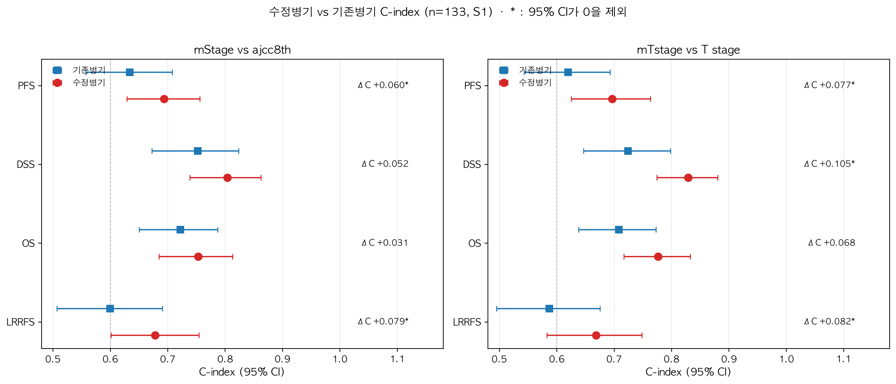
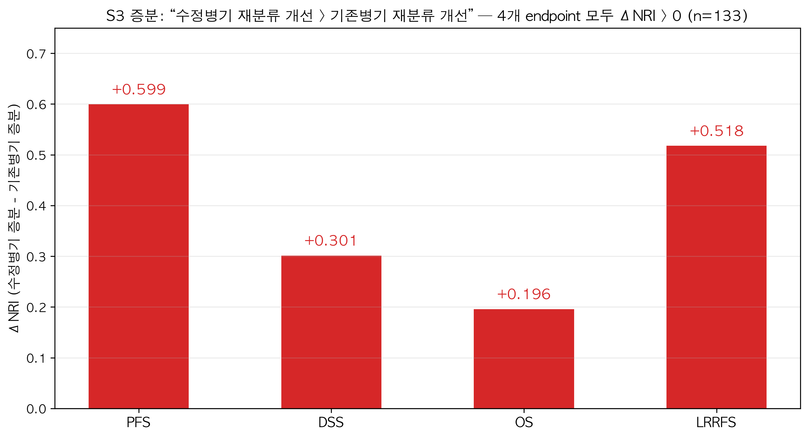
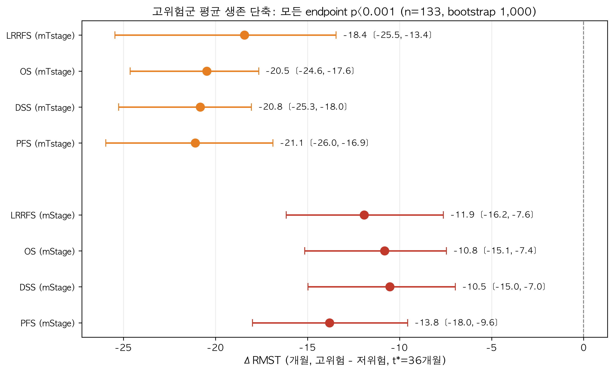

# 수정병기 효과 — 키 인사이트 요약 (n=133 전수, v3 공식 수치)

> 출처: `최종_종합_리포트_정세운선생님용.md`(v3) · `최종_종합_리포트_AI엔지니어용.md` · `정세운선생님_피드백_답변_20260902.md`
> docx(oralSCC_table.docx)와 수치 결 일치 — 겹치는 항목(PD-HC HR, DM 등)은 docx 값을 그대로 사용
> 🔄 2026-09-17 갱신: 연구번호 52번 mNstage 1→3 정정 반영(선생님 확정). mStage는 불변이라 아래
> mStage/mTstage 수치는 동일하며, mNstage 관련 수치만 갱신됨(`정세운선생님_피드백2_답변_20260917.md`).

---

## 수정병기는 4개 생존지표 전부에서 기존 병기를 이겼다 (PFS·DSS·OS·LRRFS)

- **가장 강력한 단일 증거**: mTstage가 질병특이생존(DSS) 구분력을 **C-index 0.724 → 0.829 (+0.105)** 로 끌어올림 — 이번 연구 최대 개선폭
- **OS에서도 유효**: mStage **0.753 vs 0.722**, mTstage **0.777 vs 0.708** — "죽음"이라는 가장 보수적인 endpoint에서도 수정병기가 우월
- **교란 보정 후에도 우월** (24개 임상·병리 공변량 + Cox 다변량): "수정병기 추가 시 재분류 개선(ΔNRI) > 기존병기 추가 시"가 4개 지표 모두 양수 — PFS **+0.599**, LRRFS +0.518, DSS +0.301, OS +0.196

**표 1. S1 — 병기 단독 구분력 (n=133, 95% CI는 bootstrap)**  |  ΔC* = 95% CI가 0을 제외

| 비교 | endpoint | 수정병기 C-index | 기존병기 C-index | ΔC [95% CI] |
|---|---|---|---|---|
| **mStage vs ajcc8th** | PFS | **0.694** | 0.634 | **+0.060** [0.012, 0.111]* |
| | DSS | **0.804** | 0.752 | +0.052 [−0.012, 0.120] |
| | OS | **0.753** | 0.722 | +0.031 [−0.021, 0.084] |
| | LRRFS | **0.678** | 0.600 | **+0.079** [0.020, 0.140]* |
| **mTstage vs T** | PFS | **0.697** | 0.620 | **+0.077** [0.011, 0.145]* |
| | DSS | **0.829** | 0.724 | **+0.105** [0.016, 0.196]* |
| | OS | **0.777** | 0.708 | +0.068 [−0.001, 0.140] |
| | LRRFS | **0.669** | 0.587 | **+0.082** [0.003, 0.163]* |

> **정직성 각주 — mNstage**: 수정병기의 N축 개정(mNstage vs N stage)은 **ΔC≈0으로 구분력 개선이 없어** 위 표에서 제외했습니다. 수정병기 우월성은 **T축 개정(mTstage, PD cellularity 반영)이 주도**하며 mStage의 개선도 사실상 mT 개정에서 비롯됩니다 (상세: `정세운선생님_mNstage_답변_20260903.md`). (2026-09-17 #52 mNstage 정정 반영 후에도 ΔC: PFS +0.003 / DSS −0.002 / OS −0.006 / LRRFS +0.010 — 전부 CI가 0 포함, 결론 동일.) mNstage NRI(LRRFS) 민감도·다중비교 분석은 `정세운선생님_mNstage_NRI_민감도_20260918.md` — **Holm p=0.047·permutation p=0.054로 취약(exploratory)**.

## 임상적으로 체감되는 크기 — "몇 개월 차이"로 표현

- 수정병기 고위험군(III–IV)은 저위험군(I–II)보다 **평균 생존이 10~21개월 짧음**, 4개 지표 모두 p<0.001
  - mTstage 기준 무려 **PFS −21.1개월**, OS −20.5개월
- 원격전이(DM) 9건 중 7건이 PD-HC에서 발생 (**25.9% vs 1.9%**) → 수정병기의 핵심 지표인 PD cellularity가 전이 위험을 실질적으로 반영

**표 2. ΔRMST (평균 생존 단축, bootstrap 1,000)**  |  mStage = I–II vs III–IV, mTstage = 저위험 vs 고위험

| score | PFS | DSS | OS | LRRFS |
|---|---|---|---|---|
| **mStage** | **−13.8개월** | −10.5개월 | −10.8개월 | −11.9개월 |
| **mTstage** | **−21.1개월** | −20.8개월 | **−20.5개월** | −18.4개월 |
| p (모두) | <0.001 | <0.001 | <0.001 | <0.001 |

**표 3. DM 기술 보고 (사건 9건 — docx Table 1과 동일 수치)**  |  PD-LC n=106, PD-HC n=27

| 항목 | PD-LC | PD-HC | 전체 |
|---|---|---|---|
| DM 발생, n (%) | 2 (1.9%) | **7 (25.9%)** | 9 (6.8%) |
| 발생 후 사망 | 2/2 | 7/7 | 9/9 (100%) |
| 발생 중앙값 | — | — | 4개월 |
| 수정병기 III–IV | — | — | 9/9 (100%) |

## 기존 병기의 구조적 결함을 직접 드러냄

- 기존 ajcc8th는 **중간 병기에서 사건율이 오히려 떨어지는 "비단조"** (PFS·DSS·LRRFS) — 병기 순서 자체가 깨져 있음. 수정병기는 stage↑ → 사건율↑ **4개 endpoint 모두 단조 유지**

**표 4. 단조성 진단 (사건율, 그룹 저→고)**  |  공식 nonmonotonicity 진단 결과

| endpoint | mStage 사건율 | mStage 판정 | ajcc8th 사건율 | ajcc8th 판정 |
|---|---|---|---|---|
| PFS | 0.289 / 0.474 / 0.789 | **단조** | 0.348 / 0.235 / 0.529 / 0.737 | **비단조** |
| DSS | 0.066 / 0.211 / 0.500 | **단조** | 0.065 / 0.059 / 0.294 / 0.474 | **비단조** |
| OS | 0.171 / 0.316 / 0.658 | **단조** | 0.152 / 0.176 / 0.412 / 0.684 | 단조 |
| LRRFS | 0.211 / 0.368 / 0.553 | **단조** | 0.283 / 0.176 / 0.373 / 0.474 | **비단조** |

## 값싸고 강하다 — 단, 비교 조건을 정확히 (중요)

- 수정병기 단순 score(0.678 ~ 0.804)가 생존시점을 맞히는 회귀 모델 최고 성능(0.536~0.697)을 **전부 능가**
- ⚠️ **비교 조건 주의**: 이 회귀 모델들(TabICL·AFT-LogNormal·DT-IPCW)은 **병기 값을 아예 쓰지 않았습니다**
  (T/N/ajcc8th/mStage/mTstage/mNstage 전부 모델에서 제외, 임상·병리 공변량만 사용). 따라서
  "수정병기 score가 기존 병기를 쓴 모델보다 낫다"는 뜻이 **아닙니다**. 병기를 모르는 모델과
  병기 score를 비교한 것이라 동등 조건 비교가 아닙니다. **병기 대 병기 우월성은 실험 2(직접
  C-index)와 실험 3(S3 ΔNRI, 수정 증분 > 기존 증분)으로 주장**해야 합니다(상세:
  `정세운선생님_피드백2_답변_20260917.md` ③).

**표 5. 수정병기 score vs 생존회귀 최고 모델 (C-index)**

| endpoint | 회귀 최고 (모델) | 수정병기 mStage | mTstage |
|---|---|---|---|
| PFS | 0.589 (TabICL) | **0.694** | **0.697** |
| DSS | 0.697 (AFT-LogNormal) | **0.804** | **0.829** |
| LRRFS | 0.536 (DT-IPCW) | **0.678** | **0.669** |

> **정직성 각주 — 회귀 범위**: 생존회귀 실험(4e)은 설계상 **OS를 제외**(PFS·DSS·LRRFS만)하여 OS 비교 행이 없습니다. 회귀가 실행된 3개 endpoint 모두에서 수정병기가 회귀 최고 모델을 능가합니다.

## 임상 도구로 마무리 — Nomogram + Calibration + DCA (2026-09-18)

- 선생님 요청으로 **개별 환자 3·5년 생존확률을 계산하는 nomogram**과 보조 figure를 구현
  (R `rms` 부재 → 파이썬 직접 구현). 상세: `정세운선생님_nomogram_답변_20260918.md`
- 두 endpoint 모두 **수정병기 축(mTstage·mNstage)이 최종 예후인자로 선택**됨

**표 6. Nomogram 성능 (n=133)**

| endpoint | 모델 변수 | C-index (corrected) | Calibration slope (3·5년) | Time-AUC (3·5년) | Risk-group log-rank |
|---|---|---|---|---|---|
| **DSS** | **주요변수 5개** | **0.869 (0.856)** [0.806–0.929] | 1.31 / 1.38 | 0.869 / 0.870 | **p<0.001** |
| **OS** | **주요변수 5개** | **0.805 (0.795)** [0.726–0.877] | 0.96 / 1.02 | 0.793 / 0.788 | **p<0.001** |
| **PFS** | **주요변수 5개** | **0.726 (0.714)** [0.653–0.792] | 1.08 / 0.92 | 0.737 / 0.727 | **p<0.001** |
| **LRRFS** | **주요변수 5개** | **0.718 (0.694)** [0.627–0.790] | 1.61 / 1.24 | 0.767 / 0.737 | **p<0.001** |

> 주요변수 = **PD cellularity, LN deposit, DOI, tumor size, bilateral**(stage 제외). 선생님 결정: 개별 변수
> 중요도를 강조하는 이 버전을 primary로 하고, **복합 병기(mTstage·mNstage) 버전을 본문에 동반**.
> 복합 병기 성능: DSS 0.859 / OS 0.803 / PFS 0.718 / LRRFS 0.697 (동등 수준).
> 개념·읽는 법(중요도=축 길이): `nomogram_해석_가이드.md`. DSS 가장 강함·LRRFS 가장 약함(난이도 차).

> 개념·해석(변수 중요도=축 길이, stage와 구성요소 중복)은 `nomogram_해석_가이드.md` 참조.
> DSS가 가장 강하고(C 0.86), LRRFS가 가장 약함(C 0.69) — endpoint 난이도 차이.

- Calibration slope ≈1, intercept ≈0 → **보정 양호**; DCA에서 threshold 대부분 구간 nomogram > treat-all/none.
- 한계: 단일기관 n=133 → **외부검증 필요**, 변수선택 낙관성은 optimism-corrected C로 일부 보정.

### OS

### PFS

### DSS (가장 강함)

### LRRFS (가장 약함)

## 결론은 표본 처리에 흔들리지 않음

- NX 4명 포함 여부(129 vs 133) 무관: 수치 변동 ≤0.02, **모든 유의성 판정·결론 불변** (확장판 n133)

**표 7. 민감도: n=129 → n=133 (mStage, seed 42)**

| endpoint | C-index (n129→n133) | ΔC 유지 | S3 ΔNRI 유지 |
|---|---|---|---|
| PFS | 0.696 → 0.694 | +0.062 → +0.060 ✅ | +0.593 → +0.599 ✅ |
| DSS | 0.808 → 0.804 | +0.052 → +0.052 ✅ | +0.333 → +0.301 ✅ |
| OS | 0.768 → 0.753 | +0.034 → +0.031 ✅ | +0.229 → +0.196 ✅ |
| LRRFS | 0.673 → 0.678 | +0.079 → +0.079 ✅ | +0.517 → +0.518 ✅ |

---

## 한 줄 요약

> *"병기에 PD cellularity 한 가지만 더하면 — 교란 보정 후에도 — 4개 생존지표 전부에서 기존 병기보다 재분류가 개선되고, 고위험군은 평균 10~21개월 일찍 사건이 발생한다(모두 p<0.001). 특히 DSS 구분력 +0.105는 이 데이터에서 가장 큰 예후 개선폭이다."*

---

*그림·표 생성 코드: `make_키인사이트_그림.py` → `results/exp1/키인사이트/` (전부 `*_full.csv` n=133 공식 수치에서 생성)*
