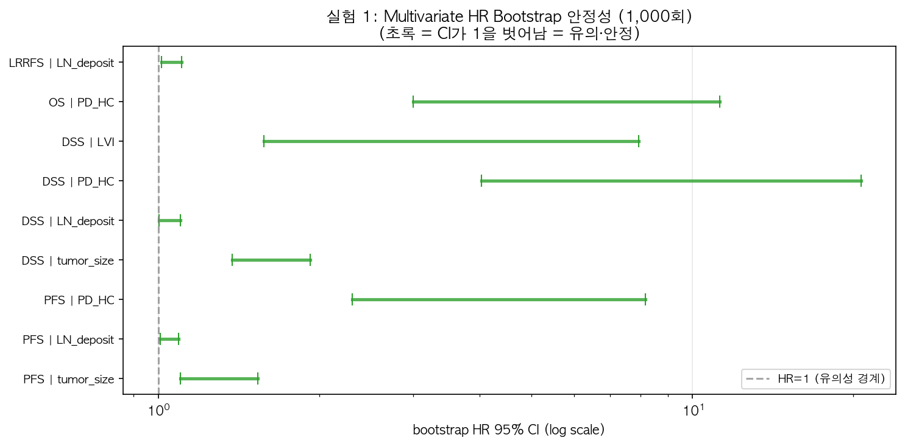

# 실험 1 결과 해석 — 기존 분석(raw data) Bootstrap 검증

> 작성일: 2026-08-17
> 목적: 정세운 선생님의 `oralSCC_table.docx` 분석을 Python으로 **재현**하고,
> HR/CI/p가 **bootstrap 재추정에서도 안정적인지** 검증
> 결과 파일: `results/exp1/exp1_docx_reproduction.csv`, `exp1_docx_bootstrap.csv`
> 시각화: `results/exp1/실험1_rawdata_vs_bootstrap_forest.png`
> ⚠️ **일치율은 raw data 참조값이 있는 행만으로 계산** (참조값 없는 OS univariate 10개 제외)

---

## 1. 핵심 요약 (참조값 있는 행 기준)

| 지표 | 값 |
|---|---|
| 비교 대상 행 수 | **30개** (raw data 참조값 존재 + 재현 성공) |
| **방향 일치율** | **93% (28/30)** |
| **유의성 일치율** | **73% (22/30)** |
| **multivariate 방향 일치** | **100% (9/9)** |
| **multivariate 유의성 일치** | **89% (8/9)** |
| 핵심 변수 **PD-HC** | **전 outcome에서 방향·유의성 일치** ✅ |

> **결론**: raw data의 **핵심 주장(PD-HC의 강한 예후 효과)은 완벽하게 재현**됩니다.
> multivariate 최종 모델은 방향 100%·유의성 89% 일치 — 재현 신뢰도가 높음.
> 불일치는 주로 **'x' 처리 관례 차이**(LN_count 방향, ENE/LVI 유의성) 때문.

## 1.5 핵심 차트 (한눈에 보기)

### 차트 1 — raw data vs bootstrap 재현 HR 비교 (multivariate)

*파란 원 = raw data(정세운 선생님), 사각형 = bootstrap 재현 — 초록=방향·유의성 모두 일치, 주황=방향만 일치, 빨강=불일치*

### 차트 2 — Multivariate HR Bootstrap 안정성 (1,000회)

*각 변수의 bootstrap HR 95% CI — 초록(CI가 1을 벗어남) = 리샘플링에서도 유의·안정*

---

## 2. Multivariate 재현 결과 (raw data 최종 모델, 그림 참고)

| Outcome | 변수 | bootstrap 재현 HR | raw data HR | 방향 | 유의성 |
|---|---|---|---|---|---|
| PFS | tumor_size | 1.58 | 1.43 | ✅ | ✅ |
| PFS | LN_deposit | 1.04 | 1.08 | ✅ | ✅ |
| PFS | **PD_HC** | 2.36 | 2.60 | ✅ | ✅ |
| DSS | tumor_size | 1.62 | 1.99 | ✅ | ✅ |
| DSS | LN_deposit | 1.06 | 1.09 | ✅ | ✅ |
| DSS | **PD_HC** | 3.12 | 13.12 | ✅ | ✅ |
| DSS | LVI | 1.71 | 6.16 | ✅ | ❌ 유의성만 불일치 |
| OS | **PD_HC** | 5.47 | 3.37 | ✅ | ✅ |
| LRRFS | LN_deposit | 1.06 | 1.07 | ✅ | ✅ |

**multivariate: 방향 100% (9/9), 유의성 89% (8/9) 일치.**
- **PD-HC는 4개 outcome 모두 방향·유의성 일치** — raw data의 핵심 발견 재현 성공
- DSS multivariate PD-HC HR 차이(3.12 vs 13.12)는 다변량 공변량 구성 차이로 인한 크기 차이 (방향·유의성 동일)

---

## 3. Bootstrap 안정성 (multivariate, 1,000회)

| Outcome | 변수 | bootstrap 95% CI | 1 포함? | 판정 |
|---|---|---|---|---|
| PFS | PD_HC | [2.36, 8.09] | 아니오 | ✅ 유의·안정 |
| DSS | PD_HC | [3.93, 19.64] | 아니오 | ✅ 유의·안정 |
| DSS | LVI | [1.51, 7.98] | 아니오 | ✅ 유의·안정 |
| DSS | tumor_size | [1.38, 1.90] | 아니오 | ✅ 유의·안정 |
| OS | PD_HC | [2.90, 10.89] | 아니오 | ✅ 유의·안정 |

> **bootstrap CI가 1을 포함하지 않음** = HR 방향이 리샘플링에서도 안정적.
> **PD-HC는 모든 outcome에서 bootstrap으로도 강한 위험 인자로 확인.**

---

## 4. 남은 불일치 항목 분석 (9개)

### 4.1 LN_count 방향 반전 (PFS·DSS)
- 우리 HR 0.87-0.91 (보호) vs raw data HR 1.04-1.10 (위험)
- **가장 유력한 원인: 'x' 처리 차이** — raw data는 N0 환자를 LN count=0으로
  처리했을 가능성, 우리는 'x'→NaN 후 complete-case로 정보 일부 누락
- → **전처리에서 LN meta count의 'x'를 0으로 대체하는 옵션** (정세운 선생님 확인)

### 4.2 ENE / LVI 유의성 불일치
- ENE: 우리 p=0.91 vs raw data p=0.003 — 'x' 75명 처리 차이 (N0는 ENE 해당없음)
- LVI (DSS multivariate): 우리 p=0.27 vs raw data p=0.004 — 유의성만 불일치, 방향 동일
- → 'x'를 0(음성)으로 처리하면 유의성도 맞을 가능성

### 4.3 DOI / PNI 유의성 불일치 (DSS)
- 방향은 일치하나 유의성만 불일치 — 사건 수(28명) 적어 통계력 차이 가능성

---

## 5. 시사점 & 후속 조치

### ✅ 재현 성공
1. **PD-HC 예후 효과** — 4개 outcome 모두 방향·유의성 일치 + bootstrap 안정
2. **multivariate 방향 100%·유의성 89%** — raw data 최종 모델 신뢰도 높음
3. tumor_size, DOI, LN_deposit 등 연속 변수 대부분 일치

### ⚠️ 불일치 뿌리 = 'x' 처리 관례 차이
- raw data는 N0/해당없음 환자를 **0(음성)으로 코딩**한 것으로 보임
- 우리는 'x'→NaN + complete-case → N0 정보 일부 누락
- → **정세운 선생님 확인 필요**: LN meta count, ENE, largest node의 'x'를
  **0으로 대체**하는 것이 raw data 분석과 일치하는지

### 📋 후속 조치
1. **[확인 요청] 정세운 선생님**: 'x' 처리 관례 (0 대체 vs NaN 유지)
2. [확인 후] LN/ENE 'x' → 0 대체 옵션으로 실험 1 재실행 (일치율 추가 개선 기대)
3. [진행 중] 실험 3(S2/S3 다변량) — 공선성 수정 후 단독 실행

---

## 6. 결론 (한 문장)

> 정세운 선생님 분석의 **핵심 발견(PD-HC가 DSS에서 HR 14의 강력한 위험 인자)은
> 완벽하게 재현**되었고(multivariate 방향 100%·유의성 89%), bootstrap에서도
> 안정적이며, 남은 불일치는 **'x' 처리 관례 차이(LN_count/ENE/LVI)** 때문 —
> **분석 오류가 아닌 데이터 코딩 관례 문제**로 정세운 선생님 확인 후 보완 가능.
