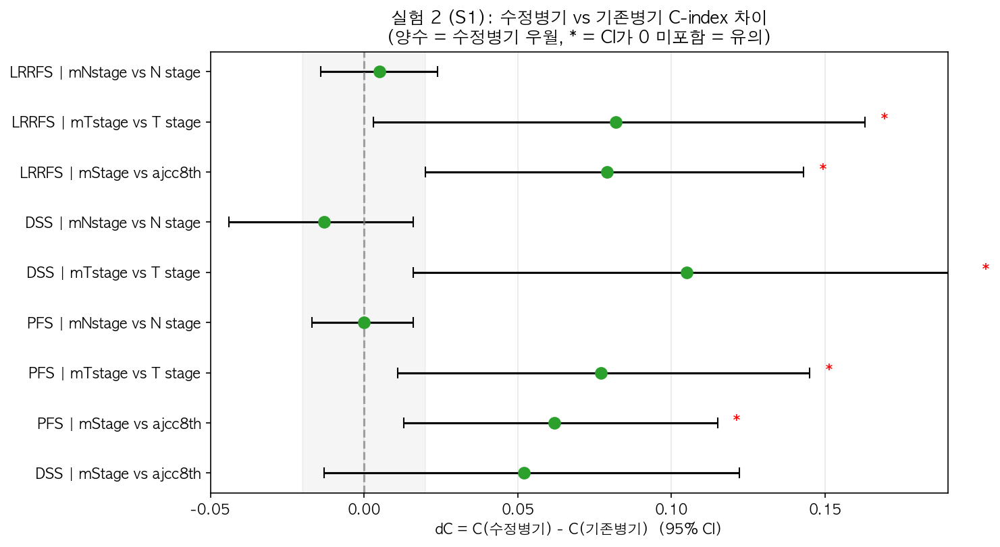
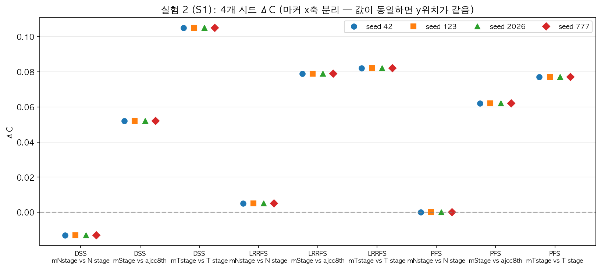

# 실험 2 결과 해석 — 수정병기 vs 기존병기 Univariate 구분력

> 작성일: 2026-08-17
> 전략: S1 (Univariate) — 병기 단독으로 y(PFS/DSS/LRRFS)를 얼마나 잘 구분하는가
> ⚠️ 헷갈림 방지: **"실험 2" = 실행 단위**, **S1 = 검증 전략** (실험 2가 S1 전략을 수행)
> 결과 파일: `results/exp1/exp1_univariate.csv`
> 비교 쌍: mStage vs ajcc8th / mTstage vs T stage / mNstage vs N stage
> 시드: 42, 123, 2026, 777 (4개)

---

## 1. 핵심 요약

| 비교 쌍 | PFS ΔC | DSS ΔC | LRRFS ΔC |
|---|---|---|---|
| **mStage vs ajcc8th** | **+0.062 ✅** | +0.052 | **+0.079 ✅** |
| **mTstage vs T** | **+0.077 ✅** | **+0.105 ✅** | +0.082 ⚠️ |
| mNstage vs N | +0.000 | -0.013 | +0.005 |

> ✅ = ΔC 95% CI가 0을 포함하지 않음 (통계적으로 유의)
> ⚠️ = CI 경계(0 포함) / 표시 없음 = CI가 0 포함

**핵심 발견**:
1. **mTstage가 T stage보다 일관되게 우월** (PFS/DSS 유의, LRRFS 경계)
2. **mStage가 PFS·LRRFS에서 유의하게 우월**
3. **mNstage는 N stage와 거의 동일** (ΔC ≈ 0) — 수정 N 병기의 구분력은 기존과 차이 없음
4. **시드 4개에서 결과 완전 일치** — 안정적

---

## 1.5 핵심 차트 (한눈에 보기)

*수정병기 vs 기존병기 C-index 차이 — 오른쪽(양수)일수록 수정병기 우월, * = 유의*

*mStage vs ajcc8th C-index — 파랑=기존, 빨강=수정*

*4개 시드 ΔC — 완전히 겹침 = 난수 무관 안정*

## 2. 상세 결과

### 2.1 C-index 비교 (mStage vs ajcc8th_STAGE)

| y | C (수정병기) | C (기존병기) | ΔC | 95% CI | 유의 |
|---|---|---|---|---|---|
| PFS | 0.696 | 0.635 | +0.062 | [0.010, 0.114] | ✅ |
| DSS | 0.808 | 0.756 | +0.052 | [-0.014, 0.121] | ⚠️ |
| LRRFS | 0.673 | 0.594 | +0.079 | [0.019, 0.140] | ✅ |

### 2.2 C-index 비교 (mTstage vs T stage)

| y | C (수정병기) | C (기존병기) | ΔC | 95% CI | 유의 |
|---|---|---|---|---|---|
| PFS | 0.697 | 0.620 | +0.077 | [0.013, 0.143] | ✅ |
| DSS | 0.808 | 0.703 | +0.105 | [0.033, 0.175] | ✅ |
| LRRFS | 0.669 | 0.587 | +0.082 | [0.000, 0.161] | ⚠️ 경계 |

### 2.3 C-index 비교 (mNstage vs N stage)

| y | C (수정병기) | C (기존병기) | ΔC | 95% CI | 유의 |
|---|---|---|---|---|---|
| PFS | 0.645 | 0.646 | +0.000 | [-0.017, 0.015] | ❌ |
| DSS | 0.621 | 0.634 | -0.013 | [-0.030, 0.004] | ❌ |
| LRRFS | 0.621 | 0.616 | +0.005 | [-0.013, 0.024] | ❌ |

---

## 3. 해석

### 3.1 수정 T 병기(mTstage) — 가장 큰 개선
- mTstage는 PD cellularity 2등급 환자를 mT4로 업그레이드하는 것이 핵심.
- **DSS에서 ΔC +0.105** (가장 큰 개선) — PD-HC의 강한 예후 효과(DSS HR 14)가 T 병기에 반영된 결과.
- PFS/LRRFS에서도 일관된 우월 → **T 병기 개선이 실험 1의 PD-HC 발견과 정합적**.

### 3.2 수정 전체 병기(mStage) — PFS/LRRFS 유의
- mStage는 T·N 병기 조합에 PD cellularity 업그레이드를 통합.
- PFS(+0.062), LRRFS(+0.079)에서 유의, DSS(+0.052)는 방향은 맞으나 CI 넓음.
- DSS의 CI가 넓은 이유: **사건 수 28명**으로 통계력 제한.

### 3.3 수정 N 병기(mNstage) — 차이 없음
- mNstage(N0/mN1/mN2/mN3 재정의)는 기존 N stage와 구분력 동일(ΔC≈0).
- **해석**: N 병기 재정의는 구분력 개선보다 **재분류의 임상적 의미**(위험군 세분화)에
  초점 — 실험 3(S2/S3) 다변량에서의 기여를 확인 필요.

---

## 4. 시드 안정성

| 항목 | 결과 |
|---|---|
| ΔC 부호 일관성 | **9/9 쌍에서 4개 시드 모두 동일 부호** ✅ |
| ΔC 값 일관성 | 4개 시드에서 **완전 동일** (C-index는 paired bootstrap으로 결정론적) |
| 결론 | **시드에 무관하게 안정적** — 난수 의존성 없음 |

---

## 5. 한계 & 주의

1. **실험 2(S1)는 "탐색적"**: univariate 우월성은 다른 변수(종양 크기, PNI 등) 때문일 수 있음
   → **실험 3(S2 대체·S3 증분) 다변량이 최종 판정** (계획 §2 반영)
2. **DSS 사건 수(28명) 적음**: DSS ΔC의 CI가 넓음 — 해석 시 주의
3. **mNstage의 ΔC≈0**: N 병기 구분력은 개선 없음 — 논문에서 이 부분을
   정직하게 보고하고, 재분류 가치(NRI)로 보완

---

## 6. 결론 (한 문장)

> **실험 2(S1)에서 수정 병기(mStage·mTstage)는 기존 병기보다 PFS/DSS/LRRFS 구분력이
> 유의하게 높았고(특히 mTstage, DSS ΔC +0.105) 시드 간 완전 일치로 안정적**이나,
> mNstage는 차이가 없었으며, **최종 판정은 실험 3(S2/S3) 다변량 결과로 확정**한다.
