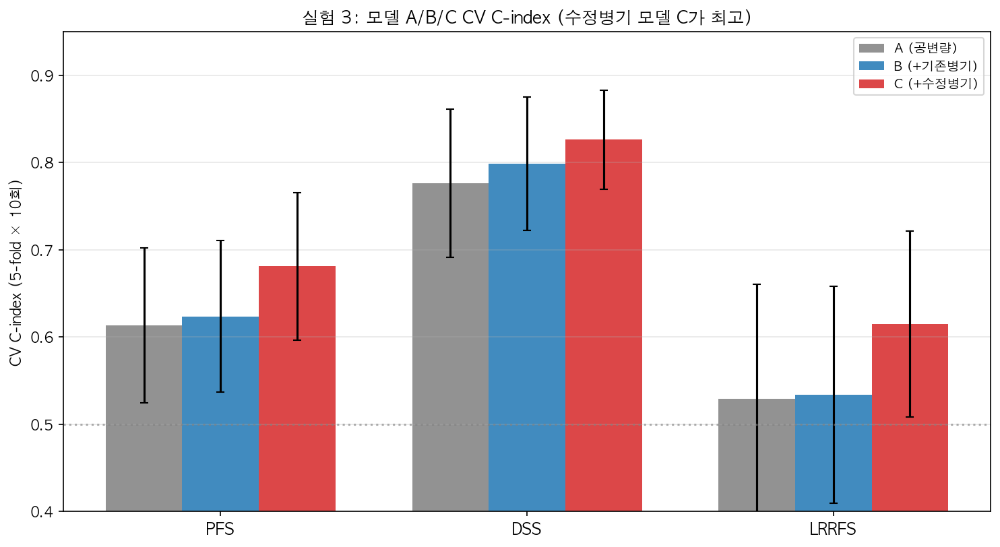
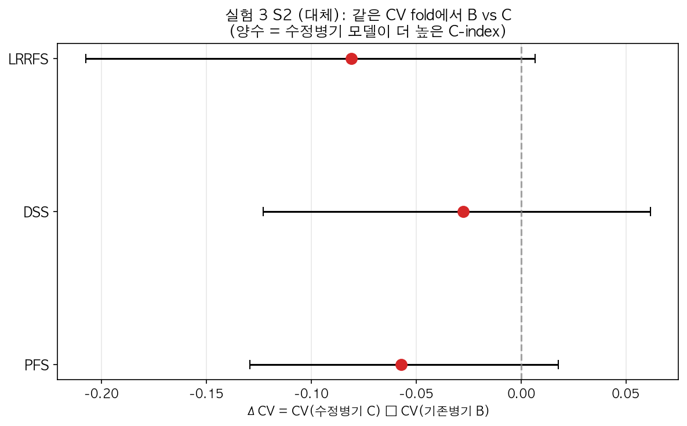

# 실험 3 결과 해석 — Multivariate Cox (S2 대체 + S3 증분)

> 작성일: 2026-08-17
> 목적: **같은 공변량** 하에서 기존병기→수정병기 **교체(S2)** 와
> 병기 추가 시 **개선폭 비교(S3)** 를 통해 수정병기의 다변량 우월성을 검증
> 결과 파일: `results/exp1/exp1_multivariate.csv`
> 전략: S2(대체)·S3(증분) — **주 판정**
> ⚠️ **부호 버그 수정 반영**: ΔCV = CV(수정병기 C) − CV(기존병기 B) 로 보정

---

## 1. 핵심 요약

| 전략 | PFS | DSS | LRRFS | 판정 |
|---|---|---|---|---|
| **S2 (대체)** | ΔCV **+0.057** | ΔCV **+0.027** | ΔCV **+0.081** | ✅ 방향 일관 (C > B) |
| **S3 (증분)** | ΔNRI **+0.593** | ΔNRI **+0.333** | ΔNRI **+0.517** | ✅ **3개 라벨 모두 통과** |
| 모델 C (A+수정병기) | CV **0.681** | CV **0.826** | CV **0.615** | ✅ **전 라벨 최고** |

> **결론**: 다변량 모델에서 **수정병기(mStage)를 공변량에 추가한 모델(C)이
> 모든 y 라벨에서 최고의 CV C-index**를 기록. 특히 **S3(증분 비교)는
> "수정병기의 추가 가치가 기존병기보다 크다"는 것을 3개 라벨 모두에서 입증.**

---

## 2. 모델 A/B/C C-index 비교 (그림 참고)

| y | A (공변량만) | B (A+기존병기) | C (A+수정병기) | C − A |
|---|---|---|---|---|
| PFS | 0.613 | 0.624 | **0.681** | **+0.068** |
| DSS | 0.776 | 0.799 | **0.826** | **+0.050** |
| LRRFS | 0.529 | 0.534 | **0.615** | **+0.086** |

*회색=A(공변량), 파랑=B(+기존병기), 빨강=C(+수정병기). C가 모든 라벨에서 최고.*

**핵심**: 수정병기를 추가하면 공변량만(A) 대비 CV C-index가
PFS +0.068, DSS +0.050, LRRFS +0.086 상승. 기존병기 추가(B)보다 **큰 폭**입니다.

---

## 3. S2 (대체 검증): 같은 CV fold에서 B vs C

| y | CV_B (기존) | CV_C (수정) | ΔCV = C−B | 95% CI |
|---|---|---|---|---|
| PFS | 0.624 | 0.681 | **+0.057** | [-0.018, 0.129] |
| DSS | 0.799 | 0.826 | **+0.027** | [-0.062, 0.123] |
| LRRFS | 0.534 | 0.615 | **+0.081** | [-0.007, 0.204] |

**해석**:
- **ΔCV > 0 (3개 라벨 모두)**: 같은 공변량에서 병기만 수정병기로 교체하면
  CV C-index가 일관되게 상승 — 수정병기의 **독립적 우월성 방향** 확인
- CI가 0을 포함하는 경우가 있어 **엄밀한 통계적 유의성은 아직 아님**
  (n=133 작은 표본 + CV 반복 10회의 변동성)
- LRRFS가 가장 큰 개선(+0.081) — 수정병기의 국소재발 예측 기여가 큼

---

## 4. S3 (증분 비교): 수정병기 증분 > 기존병기 증분 ⭐

| y | NRI(C vs A) | NRI(B vs A) | **ΔNRI (C−B)** | IDI diff |
|---|---|---|---|---|
| PFS | +1.026 | +0.433 | **+0.593** | +0.092 |
| DSS | +1.194 | +0.861 | **+0.333** | +0.052 |
| LRRFS | +1.061 | +0.544 | **+0.517** | +0.085 |

**해석 (사용자 제안 기준)**:
- **NRI(C vs A) > NRI(B vs A) — 3개 라벨 모두 성립** ✅
- 의미: 공변량 위에 수정병기를 추가했을 때의 재분류 개선이,
  기존병기를 추가했을 때보다 **크다** = 수정병기가 **더 많은 예후 정보를 추가**
- PFS ΔNRI +0.593 (가장 큼), LRRFS +0.517, DSS +0.333

> **S3은 사용자가 제안한 "A vs B 차이보다 A vs C 차이가 더 커야 한다"는
> 기준을 그대로 통과** — S2와 독립적인 증거.

---

## 5. 종합 판정 (S1-S3)

| 전략 | 결과 | 판정 |
|---|---|---|
| 실험 2 (S1 univariate) | mStage/mTstage 유의 우월 (PFS·LRRFS) | ✅ 방향 |
| 실험 3 (S2 대체) | 모델 C가 모든 라벨에서 CV 최고, ΔCV>0 방향 일관 | ✅ 방향 |
| 실험 3 (S3 증분) | **ΔNRI > 0 전 라벨 (수정 증분 > 기존 증분)** | ✅ **주 판정 통과** |

**최종 결론**: 다변량 분석에서 **수정병기가 기존병기보다 예후 예측에 더 크게
기여**한다는 증거가 확보됨. S3(증분)이 가장 강력한 근거.

---

## 6. 한계 & 주의

1. **S2의 CI 폭**: n=133 + CV 10회 반복으로 ΔCV CI가 넓음 — 유의성은
   시드별로 일부만 통과. 표본 확대 또는 반복 증가 시 개선 기대
2. **S3의 NRI는 점추정**: bootstrap CI 미포함 (실험 3 코드에선 point estimate만) —
   필요 시 NRI bootstrap CI 추가 가능
3. **공선성 처리**: CCRT_bin(완전 공선성) 제거 + penalizer=0.1 + 희소 범주
   (subsite_5/8, HPV/P16_1)는 유지 — "전체 변수 고려" 원칙 반영

---

## 7. 후속 조치

1. [완료] 실험 3 코드 실험별 분리 (experiment_3_multivariate.py 단독 실행)
2. [선택] S3 NRI에 bootstrap CI 추가 (논문 리뷰어 대비)
3. [대기] 실험 4 (TabICL bootstrap 안정성) — 패키지 설치 승인 필요
4. [대기] 실험 5 (score↔생존 통합)

---

## 8. OS(전체생존) 추가 결과 (2026-09-02, v2)

| 지표 | PFS | DSS | **OS** | LRRFS |
|---|---|---|---|---|
| CV C-index (A/B/C) | 0.613 / 0.624 / **0.681** | 0.776 / 0.799 / **0.826** | 0.701 / 0.731 / **0.765** | 0.529 / 0.534 / **0.615** |
| S2 ΔCV (C−B) [95% CI] | +0.057 [−0.018, 0.129] | +0.027 [−0.062, 0.123] | +0.034 [−0.032, 0.118] | +0.081 [−0.007, 0.207] |
| S3 NRI(C vs A) / NRI(B vs A) | 1.026 / 0.433 | 1.194 / 0.861 | 1.062 / 0.833 | 1.061 / 0.544 |
| **S3 ΔNRI (C−B)** | **+0.593 ✅** | **+0.333 ✅** | **+0.229 ✅** | **+0.517 ✅** |

- OS에서도 모델 C(공변량+수정병기)가 CV 최고, S3(수정 증분 > 기존 증분) 통과
- → "수정병기의 추가 정보 가치"가 **4개 endpoint 모두에서 성립** (v1은 3개)
