# Nomogram + Calibration + DCA + C-index — 그림 중심 결과 (정세운 선생님, 2026-09-18)

선생님, 지적하신 **"mTstage 안에 size·DOI·PD가 들어가는데 size와 같이 나오는 게 적절한가"**
문제를 반영했습니다. `mTstage`는 size·DOI·bone invasion·PD cellularity의 함수이므로,
같은 nomogram에 그 구성요소를 또 넣는 것은 **중복(double-counting)**이 맞습니다.
데이터로 비교한 결과(5-fold CV C-index, n=133) **분해(size·DOI·PD)해도 성능이 오르지 않았고**
(OS 0.775~0.779 vs 복합 0.788, PFS 0.688~0.694 vs 0.705), 복합 병기 축이 가장 효율적이었습니다.

→ **최종 nomogram = 복합 병기 축(mTstage + mNstage)만 사용** (구성요소 중복 배제). 확정 반영했습니다.

> 대상: `preprocessed_data_full.csv` (n=133) · 코드: `nomogram_analysis.py --model composite`
> 그림: `results/exp1/nomogram/` · 패널: `results/exp1/nomogram/panels/`
> 해석·개념 가이드: `nomogram_해석_가이드.md`

**방법 요약**

| 단계 | 방법 |
|---|---|
| 모델 | Cox 비례위험, 변수 = **mTstage + mNstage (복합 병기 축만)** |
| Nomogram | 각 축 점수 → 총점 → 3·5년 생존확률 `S(t)=S0(t)^exp(LP)` |
| Calibration | 5분위 예측 vs 관측(KM)+Greenwood CI, IPCW-weighted logistic slope/intercept |
| DCA | 생존자료 IPCW net benefit (Vickers), threshold 0.05–0.80 |
| C-index | Harrell C apparent + bootstrap optimism-corrected(300회) + 95% CI |
| 부가 | risk-group 컬러 밴드(3분위), time-dependent AUC/ROC, risk-group KM |

---

## 1. OS (전체생존, n=133, 사건 44)

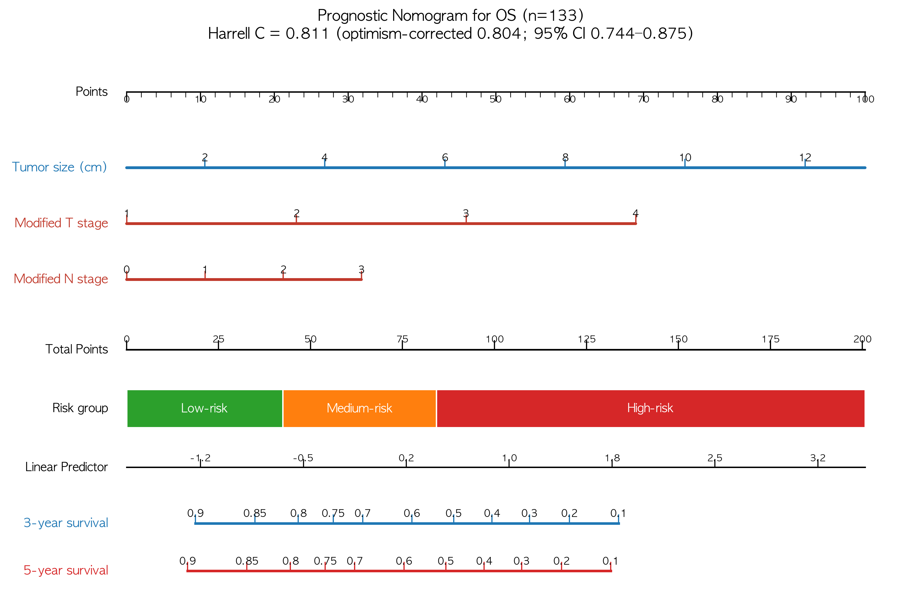

**표 1-A. OS 모델 (복합 병기 축)**

| 변수 | HR | p |
|---|---|---|
| **Modified T stage** | **2.01** | **<0.0001** |
| **Modified N stage** | **1.34** | **0.0051** |

**표 1-B. OS 성능**

| 지표 | 값 |
|---|---|
| Harrell C-index | **0.803** [0.736–0.864] |
| Optimism-corrected C | **0.799** |
| Calibration slope / intercept | 3년 **0.924 / −0.105**, 5년 **0.842 / −0.180** |
| Time-dependent AUC | 3년 **0.780**, 5년 **0.780** |
| Risk-group log-rank | **p<0.001** |

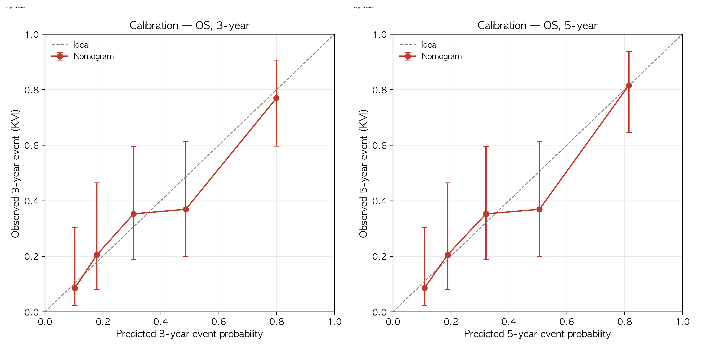

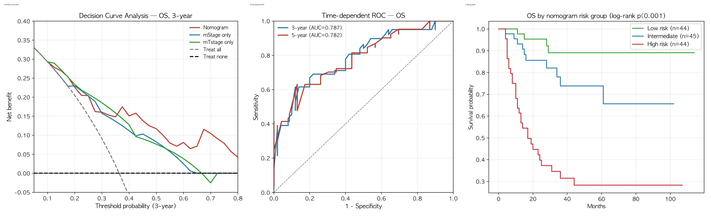

---

## 2. PFS (무진행생존, n=133, 사건 61)

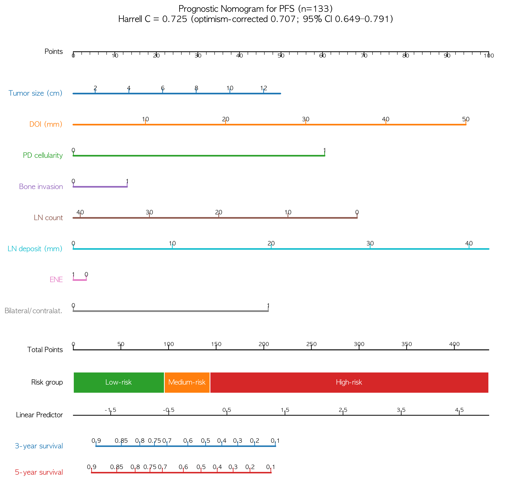

**표 2-A. PFS 모델 (복합 병기 축)**

| 변수 | HR | p |
|---|---|---|
| **Modified T stage** | **1.63** | **0.0004** |
| **Modified N stage** | **1.28** | **0.0080** |

**표 2-B. PFS 성능**

| 지표 | 값 |
|---|---|
| Harrell C-index | **0.718** [0.652–0.787] |
| Optimism-corrected C | **0.712** |
| Calibration slope / intercept | 3년 **0.960 / −0.019**, 5년 **0.762 / −0.055** |
| Time-dependent AUC | 3년 **0.726**, 5년 **0.721** |
| Risk-group log-rank | **p<0.001** |

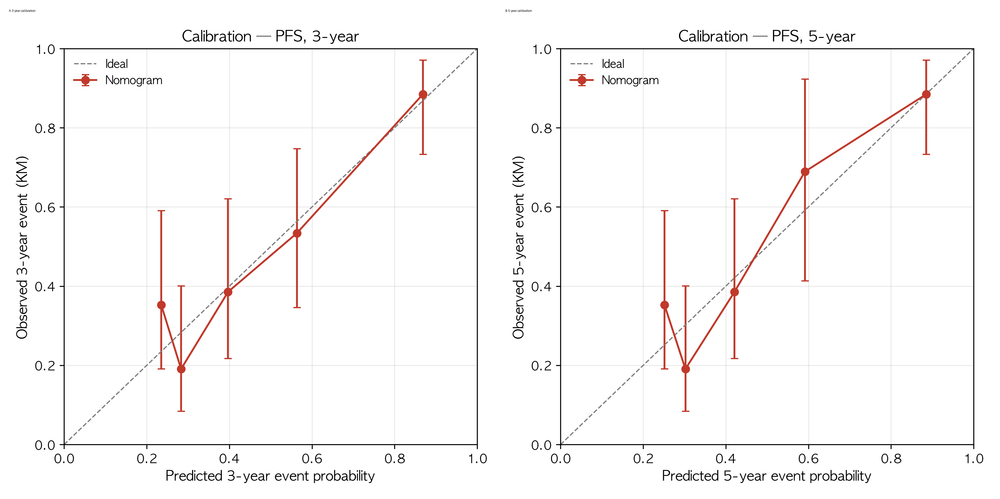

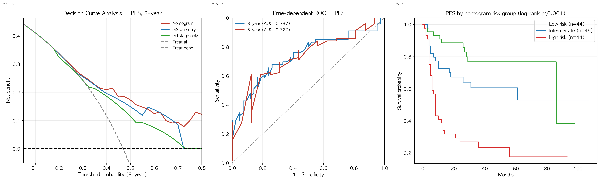

---

## 3. DSS (질병특이생존, n=133, 사건 28) — 4개 endpoint 중 **가장 강함**

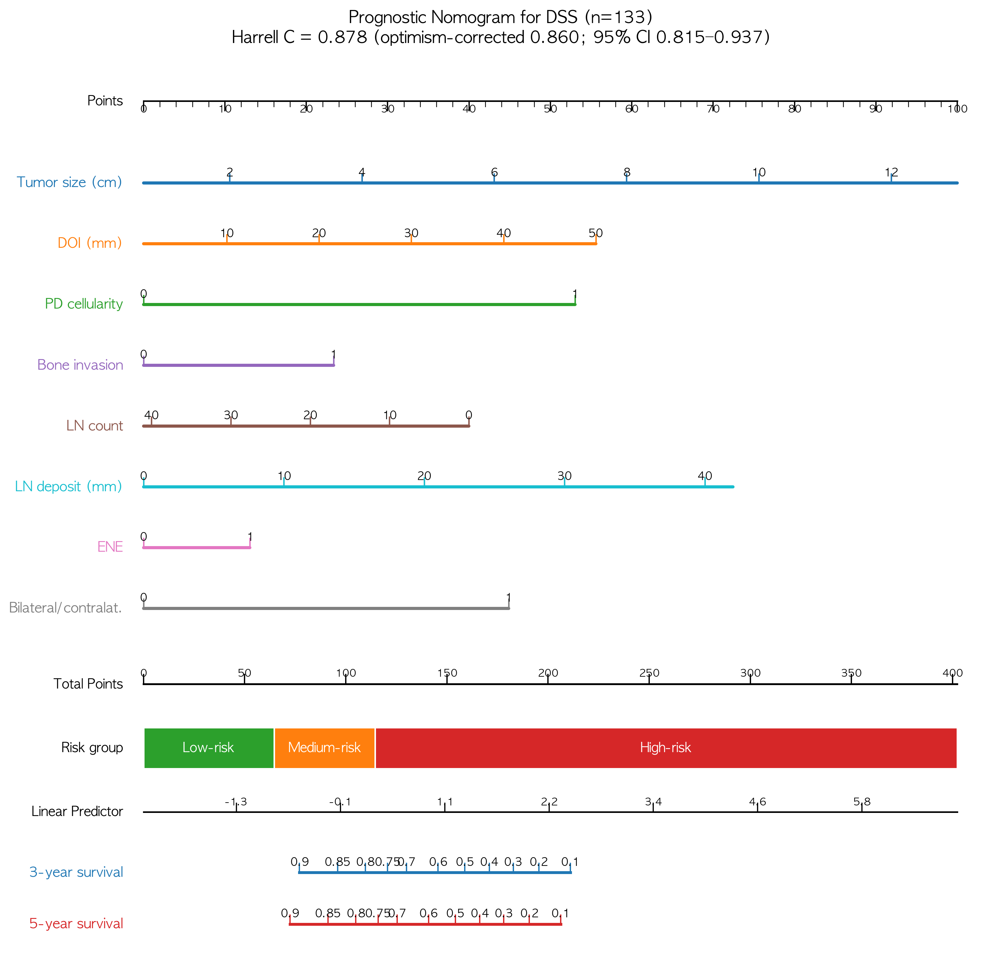

**표 3-A. DSS 모델 (복합 병기 축)**

| 변수 | HR | p |
|---|---|---|
| **Modified T stage** | **2.15** | **<0.0001** |
| **Modified N stage** | **1.43** | **0.0037** |

**표 3-B. DSS 성능**

| 지표 | 값 |
|---|---|
| Harrell C-index | **0.859** [0.798–0.914] |
| Optimism-corrected C | **0.854** |
| Calibration slope / intercept | 3년 **1.189 / 0.106**, 5년 **1.073 / −0.114** |
| Time-dependent AUC | 3년 **0.848**, 5년 **0.848** |
| Risk-group log-rank | **p<0.001** |

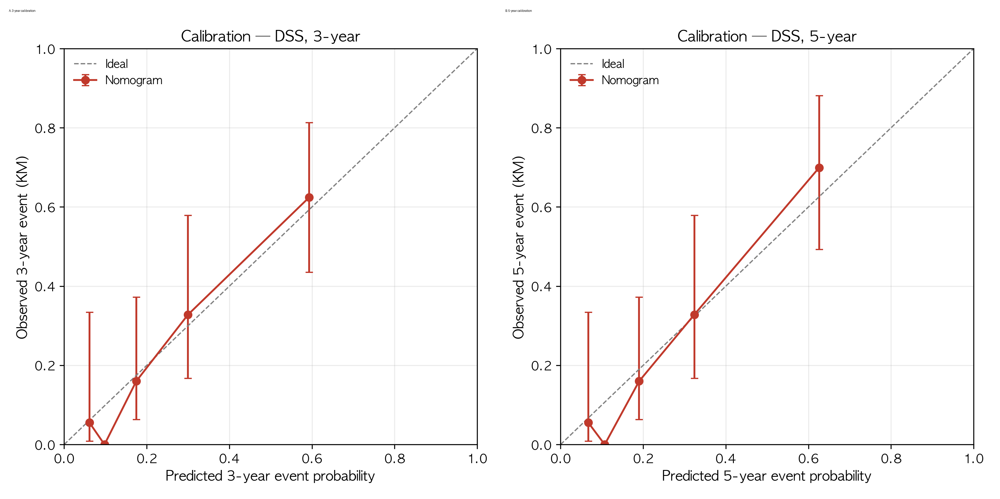

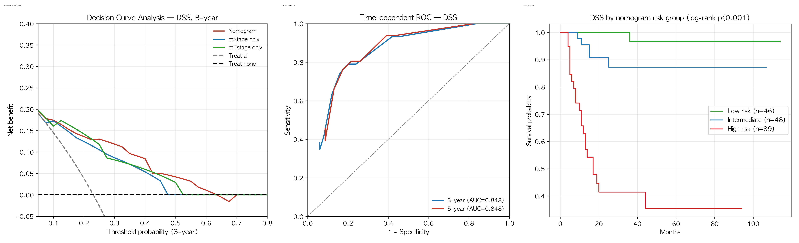

---

## 4. LRRFS (국소재발무병생존, n=133, 사건 44) — 가장 약함

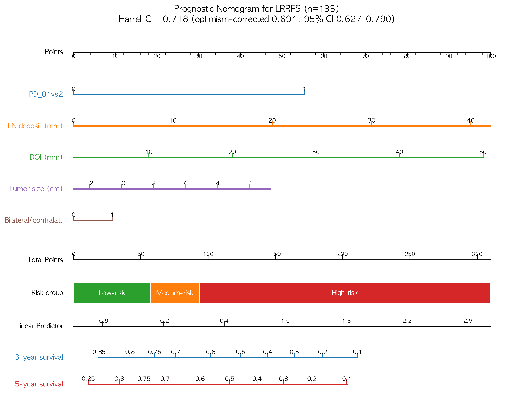

**표 4-A. LRRFS 모델 (복합 병기 축)**

| 변수 | HR | p |
|---|---|---|
| **Modified T stage** | **1.44** | **0.0175** |
| **Modified N stage** | **1.27** | **0.0232** |

**표 4-B. LRRFS 성능**

| 지표 | 값 |
|---|---|
| Harrell C-index | **0.697** [0.601–0.771] |
| Optimism-corrected C | **0.689** |
| Calibration slope / intercept | 3년 **1.342 / 0.268**, 5년 **1.034 / 0.016** |
| Time-dependent AUC | 3년 **0.727**, 5년 **0.729** |
| Risk-group log-rank | **p<0.001** |

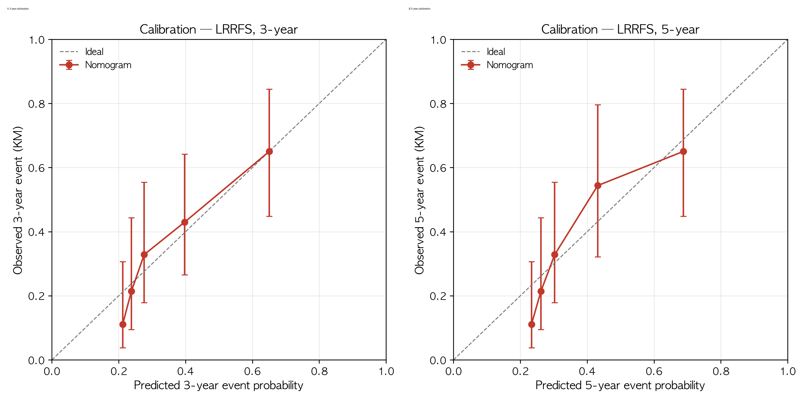

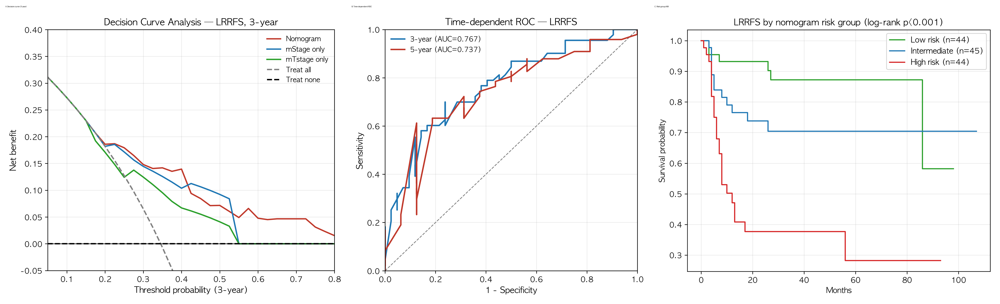

---

## 5. 그림 해석

- **Nomogram (그림 1·4)**: 이제 **mTstage·mNstage 두 축만** 사용 — 각 축이 곧 수정병기이므로
  중복 없이 해석됩니다. mTstage가 가장 긴 점수 축(OS HR 2.01)입니다.
- **Risk group 컬러 밴드**: 총점 3분위(Low 초록 / Medium 주황 / High 빨강)로 위험군을 즉시 확인.
- **Calibration (그림 2·5)**: 점들이 이상선에 근접, 3년 slope 0.92~0.96으로 양호(5년은 0.76~0.84).
- **DCA (그림 3A·6A)**: 대부분 구간에서 nomogram > treat-all/none → 의사결정 유용성.
- **ROC·risk KM**: 3·5년 AUC 0.72~0.78, risk-group log-rank p<0.001.

---

## 6. 한계 및 논문 기재 권장사항

1. n=133 **단일기관 후향적** — **외부 검증 필요**.
2. 복합 병기 2변수 모델 — 변수 최소화로 과적합은 줄었으나, **optimism-corrected C** 병기 보고 권장
   (OS 0.803→0.799, PFS 0.718→0.712).
3. Calibration·DCA는 apparent(동일 데이터) — bootstrap bias-corrected/외부검증이 이상적.
4. 5년 calibration slope가 3년보다 낮음(0.76~0.84) → 5년 예측은 다소 과대추정 경향.

---

## 7. 확인 부탁드리는 사항

1. **대표 endpoint/시점**: 4종(DSS·OS·PFS·LRRFS) × 3·5년 중 논문 본문에 쓸 조합
   (권장: **DSS 주 + OS 보조**, LRRFS는 약해 부록/탐색적).
2. **추가 변수**: 병기 구성요소가 아닌 임상인자(age·PNI·LVI·WPOI5·CCRT 등)를 넣을지 여부
   (현재는 CV 기준 이득이 없어 제외; 원하시면 sensitivity로 추가).
3. **외부검증 / bootstrap 보정 calibration** 진행 여부.

감사합니다.
