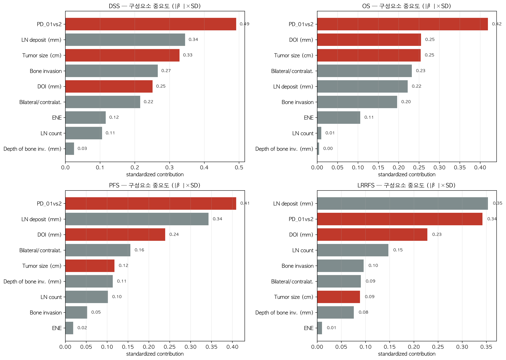

# Stage를 제외한 "구성요소 중요도" 분석 (정세운 선생님 질문, 2026-09-18)

> 질문 ① 각각의 인자는 빼는 것이 맞는가?
> 질문 ② 반대로 T/N stage를 빼고 구성요소만 넣으면 어떤 인자가 가장 중요한가? (PD·DOI·size?)
> 코드: `component_importance.py` · 결과: `results/exp1/component_importance/`

## 결론 (먼저)

1. **병기 nomogram에서는 구성요소를 빼는 게 맞습니다** — composite(mTstage·mNstage)와 중복되기 때문.
   단, 그 대가로 "개별 인자 중요도"가 안 보입니다.
2. **그래서 stage를 전부 빼고 구성요소만 넣어 확인** → **PD cellularity가 4개 endpoint 중 3개에서 1위,
   LRRFS에서 2위**로 **가장 중요한 인자**였습니다. 그 뒤로 **LN deposit, DOI, tumor size** 순.
   - **임상인자(age·sex·diff·PNI·LVI·WPOI5·CCRT·HPV)까지 넣어도 PD가 4/4 endpoint 모두 1위.**
3. 즉 선생님 직관("PD·DOI·size가 나올 것")이 **데이터로 확인**되었고, **PD가 최상위**입니다.

---

## 1. 방법

- **stage 변수 전부 제외**: mTstage·mNstage·mStage·T stage·N stage·ajcc8th.
- 구성요소 9개: `tumor size(cm)`, `DOI(mm)`, `PD cellularity`, `bone invasion`, `depth of bone inv.`,
  `LN count`, `LN deposit(mm)`, `ENE`, `bilateral/contralateral`.
- multivariable Cox (penalizer=0.1), 중요도 = **|β|×SD (표준화 기여)** — 변수 단위·범위 영향 제거.
- 민감도: 구성요소 + 임상인자 8개 모델도 동일하게 산출.

## 2. 결과 — 구성요소만 (표준화 기여도, 클수록 중요)

| 순위 | **DSS** | **OS** | **PFS** | **LRRFS** |
|---|---|---|---|---|
| 1 | **PD 0.49** (p=.0005) | **PD 0.42** (p=.0006) | **PD 0.41** (p=.0002) | **LN deposit 0.35** (p=.035) |
| 2 | LN deposit 0.34 | DOI 0.25 | LN deposit 0.34 (p=.026) | **PD 0.34** (p=.007) |
| 3 | Tumor size 0.33 | Tumor size 0.25 | DOI 0.24 | DOI 0.23 |
| 4 | Bone invasion 0.27 | Bilateral 0.23 | Bilateral 0.16 | LN count 0.15 |
| 5 | DOI 0.25 | LN deposit 0.22 | Tumor size 0.12 | Bone invasion 0.10 |

- 하위권: **ENE·LN count·depth of bone** — deposit·PD가 들어가면 기여도가 크게 낮아짐.

**민감도(구성요소 + 임상인자)** — PD는 여전히 1위:

| endpoint | 1위 (std) | 2위 | 3위 |
|---|---|---|---|
| DSS | **PD 0.45** (p=.005) | HPV(+) 0.31 | LN deposit 0.30 |
| OS | **PD 0.44** (p=.003) | DOI 0.28 | Tumor size 0.23 |
| PFS | **PD 0.47** (p=.0004) | LN deposit 0.37 | DOI 0.26 |
| LRRFS | **PD 0.42** (p=.005) | LN deposit 0.39 | DOI 0.26 |

## 3. 해석

- **PD cellularity가 가장 강력한 단일 예후 구성요소** → **수정 T staging(PD-high를 mT4로 상향)의 근거를
  정면으로 지지**합니다. 실험 2에서 mTstage의 개선이 컸던 이유와 일치합니다.
- 그 다음은 **LN deposit → DOI → tumor size**.
- **ENE·LN count**는 deposit/PD를 함께 넣으면 상대 기여도가 낮아집니다(정보가 중복·흡수됨).
- ⚠️ 주의: 구성요소 간 상관(size↔DOI, count↔deposit, bone↔depth)이 있어 **개별 p값은 불안정**합니다.
  따라서 순위는 **"모델 내 상대 기여도(standardized)"** 로 해석하고, 단독 인과로 해석하지 않습니다.

## 4. 정리 (논문용)

> stage와 구성요소는 겹치므로 **둘 중 하나만** 쓴다. 선생님 결정에 따라 **주요변수(핵심 5개:
> PD·deposit·DOI·size·bilateral) nomogram을 primary**로 하고, **복합 병기 버전은 본문에 동반**한다.
> 구성요소를 직접 모델링하면 **PD cellularity가 가장 중요한 예후인자**로 도출되며(4개 endpoint 모두),
> 이는 **수정병기의 핵심 기여(PD 기반 mT 상향)를 지지**한다. 그 뒤를 LN deposit·DOI·tumor size가 잇는다.
