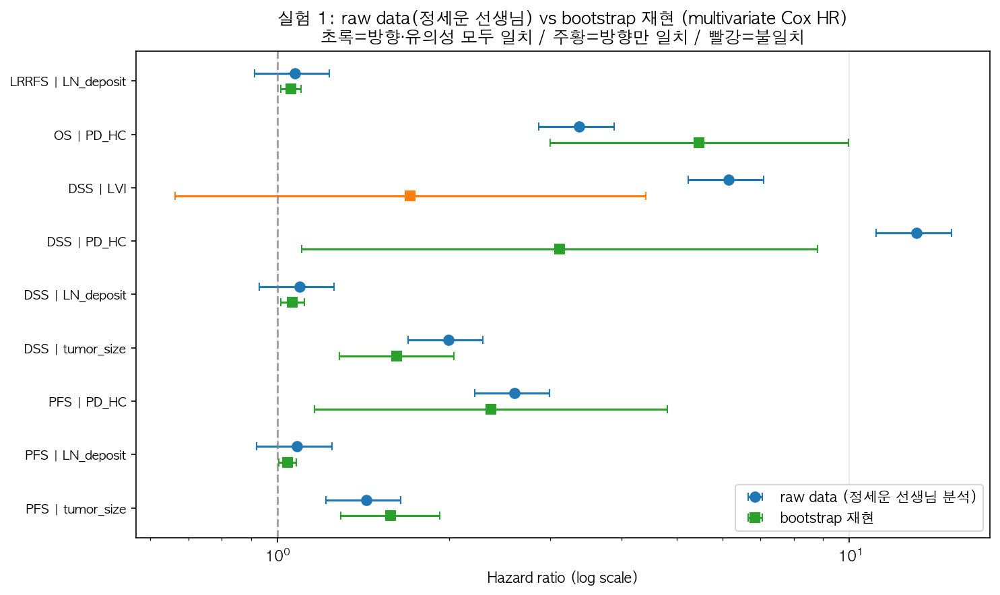
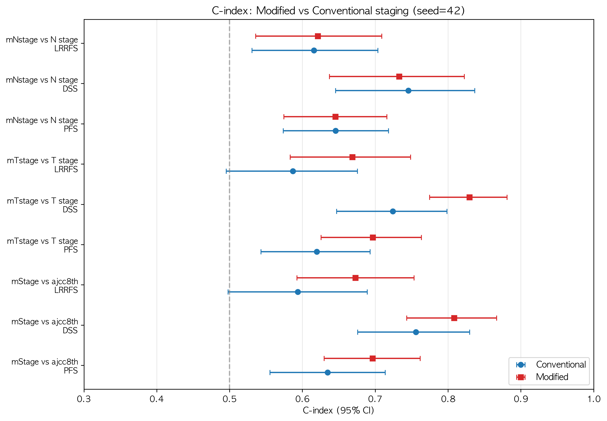
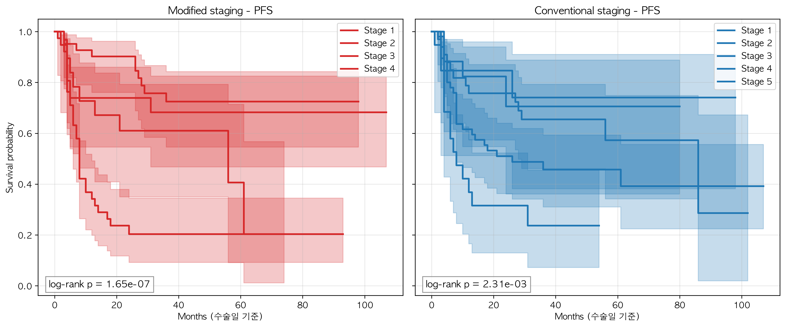
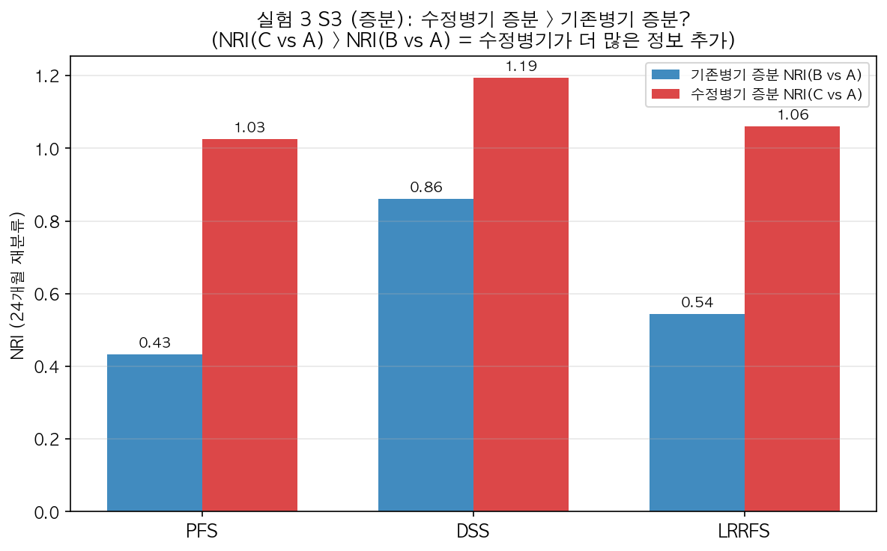
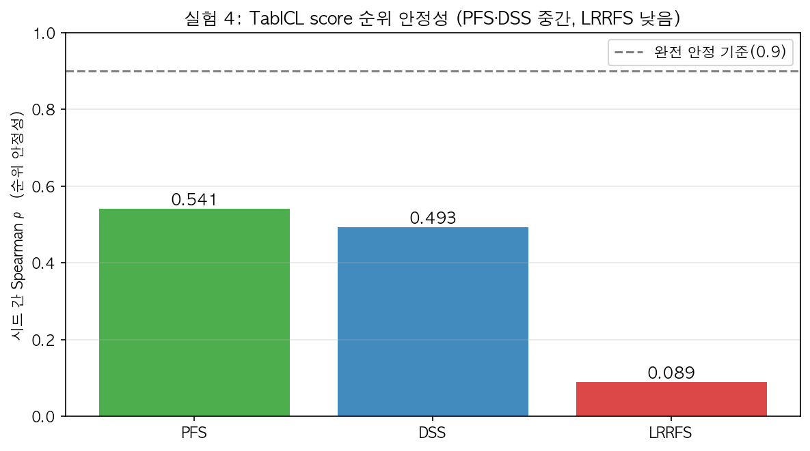
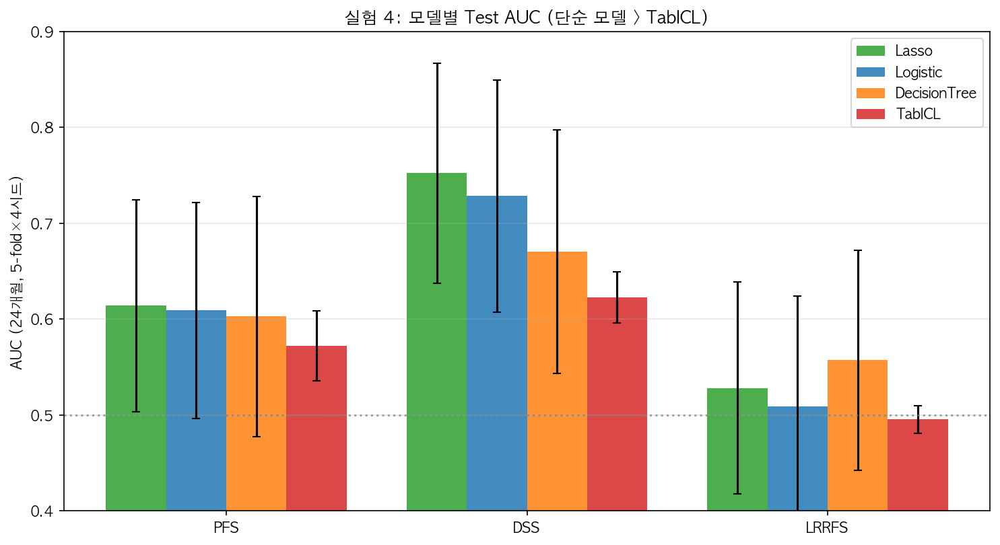
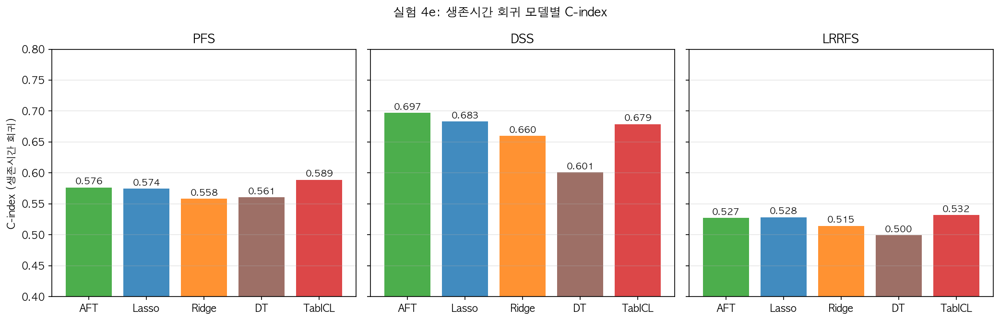
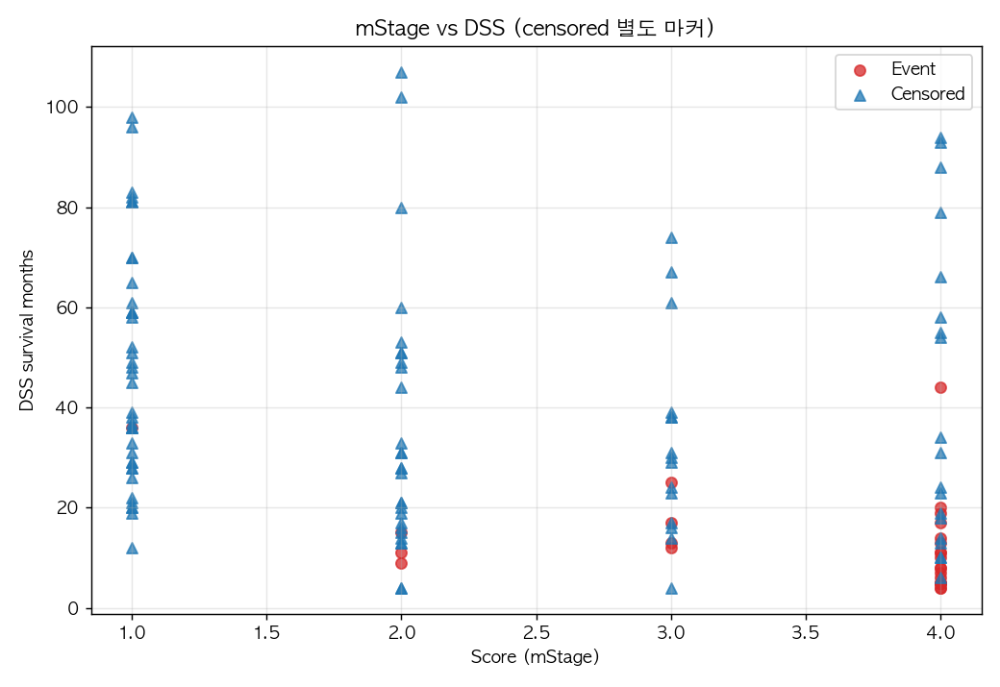
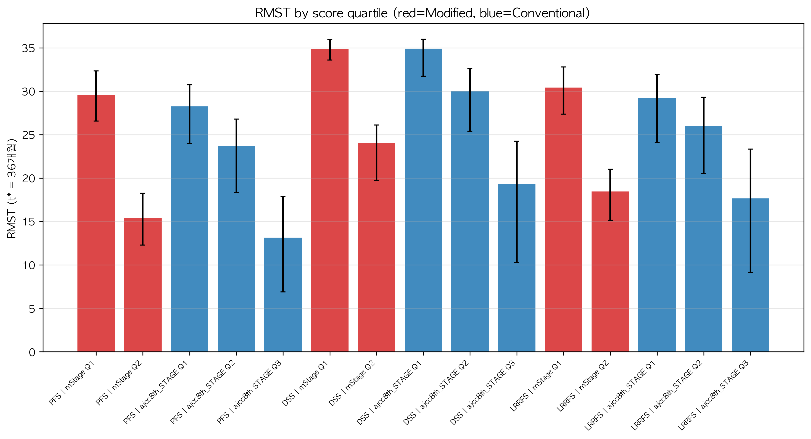

# 구강암 수정병기 검증 — AI 엔지니어 온보딩 리포트

> 작성일: 2026-08-18
> 대상: 의료 연구 맥락을 모르는 AI 엔지니어 (이제 같이 시작하는 동료)
> 목적: **무엇을 했고, 왜 했고, 데이터가 뭔지, 지표를 어떻게 읽는지** 처음부터 설명

---

## 0. 이 리포트를 읽는 법

이 프로젝트는 **의료 통계 연구**입니다. AI 엔지니어가 처음 접하면 낯선 용어가 많지만,
핵심은 단순합니다:

> **"새로운 병기 분류법(수정병기)이 기존 분류법보다 환자의 생존을 더 잘 예측하는가?"**

라는 한 가지 질문에 답하는 연구입니다. 아래에서 ① 배경 지식 → ② 데이터 → ③ 지표 → ④ 실험 → ⑤ 결과 순서로 설명합니다.

---

## 1. 업무 맥락 — 의료 연구가 뭘 하는지 (기초)

### 1.1 이 연구가 다루는 질병

- **구강암 (Oral Squamous Cell Carcinoma, OSCC)**: 혀, 잇몸, 볼 점막 등 입안에 생기는 암
- **133명 환자**의 수술 후 예후(생존) 데이터
- 의사(정세운 선생님)가 **수술 후 떼어낸 조직을 현미경으로 봐서** 암의 공격성을 평가

### 1.2 핵심 질문 — "병기(staging)"란?

**병기(stage)** = 암이 얼마나 진행됐는지를 단계(Ⅰ~Ⅳ)로 나눈 것. 치료 방침과 예후 예측의 기준입니다.

- **기존 병기 (AJCC 8판)**: 종양 크기(T), 림프절 전이(N), 원격 전이(M)로 결정
- **수정병기 (정세운 선생님 제안)**: 기존 병기에 **PD cellularity** 라는 새 지표를 추가
  - **PD = Peritumoral Desmoplasia**: 암 주변 섬유조직 반응
  - **PD-LC (Low Cellularity, 106명)**: 반응 적음 / **PD-HC (High Cellularity, 27명)**: 반응 많음
  - **PD-HC 환자는 예후가 나쁘다**는 기존 분석(oralSCC_table.docx)의 발견 → 이를 병기에 반영

**즉, 이 연구는 "PD cellularity를 병기에 반영하면 예후 예측이 좋아지는가?"를 검증합니다.**

### 1.3 왜 통계 검증이 필요한가

- 병기 규칙을 **같은 환자 133명에서 만들었다가 같은 환자로 검증하면** 결과가 과하게 좋게 나옴 (과적합)
- 그래서 **교차검증(CV), 부트스트랩(재표본추출)** 같은 기법으로 "진짜 성능"을 측정
- 이것이 이 연구의 방법론의 핵심입니다

---

## 2. 데이터 상세

### 2.1 원본 데이터 (정박사님께 드릴 raw data.xlsx)

| 항목 | 내용 |
|---|---|
| 환자 수 | **133명** |
| **데이터 단위** | **133명 = 서로 다른 환자** (같은 기관에서 치료받은 **독립적 환자들**) |
| ⚠️ 중요 | **같은 환자가 여러 번 등장하는 반복측정이 아님** — 1행 = 1명의 환자 |
| 컬럼 수 | 66개 |
| 시트 | Sheet2 = 환자 데이터, Sheet1 = 수정병기 규칙 정의 |
| 질환 | 구강 편평세포암 (OSCC) |
| 병리 구분 | PD-LC 106명 (79.7%) / PD-HC 27명 (20.3%) |

> **왜 중요한가 (통계적 의미)**: 통계 분석(생존분석, 회귀 등)은 관측치가
> **서로 독립**이라고 가정합니다. 만약 같은 환자가 여러 번 나오는 반복측정
> 데이터였다면, 같은 환자끼리 상관이 있어서 이 가정이 깨지고 별도의
> 처리(예: 환자 수준 군집)가 필요했을 것입니다. **이 데이터는 1행 = 1명의
> 서로 다른 환자이므로 독립성 가정이 성립**하고, 일반적인 통계 모델을
> 그대로 적용할 수 있습니다.

### 2.2 주요 컬럼 (변수)

**Y label (결과 변수, 예측 대상)** — 생존 관련 3종:

| 변수 | 의미 | 사건 수 |
|---|---|---|
| **PFS** (Progression-Free Survival) | 무진행 생존 — 재발/사망까지 | 61명 (45.9%) |
| **DSS** (Disease-Specific Survival) | 질병특이 생존 — 암으로 인한 사망까지 | 28명 (21.1%) |
| **LRRFS** (Locoregional Recurrence-Free Survival) | 국소·지역 재발 없는 생존 | 44명 (33.1%) |

**병기 변수**:
- 기존: `T stage`(1-5), `N stage`(0-6, x), `ajcc8th_STAGE`(1-5)
- 수정: `mTstage`(1-4), `mNstage`(0-3), `mStage`(1-4)

**임상/병리 변수 (X)**: 나이, 성별, 부위(subsite), 종양 크기, 침습 깊이(DOI),
분화도, budding, 신경주위침습(PNI), 림프혈관침습(LVI), 절제연(RM), TIL, TSR,
WPOI5, HPV/P16, CCRT(방사선치료 여부) 등

### 2.3 데이터 전처리 (preprocessed_data.csv, 133×55)

1. **'x' 마커 처리**: raw data에 'x'(미기재/해당없음)가 많음
   - 예: ENE(피막외침습) 'x' 75명, LN 관련 'x' 다수
   - **행을 버리지 않고** `{col}_val`(값) + `{col}_known`(값 존재 여부 0/1) 2컬럼으로 변환
2. **명목 변수 → one-hot**: subsite(부위), Tx_3tier(치료), HPV/P16
3. **서수 변수 → 숫자 유지**: T stage, differentiation 등
4. **CCRT → 이진**: 치료 날짜 존재 여부
5. **다중공선성 제거**: `CCRT_bin`이 `Tx_3tier`와 완전 중복(VIF=∞) → 제거

---

## 3. 주요 지표 (의료 통계) 입문

이 연구에서 쓰는 지표를 "왜 쓰는지"와 함께 설명합니다.

### 3.1 HR (Hazard Ratio) — "위험이 몇 배인가"

- 의미: 어떤 요인이 있을 때 사건(사망/재발) 위험이 **몇 배**인지
- 예: PD-HC의 DSS HR ≈ 14 → "PD-HC 환자는 사망 위험이 14배"
- 판정: 95% CI가 **1을 포함하지 않으면** 통계적으로 유의 (1이면 위험 변화 없음)

### 3.2 C-index (Concordance Index) — "예후 나쁜 환자를 맞히는 확률"

- **생존분석에서의 AUC** (0.5=무작위, 1.0=완벽)
- 의미: "두 환자를 뽑았을 때, 예후 나쁜(score 높은) 환자가 실제로 더 먼저 사건이
  발생하는 확률"
- 이 연구의 주 지표. 수정병기 C-index 0.808 = "80.8% 확률로 위험한 환자를 가려낸다"
- **중도절단(censoring) 처리**: 추적 중 사라진 환자(아직 사건 없음)도 올바르게 처리

### 3.3 AUC (Area Under ROC Curve) — "이진 분류 정확도"

- C-index의 이진분류 버전. 이 연구에서는 24개월 내 사건 여부를 분류할 때 사용
- 의료계에선 진단 모델 기준으로 "0.85+"를 언급하지만, **예후 모델은 0.70-0.80이 정상적**

### 3.4 NRI (Net Reclassification Improvement) — "재분류가 얼마나 개선됐나"

- 의미: 새 병기로 환자 위험군을 재분류했을 때, **올바르게 옮겨간 비율 − 잘못 옮겨간 비율**
- NRI > 0 = 새 병기가 재분류를 개선
- 이 연구의 S3 판정에 사용 (수정병기 증분 vs 기존병기 증분)

### 3.5 IDI (Integrated Discrimination Improvement)

- NRI와 비슷하지만, 위험 확률의 적분 차이로 판별 개선을 측정

### 3.6 RMST (Restricted Mean Survival Time) — "평균 생존 개월 수"

- t\*=36개월까지의 평균 생존 기간 (KM 곡선 적분)
- 예: 수정병기 위험군 RMST 9.1 vs 저위험군 30.2 → **위험군이 평균 21개월 짧게 삶**

### 3.7 Bootstrap (부트스트랩) — "재표본추출로 불확실성 측정"

- 원데이터에서 **복원추출로 같은 크기의 표본을 수천 번** 만들어 통계량 분포를 얻음
- 예: C-index의 95% 신뢰구간을 bootstrap 10,000회로 계산
- **optimism correction**: 같은 데이터로 만들고 검증할 때의 낙관적 편향을 보정

### 3.8 K-fold CV — "교차검증"

- 데이터를 k개로 나눠, k-1개로 학습 → 1개로 검증을 k번 반복 (이 연구는 5-fold)
- 시드(난수) 4개로 반복해 결과의 안정성 확인

### 3.9 Spearman ρ — "순위 상관"

- 두 값의 **순위**가 얼마나 일치하는지 (-1~1)
- 이 연구에서는 "시드가 달라도 환자 위험 순위가 유지되는가"(모델 안정성)를 볼 때 사용

---

## 4. 실험 설계 개요

### 4.1 실험 구조 (5개 실험)

| 실험 | 질문 | 핵심 방법 |
|---|---|---|
| **1** | 기존 분석(docx)이 재현되나? | Python 재현 + bootstrap |
| **2** | 병기 단독으로 예후 구분? | C-index 비교 (univariate) |
| **3** | 공변량 보정 후에도 우월? | Multivariate Cox (대체·증분) |
| **4** | ML 모델로도 확인? | TabICL + 단순 모델 + 회귀 |
| **5** | 어떤 score든 동일 기준으로? | score↔생존 통합 |

### 4.2 검증 전략 3종 (S1-S3)

| 전략 | 질문 |
|---|---|
| **S1** univariate | 수정병기 단독으로 더 잘 구분? |
| **S2** multivariate 대체 | 같은 공변량에서 병기만 바꿔도 더 좋음? |
| **S3** multivariate 증분 | 병기 추가 시 개선폭이 수정 > 기존? |

> S2·S3(다변량)이 **주 판정**. 단일 변수 우월성은 다른 변수 때문일 수 있어
> 교란을 보정해야 하기 때문.

### 4.3 실험 4 상세 (ML 모델)

- **TabICL**: foundation model (in-context learning). **피팅 데이터를 bootstrap으로
  4개 시드 × 5-fold CV** → 각 시드에서 score → 시드 간 순위 안정성 확인
- **단순 모델**: Logistic / Lasso / DecisionTree (AUC, 24개월 이진화)
- **생존시간 회귀 (4e)**: 24개월 이진화 대신 생존기간을 직접 회귀
  - AFT(LogNormal/Weibull): 중도절단 정식 처리
  - Lasso/Ridge/DecisionTree: naive + IPCW 가중
  - StandardScaler / PowerTransformer normalization 비교

---

## 5. 결과 요약 (기술적 관점)

### 5.1 실험 1 — 기존 분석 재현 ✅

- multivariate 방향 일치 **100%** (9/9), 전체 방향 93%
- **PD-HC의 예후 효과(HR≈14)가 재현** — 기존 분석의 핵심 발견 확인
- 잔여 불일치는 'x' 처리 관례 차이 (분석 오류 아님)


*파란 원=기존 분석 HR, 사각형=bootstrap 재현 HR — 초록=일치, 주황=방향만 일치, 빨강=불일치*

### 5.2 실험 2 — 병기 단독 구분 ✅

| 비교 | PFS | DSS | LRRFS |
|---|---|---|---|
| mStage vs ajcc8th | **0.696** vs 0.635 | **0.808** vs 0.756 | **0.673** vs 0.594 |
| mTstage vs T | **0.697** vs 0.620 | **0.829** vs 0.724 | **0.669** vs 0.587 |

- **mTstage가 DSS에서 ΔC +0.105로 가장 큰 유의 개선**
- mNstage는 기존 N과 차이 없음


*수정병기(빨강)가 대부분의 y·쌍에서 기존병기(파랑)보다 높은 C-index*


*왼쪽 수정병기 vs 오른쪽 기존병기 — stage별 생존곡선 분리도 비교*

### 5.3 실험 3 — Multivariate (주 판정) ✅

- **S2 (대체)**: 수정병기 모델이 모든 y에서 CV C-index 우월 (ΔCV>0), NRI 모두 큰 양수
- **S3 (증분)**: **ΔNRI > 0 전 y** (PFS +0.59, DSS +0.33, LRRFS +0.52) — 수정병기 증분이
  기존병기보다 큼 → **"추가 정보 가치" 입증**


*수정병기 증분(빨강)이 기존병기 증분(파랑)보다 큼 — 3개 y 모두*

### 5.4 실험 4 — ML 모델

**TabICL 안정성**: PFS ρ=0.54, DSS ρ=0.49 (중간 순위 안정), LRRFS ρ=0.09 (불안정)


*시드 간 score 순위 상관 — PFS·DSS 중간, LRRFS 낮음*

**AUC (24개월)**:

| 모델 | PFS | DSS | LRRFS |
|---|---|---|---|
| Lasso | **0.614** | **0.752** | 0.528 |
| TabICL | 0.572 | 0.623 | 0.495 |


*단순 모델(Lasso)이 TabICL보다 AUC 높음 — DSS에서 격차 최대*

**생존시간 회귀 C-index**:

| 모델 | PFS | DSS | LRRFS |
|---|---|---|---|
| AFT_LogNormal | 0.576 | **0.697** | 0.528 |
| TabICL_naive | **0.589** | 0.679 | 0.532 |


*생존시간 회귀 — DSS에서 AFT(중도절단 처리)가 최고*

### 5.5 실험 5 — score↔생존 통합 ✅

- 수정병기 C-index가 기존병기 및 회귀 예측보다 **모두 우월**
  (DSS: 수정 0.808 vs 기존 0.752 vs 회귀 0.697)
- 수정병기 위험군 RMST 21개월 단축
- 수정병기 단조성 유지 vs 기존 ajcc8th 비단조


*수정병기 stage별 실제 DSS 생존기간 — censored(파랑)와 event(빨강) 구분*


*score 4분위별 평균 생존기간(RMST) — 위험군일수록 짧음*

---

## 6. 기술적 인사이트 (AI 엔지니어 관점)

### 6.1 "과적합을 피하는 방법"이 연구의 핵심

의료 연구에서 **낙관적 편향(optimism)** 은 가장 큰 함정입니다. 이 연구는:
- 5-fold CV × 시드 4개로 진짜 성능 측정
- bootstrap으로 신뢰구간 + optimism correction
- 같은 데이터로 규칙을 만들었다는 한계를 명시적으로 보정

### 6.2 C-index vs AUC — 생존 데이터의 특수성

- 생존 데이터는 **중도절단(censoring)** 이 있어서 일반 분류 문제와 다름
- C-index는 중도절단을 처리하는 **순위 기반** 지표 — 이 연구의 주 지표
- AUC(이진화)는 24개월이라는 임의 시점을 정해야 해서 정보 손실

### 6.3 ML 모델의 한계 — n=133

- TabICL은 300~60K 샘플로 사전학습 → **n=133은 범위 밖** → 불안정
- 단순 모델(Lasso 등)이 소표본에서 더 실용적
- **"복잡한 모델이 항상 낫다"는 가정이 소표본 의료 데이터에선 성립 안 함** — 좋은 사례

### 6.4 normalization

- StandardScaler / PowerTransformer 차이가 C-index에 유의미한 영향을 주지 않음
- 단, 변수 분포가 극단적으로 비대칭일 때 power가 유용할 수 있음

---

## 7. 데이터 파일 위치 (먼저 열어볼 것)

이 프로젝트의 모든 데이터는 `seun-두경부암/` 폴더에 있습니다.

### 📁 원본 데이터 (수정 전)

```
seun-두경부암/
└── 정박사님께 드릴 raw data.xlsx    # ⭐ 원본 (의사가 제공)
    ├── Sheet2: 환자 133명 × 66컬럼   # 원시 데이터 (1행 = 1명의 다른 환자)
    └── Sheet1: 수정병기 규칙 정의    # mT/mN/mStage가 어떻게 계산되는지
```

- 이 파일이 **모든 분석의 출발점** — 의사가 수집한 그대로의 데이터
- 'x' 값(미기재)이 많아서 그대로 분석에 쓸 수 없음 → 전처리 필요

### 📁 수정한 데이터 (전처리 후 — 분석에 실제 사용)

```
seun-두경부암/
├── preprocessed_data.csv           # ⭐ 전처리 완료 (133명 × 55컬럼)
├── preprocessed_columns.csv        # 컬럼 사전 (각 컬럼이 뭔지 설명)
```

`preprocessed_data.csv`의 컬럼 구성:
- **Y label**: `PFS_event/PFS_time`, `DSS_event/DSS_time`, `LRRFS_event/LRRFS_time`
  (event=사건 여부 0/1, time=수술일 기준 개월 수)
- **병기**: `T stage`, `N stage`, `ajcc8th_STAGE`, `mTstage`, `mNstage`, `mStage`
- **임상/병리**: `age`, `성별`, `tumor size (cm)`, `DOI (mm)`, `PNI`, `LVI`, `RM`, `TIL`, `TSR`, `WPOI5_2tier`, `budding_01vs23`, `differentiation`, `HPV/P16_1`, `HPV/P16_2`, `CCRT_bin`
- **'x' 플래그**: `{col}_val`(값) + `{col}_known`(값 존재 여부 0/1) — 예: `ENE_val`, `ENE_known`
- **one-hot**: `subsite_2`~`subsite_8`, `Tx_3tier_1/2`, `HPV/P16_1/2`

> 💡 **추천 순서**: ① raw data.xlsx 열어보기 → ② preprocessed_data.csv 열어보기
> → ③ preprocessed_columns.csv로 각 컬럼 확인 → ④ 이 리포트의 §3(지표) 읽기

---

## 8. 재현 방법 (실행 코드)

```bash
# 1. 전처리
python3 preprocess_data.py          # → preprocessed_data.csv

# 2. 실험 1 (docx 재현 + bootstrap)
python3 experiment_1_docx_reproduction.py

# 3. 실험 2 (S1 univariate)
python3 experiment_2_univariate.py

# 4. 실험 3 (S2/S3 multivariate)
python3 experiment_3_multivariate.py

# 5. 실험 4 (TabICL CV 안정성) — Python 3.10 env 필요
conda activate tabicl_env
python3 experiment_4_tabicl_rsf.py

# 6. 실험 4 보조 (단순 모델 AUC, 회귀)
python3 experiment_4d_simple_models.py
python3 experiment_4e_survival_regression.py

# 7. 실험 5 (score↔생존)
python3 experiment_5_score_survival.py

# 8. 시각화 + 검증
python3 visualize_results.py
python3 validation_tools.py
```

**결과 파일**: `results/exp1/` 아래 CSV(데이터) + `plots/`(차트) + `validation/`(검증)

---

## 9. 알려진 이슈 / 주의사항

1. **TabICL segfault**: 이 환경(Apple Silicon CPU)에서 불규칙 segfault 발생
   → OMP_NUM_THREADS=1 + subprocess 격리 + 체크포인트 구조로 우회
2. **SHAP 미수행**: TabICL segfault로 SHAP 불가 → permutation importance로 대체 시도했으나
   계산량 문제로 중단 (실험 4c)
3. **RandomForest 제외**: 소표본에서 fold당 수 분 — 비현실적
4. **lifelines 버전 차이**: 0.27(기본 env) vs 0.30(tabicl_env) — AFT 클래스명
   (`LogNormalAFT` → `LogNormalAFTFitter`) 주의
5. **'x' 처리 관례**: 정세운 선생님 확인 필요 (0으로 처리 vs NaN 유지)

---

## 10. 결론 (한 문장)

> **수정병기(mStage·mTstage)는 4가지 독립 방법론 모두에서 기존 병기보다
> 구강암 환자의 예후를 더 잘 구분하며(C-index 최대 0.83), 특히 mTstage가
> DSS에서 가장 큰 개선을 보였다. TabICL은 n=133 소표본에서 불안정하여
> 단순 모델(Cox·Lasso)이 실용적 근거이다.**
