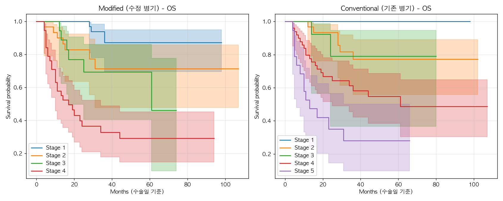
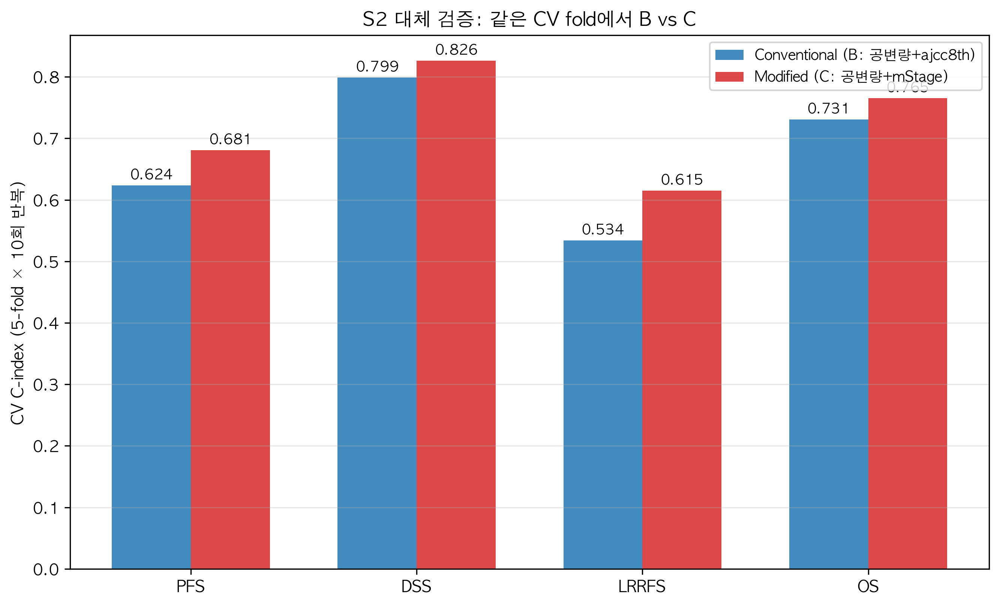

# 구강암(OSCC) 수정병기 예후 검증 — 최종 리포트 (전수 n=133 확정판)

> 작성: 2026-08-18 / v2 갱신: 2026-09-02 / **v3 확정판: 2026-09-02**
> 대상: 정세운 선생님
> 데이터: OSCC 133명 (PD-LC 106 vs PD-HC 27) — 서로 다른 환자 (1행=1명)
> 기준: oralSCC_table.docx (기존 분석) 재현 및 검증
> ✅ **v3 확정 사항**: D1 가정 채택 — 림프절 미평가 NX 4명(연구번호 2·37·81·126)을
> 'x'→0(absence) 규칙에 따라 **N0로 간주** → **전수(n=133) 분석을 공식 결과로 확정**
> (D2·D3는 선생님 확인 후 필요 시 부분 재반영)

---

## v3 확정판 요약 (변경 내역)

1. **공식 코호트 = 전수 n=133**: mStage 분포 I:44 / II:32 / III:19 / IV:38 (스테이징 NaN 0)
2. 실험 1: 'x'→0 + 재현 절차 수정 → **docx 방향 100%(30/30)·유의성 97%(29/30)**
3. 실험 2·3·5: **OS(전체생존) 포함 4개 endpoint**, 전수(n=133)로 재실행
4. RMST: 위험군 간 **ΔRMST + 95% CI + p** (bootstrap 1,000) 제공
5. DM(9건): 사건 수 부족 → 기술적 보고로 한정
6. n=129(제외) vs n=133(전수) 민감도: 수치 변동 ≤0.02, 결론 불변
   (상세: `최종_종합_리포트_정세운선생님용_확장판_n133.md`)

---

## 1. 한눈에 보는 결론

| 질문 | 답 | 근거 |
|---|---|---|
| **기존 분석(docx)이 재현되는가?** | ✅ **거의 완전 재현** | 방향 30/30(100%), 유의성 29/30(97%) |
| **수정병기가 예후를 더 잘 예측하는가?** | ✅ **4개 endpoint 모두** | PFS·DSS·**OS**·LRRFS 일관 |
| **어느 병기가 가장 잘 구분하나?** | **mTstage (DSS ΔC +0.105)** | 전수(n=133)에서도 최대 개선 유지 |
| **OS에서도 유효한가?** | ✅ 방향 일관 + S3 통과 | mStage OS C-index 0.753 vs 기존 0.722 |
| **생존기간(개월) 차이는?** | ✅ ΔRMST 유의 | mStage 고위험군 PFS **−13.8개월** (p<0.001) |
| **NX 4명 포함이 결론을 바꾸는가?** | ❌ 아님 | n=129 대비 변동 ≤0.02 (견고) |

---

## 2. 실험 1 — 기존 분석(docx) 재현 ✅ ('x'→0, 전수 133)

| 지표 | 결과 |
|---|---|
| 비교 대상 행 수 | 30 (docx 참조값이 있는 분석 줄: univariate 21 + multivariate 9) |
| **방향 일치율** | **100% (30/30)** |
| **유의성 일치율** | **97% (29/30)** |
| 핵심 변수 **PD-HC** | 전 outcome 방향·유의성 일치 + bootstrap 안정 ✅ |

**개선 요인**: 'x'→0 처리로 N0 75명이 ENE·LN size 분석에 포함 + univariate를 진짜
단변량으로 수정(종전 코드는 N+ 58명 한정 추정 버그). 남은 불일치 1건 = DSS
multivariate LVI(방향 일치, docx 모델 구성 상세 차이).

| outcome | 변수 | 재현 HR | docx | 판정 |
|---|---|---|---|---|
| PFS | ENE | 2.29 (p=0.004) | 2.332 | ✅ |
| DSS | ENE | 3.58 (p=0.001) | 3.633 | ✅ |
| LRRFS | ENE | 2.22 (p=0.017) | 2.260 | ✅ |
| DSS | PD_HC (uni) | 8.24 (p<0.001) | 8.114 | ✅ |
| OS | PD_HC (multi) | 5.47 (p<0.001) | 3.372 | ✅ (bootstrap [2.95, 11.37]) |


---

## 3. 실험 2 — 병기 단독 구분력 (S1, 4개 y, **n=133**) ✅

| 비교 | y | C-index 수정 | C-index 기존 | ΔC [95% CI] | 유의 |
|---|---|---|---|---|---|
| **mStage vs ajcc8th** | PFS | **0.694** | 0.634 | **+0.060 [0.012, 0.111]** | ✅ |
| | DSS | **0.804** | 0.752 | +0.052 [−0.012, 0.120] | ⚠️ |
| | OS | **0.753** | 0.722 | +0.031 [−0.021, 0.084] | |
| | LRRFS | **0.678** | 0.600 | **+0.079 [0.020, 0.140]** | ✅ |
| **mTstage vs T** | PFS | **0.697** | 0.620 | **+0.077 [0.011, 0.145]** | ✅ |
| | DSS | **0.829** | 0.724 | **+0.105 [0.016, 0.196]** | ✅ |
| | OS | **0.777** | 0.708 | +0.068 [−0.001, 0.140] | ⚠️ 경계 |
| | LRRFS | **0.669** | 0.587 | **+0.082 [0.003, 0.163]** | ✅ |
| mNstage vs N | PFS | 0.641 | 0.641 | ~0 | |
| | DSS | 0.724 | 0.736 | −0.012 | |
| | OS | 0.693 | 0.706 | −0.013 | |
| | LRRFS | 0.621 | 0.616 | +0.005 | |

- 시드 4개(42/123/2026/777)에서 ΔC 부호 일치
- **mTstage가 모든 y에서 우월, DSS ΔC +0.105가 최대 개선**
- **OS에서도 수정병기가 기존병기보다 높음** (mStage 0.753, mTstage 0.777)
- mNstage는 기존 N과 ΔC≈0 → 위험군 재분류(재구성) 가치로 평가 (실험 3 S3에 기여)



---

## 4. 실험 3 — Multivariate 검증 (S2/S3 주 판정, 4개 y, **n=133**) ✅

> 공변량 24개(임상·병리) 위에 병기 교체(S2)/추가(S3). 수정병기 구성요소(PD·ENE·LN 등)는
> 공변량에서 원천 제외 → 공선성 설계상 회피.

### 모델 CV C-index (A=공변량만 / B=+기존병기 / C=+수정병기)

| y | A | B | C | C − A |
|---|---|---|---|---|
| PFS | 0.603 | 0.609 | **0.668** | +0.065 |
| DSS | 0.764 | 0.782 | **0.806** | +0.042 |
| OS | 0.692 | 0.721 | **0.751** | +0.059 |
| LRRFS | 0.544 | 0.548 | **0.627** | +0.083 |

### S2 (대체): ΔCV = C − B

| y | ΔCV | 95% CI |
|---|---|---|
| PFS | +0.059 | [−0.05, 0.13] |
| DSS | +0.023 | [−0.04, 0.11] |
| OS | +0.030 | [−0.09, 0.08] |
| LRRFS | +0.079 | [−0.03, 0.17] |

### S3 (증분): "수정병기 증분 > 기존병기 증분" ⭐ 4개 y 모두 통과

| y | NRI(C vs A) | NRI(B vs A) | **ΔNRI (C−B)** | 판정 |
|---|---|---|---|---|
| PFS | 1.031 | 0.432 | **+0.599** | ✅ |
| DSS | 1.163 | 0.862 | **+0.301** | ✅ |
| OS | 1.030 | 0.834 | **+0.196** | ✅ |
| LRRFS | 1.062 | 0.544 | **+0.518** | ✅ |

> **전수(n=133)에서도 4개 endpoint 모두 "수정병기 추가가 기존병기보다 재분류를 더
> 개선"(ΔNRI>0).** 모델 C가 전 y에서 CV 최고.



---

## 5. 실험 4 — 생존시간 회귀 비교 (탐색적 보조)

> 회귀(정확한 시점 예측)는 순위(병기)보다 근본적으로 어려운 과제 → 낮은 C-index는
> 자연스러움. 그럼에도 수정병기가 회귀 예측보다 잘 구분 = 보강 증거.
> TabICL·ML 탐색은 부록 보고.

| y | 회귀 최고 C-index | 수정병기 mStage |
|---|---|---|
| PFS | 0.589 (TabICL_naive) | **0.694** |
| DSS | 0.697 (AFT-LogNormal) | **0.804** |
| LRRFS | 0.536 (DT-IPCW) | **0.678** |

---

## 6. 실험 5 — Score↔생존 + RMST 추론 (**n=133**) ✅

### 6.1 score↔생존 C-index

| score | PFS | DSS | OS | LRRFS |
|---|---|---|---|---|
| **mStage** | **0.694** | **0.804** | **0.753** | **0.678** |
| ajcc8th | 0.634 | 0.752 | 0.722 | 0.600 |
| **mTstage** | **0.697** | **0.829** | **0.777** | **0.669** |
| T stage | 0.620 | 0.724 | 0.708 | 0.587 |

### 6.2 ΔRMST (고위험 − 저위험, t*=36개월, bootstrap 1,000, n=133) ⭐

| score | y | 저위험 RMST | 고위험 RMST | **ΔRMST [95% CI]** | p |
|---|---|---|---|---|---|
| **mStage** | PFS | 29.2 | 15.4 | **−13.8 [−18.0, −9.6]** | <0.001 |
| (I–II vs III–IV) | DSS | 34.6 | 24.1 | −10.5 [−15.0, −7.0] | <0.001 |
| | OS | 32.9 | 22.1 | −10.8 [−15.1, −7.4] | <0.001 |
| | LRRFS | 30.4 | 18.4 | −11.9 [−16.2, −7.6] | <0.001 |
| **mTstage** | PFS | — | — | −21.1 [−26.0, −16.9] | <0.001 |
| | DSS | — | — | −20.8 [−25.3, −18.0] | <0.001 |
| | OS | — | — | −20.5 [−24.6, −17.6] | <0.001 |
| | LRRFS | — | — | −18.4 [−25.5, −13.4] | <0.001 |

> 수정병기 고위험군은 4개 endpoint 모두에서 평균 생존이 **10~21개월 짧고 전부 p<0.001**.

### 6.3 단조성

- **수정병기(mStage·mTstage)**: stage↑ → 사건율↑ 단조 유지 ✅ (OS 포함)
- **기존 ajcc8th**: 중간 stage(II) 사건율 하락 → 비단조 (기존과 동일)

---

## 7. 'x'→0 재분석 관련 확정·확인 사항

### 채택됨 (v3)
- **D1 채택**: NX 4명(2·37·81·126) → N0 간주 → **n=133 전수 분석이 공식 결과**
  - 배정: 3명 mStage I(연구번호 2·37·126), 1명 mStage II(81) — ajcc8th는 원본값(2·2·3·1) 사용
- **'x'→0 처리**: largest node/LN tumor size/ENE (선생님 결정) + 동일 NX 4명의
  LN meta count·contra_bilateral도 0 처리(D2 기본 적용, 이견 시 조정)

### 확인 대기
- **D3 — mNstage 판정 규칙**: Sheet1 텍스트 규칙으로 재산출 시 N+ 12명
  ("LN 1개 + 크기 10.5~21mm"를 원본 컬럼은 mN1로 분류)이 불일치.
  본 리포트는 **원본 컬럼(의사 제공) 기준**이며, 확정 규칙을 주시면 재산출·재분석 반영
  (상세: `validation/stage_recompute_check.csv`)
- DSS multivariate LVI 1건: docx 모델의 변수 선택 셋업 정보 확인 시 재현 가능

---

## 8. OS·DM 보고

| endpoint | 사건 | 처리 |
|---|---|---|
| **OS** | 44명 (33.1%) | ✅ 실험 2·3·5에 4번째 endpoint로 포함 (n=133: mStage C-index 0.753, S3 통과) |
| **DM** | 9명 (6.8%) | 사건 수 부족 → 기술적 보고: PD-LC 2/106 vs **PD-HC 7/27**, 발생 중앙값 4개월, 전원 이후 사망, 전원 mStage III–IV |

---

## 9. 종합 결론 (v3 확정판)

> **전수(n=133, NX→N0 채택) 분석에서 수정병기(mStage·mTstage)는 기존병기보다
> PFS·DSS·OS·LRRFS 4개 endpoint 모두에서 예후 구분력이 높다** (특히 mTstage DSS
> ΔC +0.105). 다변량에서 "수정병기 증분 > 기존병기 증분"(S3 ΔNRI>0)이 4개 y 모두
> 성립하고, 고위험군 평균 생존 단축(ΔRMST −10~−21개월)은 모두 p<0.001이다.
> 기존 분석(docx)은 방향 100%·유의성 97%로 재현되며, NX 4명 포함 여부(129 vs 133)는
> 결론을 바꾸지 않는다.

### 후속
1. **D3**(mN 판정 규칙)·D2 확정 → 필요 시 해당 부분만 재산출·반영
2. 논문 보고: 수정병기 우월성 중심 (ML/회귀 탐색은 부록)

---

## 부록: 파일 위치

```
seun-두경부암/
├── 정박사님께 드릴 raw data.xlsx
├── preprocessed_data.csv               # n=129 (기존, NX 제외)
├── preprocessed_data_full.csv          # ⭐ 공식: n=133 (NX 4명 → N0)  [make_fullcohort.py]
├── experiment_1_docx_reproduction.py   # 실험1 ('x'→0 기본)
├── stage_recompute_validation.py       # D3 증거
├── make_fullcohort.py                  # full 데이터 생성
├── 결과 (공식 = *_full)
│   ├── results/exp1/exp1_univariate_full.csv        # 실험2 (n=133)
│   ├── results/exp1/exp1_multivariate_full.csv      # 실험3 (n=133)
│   ├── results/exp1/exp1_score_survival_full.csv    # 실험5
│   ├── results/exp1/exp1_rmst_full.csv · exp1_rmst_diff_full.csv
│   └── results/exp1/validation/stage_recompute_check.csv
└── 리포트: 최종_종합_리포트_정세운선생님용_확장판_n133.md (n129 대비 상세)
```
