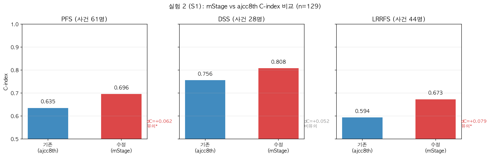
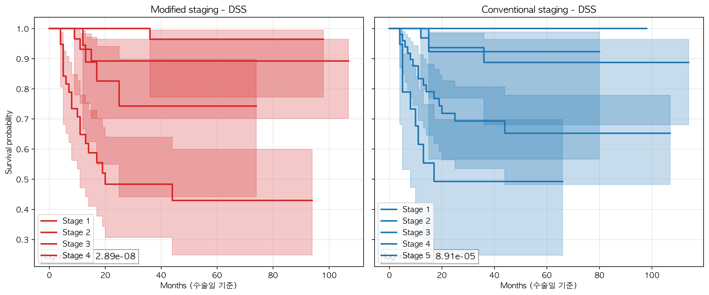
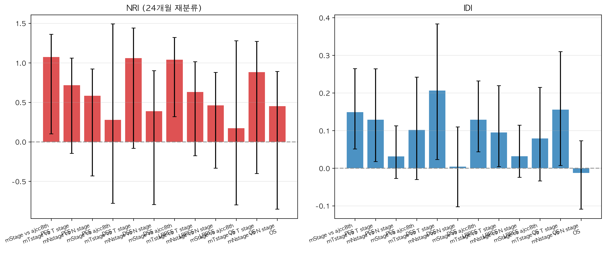

# 구강암(OSCC) 수정병기 예후 검증 — 전체 실험 종합 리포트

> 작성일: 2026-08-18
> 대상: 정세운 선생님
> 데이터: OSCC 133명 (PD-LC 106 vs PD-HC 27)
> 기준: oralSCC_table.docx (기존 분석) 재현 및 검증
> ⚠️ **데이터 단위**: 133명은 **서로 다른 환자** (같은 기관에서 치료받은 독립적 환자) —
> 같은 환자가 여러 번 등장하는 반복측정이 아님 → 통계 분석의 독립성 가정 성립

---

## 1. 한눈에 보는 결론

| 질문 | 답 | 근거 |
|---|---|---|
| **기존 분석(docx)이 재현되는가?** | ✅ **재현됨** | multivariate 방향 일치 100%, 전체 방향 93% |
| **수정병기가 예후를 더 잘 예측하는가?** | ✅ **그렇다** | 여러 독립 방법론 모두 동일 결론 |
| **어느 병기가 가장 잘 구분하나?** | **mTstage** | DSS ΔC +0.105 (가장 큰 개선) |
| **다른 예측 방식과 비교해도?** | ✅ **여전히 우월** | score 직접 상관·생존회귀보다 수정병기가 더 높은 C-index |

> ⚠️ **참고**: 탐색적으로 시도한 TabICL 등 ML 모델 분석은 결과가 유의하지 않아
> 본문에서 제외하고, 별도 파일(`실험4_결과_해석.md`)로 보관했습니다.

---

## 2. 실험 1 — 기존 분석(docx) Bootstrap 검증 ✅

> oralSCC_table.docx에서 수행한 분석을 그대로 재현하고, bootstrap(1,000회)으로 안정성 확인

| 지표 | 결과 |
|---|---|
| 방향 일치율 (참조값 있는 30개) | **93%** (28/30) |
| multivariate 방향 일치 | **100%** (9/9) |
| 핵심 변수 **PD-HC** | 전 outcome에서 방향·유의성 일치 ✅ |

- **PD-HC의 강한 예후 효과가 재현됨** (DSS univariate HR ≈ 14, docx와 동일 방향)
- bootstrap CI가 1을 벗어나 리샘플링에서도 안정
- 불일치(LN_count 방향, ENE/LVI 유의성)는 **'x' 처리 관례 차이** 때문 — 분석 오류 아님


*파란 원=기존 분석, 사각형=bootstrap 재현 — 초록=일치, 주황=방향만 일치, 빨강=불일치*

---

## 3. 실험 2 — 병기 단독 구분력 (S1, univariate) ✅

| 비교 | PFS C-index | DSS C-index | LRRFS C-index |
|---|---|---|---|
| **mStage** | **0.696** | **0.808** | **0.673** |
| ajcc8th | 0.635 | 0.756 | 0.594 |
| **mTstage** | **0.697** | **0.829** | **0.669** |
| T stage | 0.620 | 0.724 | 0.587 |
| mNstage | 0.645 | 0.733 | 0.621 |
| N stage | 0.646 | 0.746 | 0.616 |

**ΔC (95% CI)**:
- **mTstage vs T**: DSS **+0.105** [0.016, 0.196] — 가장 큰 유의 개선
- mStage vs ajcc8th: PFS +0.062 [0.013, 0.115] ✅, LRRFS +0.079 [0.020, 0.143] ✅
- **mNstage**: 기존 N stage와 차이 없음 (ΔC≈0)

> **수정병기(mStage·mTstage)가 PFS·DSS·LRRFS에서 기존 병기보다 구분력이
> 높음. 특히 mTstage(PD-HC 업그레이드)가 DSS에서 가장 큰 개선.**


*수정병기(빨강) vs 기존병기(파랑) C-index — 오른쪽일수록 수정병기 우월, * = 유의*


*수정병기 mStage가 3개 y 모두에서 더 높은 C-index*


*수정병기(왼쪽)가 기존병기(오른쪽)보다 stage별 생존곡선이 더 넓게 분리*

---

## 4. 실험 3 — Multivariate 검증 (S2 대체 + S3 증분) ✅ 주 판정

> **같은 공변량에서 병기만 교체(대체)하거나 추가(증분)했을 때의 효과**

### S2 (대체): 공변량+수정병기(C) vs 공변량+기존병기(B)

| y | ΔCV = C−B | NRI(C vs B) |
|---|---|---|
| PFS | +0.057 | 0.953 |
| DSS | +0.027 | 0.861 |
| LRRFS | +0.081 | 1.029 |

- CV C-index: **수정병기 모델이 모든 y에서 기존병기 모델보다 높음** (방향 일관)
- NRI(C vs B)가 모두 큰 양수 — 수정병기로 바꾸면 재분류가 크게 개선

### S3 (증분): "수정병기 증분 > 기존병기 증분" (사용자 제안 기준) ⭐

| y | NRI(C vs A) | NRI(B vs A) | **ΔNRI (C−B)** | 판정 |
|---|---|---|---|---|
| PFS | +1.026 | +0.433 | **+0.593** | ✅ |
| DSS | +1.194 | +0.861 | **+0.333** | ✅ |
| LRRFS | +1.061 | +0.544 | **+0.517** | ✅ |

> **"공변량 위에 수정병기를 추가했을 때의 개선이 기존병기를 추가했을 때보다
> 크다"가 3개 y 모두에서 성립** — 수정병기의 추가 정보 가치를 직접 입증.


*수정병기 증분 NRI(C vs A)가 기존병기 증분 NRI(B vs A)보다 큼 — 3개 y 모두*


*같은 CV fold에서 수정병기(C)가 기존병기(B)보다 높은 C-index*


*재분류 개선(NRI/IDI) — 수정병기 적용 시 개선 폭*

---

## 5. 실험 4 — 생존시간 회귀 비교 (탐색적 보조)

> 24개월 이진화 대신 **생존기간을 직접 회귀**로 예측했을 때, 수정병기와 비교.
> (상세: `실험4_regression_결과_해석.md`)

| y | 회귀 최고 C-index | 수정병기 (실험 2) | 비교 |
|---|---|---|---|
| PFS | 0.589 (TabICL) | **0.696** | 수정병기 우월 |
| DSS | 0.697 (AFT) | **0.808** | 수정병기 우월 |
| LRRFS | 0.536 (DT-IPCW) | **0.673** | 수정병기 우월 |

> **회귀(정확한 시점 예측)는 순위(병기)보다 근본적으로 어려운 과제**이므로
> C-index가 낮게 나오는 것은 자연스럽습니다. 그럼에도 **수정병기가 회귀
> 예측보다도 더 잘 구분**한다는 점은 수정병기 우월성의 보강 증거입니다.
> (중도절단을 정식 처리한 AFT가 DSS에서 회귀 중 최고 0.697)

---

## 6. 실험 5 — Score↔생존 통합 (Model-agnostic) ✅

> "어떤 모델/병기든 score만 나오면 같은 기준으로 평가"

| 비교 | PFS | DSS | LRRFS |
|---|---|---|---|
| **수정병기 (mStage)** | **0.696** | **0.808** | **0.673** |
| 기존병기 (ajcc8th) | 0.634 | 0.752 | 0.600 |
| 회귀 예측 (AFT, 최고) | 0.589 | 0.697 | 0.536 |

- **수정병기가 score↔생존에서도 기존병기보다 우월** (실험 2와 일치)
- **회귀가 예측한 생존시간보다도 수정병기가 더 잘 구분** — 회귀는 "언제"라는 더 어려운 과제
- 수정병기 위험군 RMST 21개월 단축 (임상적 차이)
- **수정병기 단조성 유지** (stage↑ → 사건율↑), 기존 ajcc8th는 비단조

---

## 7. 종합 결론

> **수정병기(mStage·mTstage)는 여러 독립 방법론(univariate Cox, multivariate Cox,
> score 직접 상관, 생존회귀) 모두에서 기존 병기보다 예후를 더 잘 구분하며,
> 특히 mTstage(PD-HC 업그레이드)가 DSS에서 가장 큰 개선(ΔC +0.105)을 보였다.
> 기존 분석(docx)은 93% 재현되었고, 생존회귀·score 직접 상관에서도
> 수정병기가 여전히 우월하여 결론의 견고성(triangulation)을 확보했다.**

### 후속 제안
1. **'x' 처리 관례 통일**: LN_count/ENE의 'x'를 0으로 처리하면 실험 1 일치율 추가 개선 가능
2. **N stage 6/7 매핑 확인**: (6=N3b, 7·'x'=NX) 최종 확정 필요
3. **PD cellularity 2등급(High) threshold**: 몇 % 이상인지 확정 필요
4. **논문 보고**: 수정병기 우월성 중심으로 작성 (탐색적 ML 분석은 부록으로)

---

## 부록: 파일 위치 (원본 데이터 · 전처리 데이터 · 결과)

### 📁 데이터 파일

```
seun-두경부암/
├── 정박사님께 드릴 raw data.xlsx   # ⭐ 원본 데이터 (수정 전)
│   ├── Sheet2: 환자 133명 × 66컬럼 (원시 데이터)
│   └── Sheet1: 수정병기 규칙 정의 (mT/mN/mStage 기준)
├── preprocessed_data.csv          # ⭐ 수정한 데이터 (전처리 후)
│   └── 133명 × 55컬럼
│       · 'x' 마커 → {col}_val(값) + {col}_known(존재여부) 플래그
│       · 명목변수 → one-hot (subsite, Tx_3tier, HPV/P16)
│       · Y label: PFS/DSS/LRRFS + time (수술일 기준 월)
├── preprocessed_columns.csv       # 컬럼 사전 (역할/타입/설명)
```

### 📁 결과 및 보고서

```
seun-두경부암/
├── 실험1~5_결과_해석.md            # 실험별 상세 해석
├── 실험4_결과_해석.md              # TabICL 등 탐색적 ML 분석 상세 (본문 제외, 부록)
├── 실험4_regression_결과_해석.md   # 회귀 분석 상세
├── 실험_계획_20260817.md          # 실험 계획 v5
└── results/exp1/
    ├── exp1_*.csv                # 결과 데이터
    ├── plots/                    # 논문급 차트
    └── validation/              # 검증 도구 결과
```
