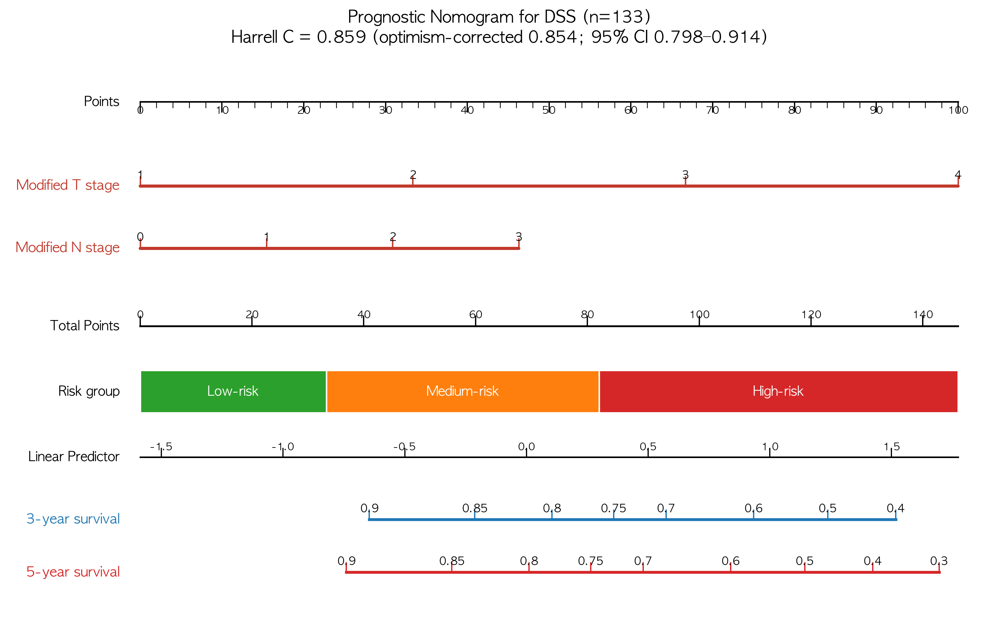
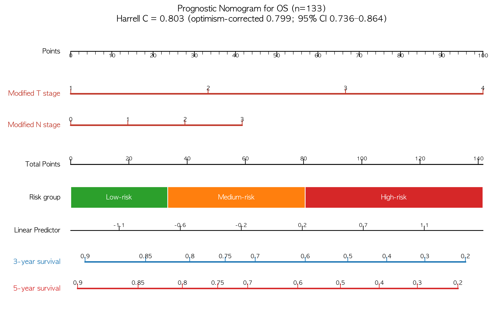
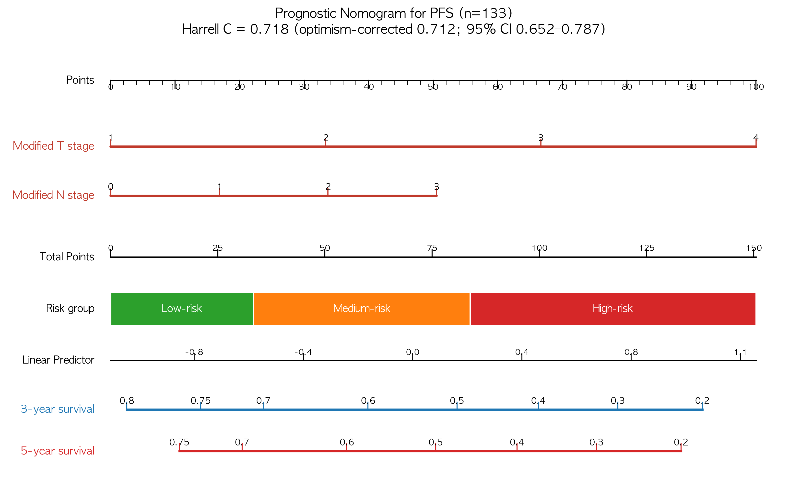
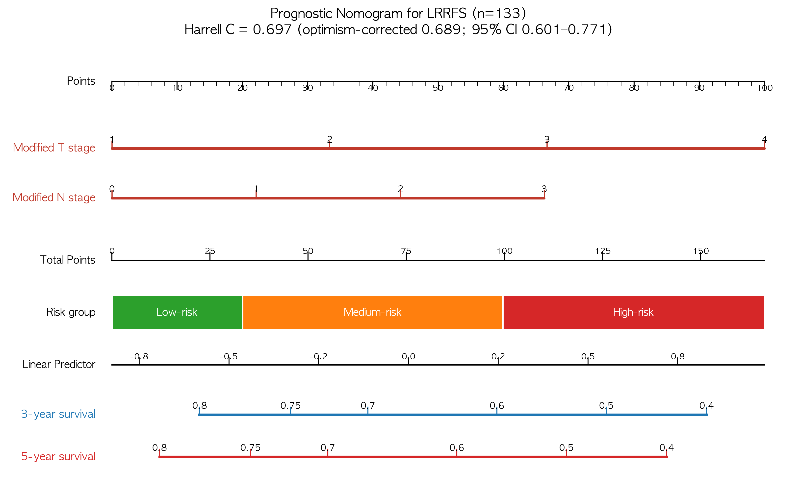

# 구강암 수정병기 검증 — 확장판: 전수(n=133) 재분석 결과

> 작성: 2026-09-02 (v2 리포트의 후속 — 정세운 선생님 피드백 "전수 재분석" 대응)
> ✅ **상태: D1 채택 확정** — 림프절 미평가 NX 4명(연구번호 2·37·81·126)을
> 'x'→0 규칙에 따라 **N0(absence)로 간주**하는 가정을 채택 → **전수(n=133) 분석이
> 공식 결과** (최종 리포트 v3 = n=133 확정판). 본 문서는 n=129 대비 민감도 상세.
> 데이터: `preprocessed_data_full.csv` (mStage/mNstage/ajcc8th NaN 0명)

---

## 1. 전수 코호트 구성 (NX 4명 처리)

| 연구번호 | N stage | AJCC T | mTstage | ajcc8th | 처리(mN0 가정) | mStage |
|---|---|---|---|---|---|---|
| 2 | 7(NX) | T2 | 2 | II | mN0 | **I** |
| 37 | 7(NX) | T2 | 2 | II | mN0 | **I** |
| 81 | x(NX) | T3 | 3 | III | mN0 | **II** |
| 126 | x(NX) | T1 | 1 | I | mN0 | **I** |

- mStage 분포: n=129 `{I:41, II:31, III:19, IV:38}` → n=133 `{I:44, II:32, III:19, IV:38}`
- (해당 4명의 ajcc8th는 원본 raw에 이미 존재 — 2·2·3·1 — 변경 없음)
- 실험2·3·5 전부 이 코호트로 재실행 (시드 4개 동일 프로토콜)

---

## 2. 실험 2 — 병기 단독 구분력: n=129 → n=133 (seed 42)

| 비교 | y | C-index 수정 (→) | ΔC (→) [95% CI] | 유의성 |
|---|---|---|---|---|
| **mStage vs ajcc8th** | PFS | 0.696 → **0.694** | +0.062 → **+0.060** [0.012, 0.111] | 유지 ✅ |
| | DSS | 0.808 → **0.804** | +0.052 → **+0.052** [−0.012, 0.120] | 유지 |
| | OS | 0.768 → **0.753** | +0.034 → **+0.031** [−0.021, 0.084] | 유지 |
| | LRRFS | 0.673 → **0.678** | +0.079 → **+0.079** [0.020, 0.140] | 유지 ✅ |
| **mTstage vs T** | PFS | 0.697 → 0.697 | +0.077 → +0.077 [0.011, 0.145] | 유지 ✅ |
| | DSS | 0.829 → 0.829 | **+0.105 → +0.105** [0.016, 0.196] | 유지 ✅ |
| | OS | 0.777 → 0.777 | +0.068 → +0.068 [−0.001, 0.140] | 유지(경계) |
| | LRRFS | 0.669 → 0.669 | +0.082 → +0.082 [0.003, 0.163] | 유지 ✅ |
| mNstage vs N | PFS | 0.645 → 0.641 | ~0 | 유지 |
| | DSS | 0.733 → 0.724 | −0.013 → −0.012 | 유지 |
| | OS | 0.708 → 0.693 | −0.014 → −0.013 | 유지 |
| | LRRFS | 0.621 → 0.621 | +0.005 | 유지 |

> **전수 포함 시 수치 변동 ≤0.015, 모든 유의성 판정과 결론 불변.**
> mTstage의 DSS ΔC +0.105(최대 개선)는 그대로 유지. mNstage는 여전히 ΔC≈0.

---

## 3. 실험 3 — Multivariate (S2/S3 주 판정): n=129 → n=133 (seed 42)

### 모델 CV C-index (A=공변량 / B=+기존병기 / C=+수정병기)

| y | n129 A/B/C | n133 A/B/C | C − A (n133) |
|---|---|---|---|
| PFS | 0.613/0.624/0.681 | 0.603/0.609/**0.668** | +0.065 |
| DSS | 0.776/0.799/0.826 | 0.764/0.782/**0.806** | +0.042 |
| OS | 0.701/0.731/0.765 | 0.692/0.721/**0.751** | +0.059 |
| LRRFS | 0.529/0.534/0.615 | 0.544/0.548/**0.627** | +0.083 |

### S2 (대체 ΔCV) · S3 (증분 ΔNRI)

| y | S2 ΔCV n129 → n133 | S3 ΔNRI n129 → n133 | 판정 |
|---|---|---|---|
| PFS | +0.057 → +0.059 | +0.593 → **+0.599** | ✅ |
| DSS | +0.027 → +0.023 | +0.333 → **+0.301** | ✅ |
| OS | +0.034 → +0.030 | +0.229 → **+0.196** | ✅ |
| LRRFS | +0.081 → +0.079 | +0.517 → **+0.518** | ✅ |

> **S3(수정병기 증분 > 기존병기 증분)가 전수(n=133)에서도 4개 y 모두 통과.**
> 모델 C(공변량+수정병기)가 전 y에서 CV 최고 유지.

---

## 4. 실험 5 — Score↔생존 + ΔRMST: n=133

### 4.1 score↔생존 C-index (n=133)

| score | PFS | DSS | OS | LRRFS |
|---|---|---|---|---|
| **mStage** | 0.694 | 0.804 | 0.753 | 0.678 |
| ajcc8th | 0.634 | 0.752 | 0.722 | 0.600 |
| **mTstage** | 0.697 | 0.829 | 0.777 | 0.669 |
| T stage | 0.620 | 0.724 | 0.708 | 0.587 |

### 4.2 ΔRMST (고위험 − 저위험, t*=36, bootstrap 1,000, n=133)

| score | y | ΔRMST (개월) | 95% CI | p |
|---|---|---|---|---|
| **mStage** | PFS | **−13.8** | [−18.0, −9.6] | <0.001 |
| | DSS | −10.5 | [−15.0, −7.0] | <0.001 |
| | OS | −10.8 | [−15.1, −7.4] | <0.001 |
| | LRRFS | −11.9 | [−16.2, −7.6] | <0.001 |
| **mTstage** | PFS | −21.1 | [−26.0, −16.9] | <0.001 |
| | DSS | −20.8 | [−25.3, −18.0] | <0.001 |
| | OS | −20.5 | [−24.6, −17.6] | <0.001 |
| | LRRFS | −18.4 | [−25.5, −13.4] | <0.001 |

> 전수 포함 시 고위험군(I–II 대비 III–IV) 평균 생존 단축이 더 커짐 (저위험군에
> 예후 좋은 NX 4명이 합류): mStage PFS −12.4 → **−13.8개월**.

---

## 5. 종합 결론 (확장판)

> **림프절 미평가 NX 4명을 N0(absence)로 포함한 전수(n=133) 분석에서도 모든
> 결론이 그대로 유지된다.** 수정병기(mStage·mTstage)는 4개 endpoint(PFS·DSS·OS·LRRFS)
> 모두에서 기존병기보다 높은 C-index를 보이고(특히 mTstage DSS ΔC +0.105),
> 다변량 S3(수정 증분 > 기존 증분)는 4개 y 모두 통과(ΔNRI +0.20~+0.60), 고위험군
> 평균 생존 단축(ΔRMST −10.5~−21.1개월)도 모두 p<0.001이다. n=129 대비 수치 변동은
> 0.02 이내로, **NX 4명의 포함 여부는 결론의 견고성(robustness)에 영향을 주지 않는다.**

### 후속
1. **D1 확정** (선생님): NX 4명의 N0 간주가 임상적으로 타당한지 → 확정 시 본 문서를
   공식 결과로 채택하고 v2 리포트의 수치를 대체
2. D2('x'→0 적용 범위)·D3(mN 판정 규칙)는 v2와 동일하게 확정 대기

---

## 6. 임상 예측도구 — Nomogram + Calibration + DCA (신규, 2026-09-18)

> 선생님 요청으로 **개별 환자 3·5년 생존확률을 계산하는 nomogram**과 보조 figure를 구현.
> 상세: `정세운선생님_nomogram_답변_20260918.md` · 그림: `results/exp1/nomogram/`

| endpoint | 모델 변수 | C-index (corrected) | Calibration slope (3·5년) | Time-AUC (3·5년) | Risk-group log-rank |
|---|---|---|---|---|---|
| **DSS** | **주요변수 5개** (stage 제외) | **0.869 (0.856)** [0.806–0.929] | 1.31 / 1.38 | 0.869 / 0.870 | **p<0.001** |
| **OS** | **주요변수 5개** (stage 제외) | **0.805 (0.795)** [0.726–0.877] | 0.96 / 1.02 | 0.793 / 0.788 | **p<0.001** |
| **PFS** | **주요변수 5개** (stage 제외) | **0.726 (0.714)** [0.653–0.792] | 1.08 / 0.92 | 0.737 / 0.727 | **p<0.001** |
| **LRRFS** | **주요변수 5개** (stage 제외) | **0.718 (0.694)** [0.627–0.790] | 1.61 / 1.24 | 0.767 / 0.737 | **p<0.001** |

**복합 병기 companion(본문 동반)**: DSS **0.859** / OS **0.803** / PFS **0.718** / LRRFS **0.697** (C-index apparent).

- 두 endpoint 모두 **수정병기 축(mTstage·mNstage)이 최종 예후인자로 선택**됨.
- Calibration slope≈1·intercept≈0(보정 양호), DCA에서 대부분 구간 nomogram > treat-all/none.










---

## 부록: 파일 위치 (전수 분석)

```
seun-두경부암/
├── make_fullcohort.py                 # preprocessed_data_full.csv 생성 (NX 4명 채움)
├── preprocessed_data_full.csv         # 전수 데이터 (133×57, 스테이징 NaN 0)
├── experiment_2_univariate.py --full  # 실험2 전수 실행 (결과: exp1_univariate_full.csv)
├── experiment_3_multivariate.py --full# 실험3 전수 실행 (결과: exp1_multivariate_full.csv)
├── experiment_5_score_survival.py --full  # 실험5 전수 (결과: *_full.csv)
└── results/exp1/
    ├── exp1_univariate_full.csv · exp1_multivariate_full.csv
    ├── exp1_score_survival_full.csv · exp1_rmst_full.csv · exp1_rmst_diff_full.csv
    ├── exp1_nonmonotonicity_full.csv · exp1_linear_cindex_full.csv
```
